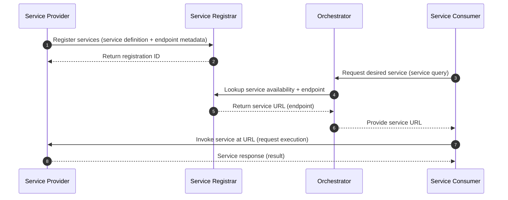

# mbaigo systems

The Arrowhead Framework is used to compose a *system of systems* for a specific purpose.

It is similar to building with LEGO: the same set of building blocks can be assembled into different solutions (e.g., a plane or a car), and the final assembly represents a distinct functional concept. For example, to build a climate control solution, you would select and integrate systems such as a temperature sensor system, a valve (actuator) system, and a thermostat/control system.

An Arrowhead system of systems—also called a *local cloud*—is dynamic: systems may join or leave during operation. This is possible because Arrowhead relies on *service-oriented architecture (SOA)*. Each system exposes one or more services that other systems can consume.

A *service* is an externally accessible function provided by a system, typically representing the capabilities of its underlying asset. For example:

* A temperature sensor system has a physical sensor as its asset. The sensor’s function is to measure temperature, and the system exposes that measurement as a temperature service.
* A database system has a database as its asset. The system exposes operations such as create, read, update, and delete (CRUD) as services.

To enable service discovery, each provider system registers its services with the *Service Registrar*, whose asset is the service registry. When a consumer system wants to use a service, it asks the *Orchestrator* how to reach the desired service.

The Orchestrator queries the Service Registrar to check whether the requested service is currently registered (i.e., available). If it is available, the Orchestrator returns the service endpoint (URL) to the consumer. The consumer then communicates directly with the provider using that URL.

## Collections of systems that rely on the mbaigo module

- Service Registrar (asset: SQLite database)
	- alternatively, esr (Ephemeral Service Register)
- Orchestrator (asset:match making algorithm)
- ds18b20 (asset: 1-wire temperature sensor)
- Parallax4 (asset: servomotor)
- Thermostat (asset: PID controller)

## Other systems under development (off dev branch)
- UAClient (asset: OPC UA server)
- Modboss (asset: Modbus slave or server)
- Telegrapher (asset: MQTT broker)
- Weatherman (asset: Davis Vantage Pro2 weatherstation)
- Busdriver (asset: car engine via CAN-bus OBD2)
- Photographer (asset: RPi camera)
- Recorder (asset: USB microphone)

Many of the testing is done with the Raspberry Pi (3, 4, &5) with [GPIO](https://www.raspberrypi.com/documentation/computers/raspberry-pi.html#gpio)

## Default http ports for different systems
- 20100  Certificate Authority
- 20101  Maitre d’ (Authentication)
- 20102  Service Registrar
- 20103  Orchestrator
- 20104  Authorizer
- 20105  Modeler (local cloud semantics with GraphDB)
- 20150  ds18b20 (1-wire sensor)
- 20151  Parallax (PWM)
- 20152  Thermostat
- 20153  Revolutionary (Rev Pi PLC)
- 20154  Levler (Level control)
- 20160  Picam
- 20161  USB microphone 
- 20170  UA client (OPC UA)
- 20171  Modboss (Modbus TCP)
- 20172  Telegrapher (MQTT)
- 20180  Influxer (Influx DB)