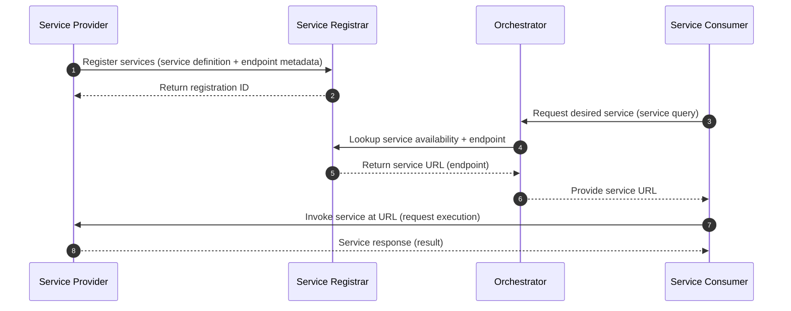

# mbaigo systems

The Arrowhead Framework is used to compose a *system of systems* for a specific purpose.

It is similar to building with LEGO: the same set of building blocks can be assembled into different solutions (e.g., a plane or a car), and the final assembly represents a distinct functional concept. For example, to build a climate control solution, you would select and integrate systems such as a temperature sensor system, a valve (actuator) system, and a thermostat/control system.

An Arrowhead system of systems—also called a *local cloud*—is dynamic: systems may join or leave during operation. This is possible because Arrowhead relies on *service-oriented architecture (SOA)*. Each system exposes one or more services that other systems can consume.

A *service* is an externally accessible function provided by a system, typically representing the capabilities of its underlying asset. For example:

* A temperature sensor system has a physical sensor as its asset. The sensor’s function is to measure temperature, and the system exposes that measurement as a temperature service.
* A database system has a database as its asset. The system exposes operations such as create, read, update, and delete (CRUD) as services.

To enable service discovery, each provider system registers its services with the *Service Registrar*, whose asset is the service registry. When a consumer system wants to use a service, it asks the *Orchestrator* how to reach the desired service.

The Orchestrator queries the Service Registrar to check whether the requested service is currently registered (i.e., available). If it is available, the Orchestrator returns the service endpoint (URL) to the consumer. The consumer then communicates directly with the provider using that URL.

## Collections of systems that rely on the mbaigo module

### Core systems

| System | Description |
|---|---|
| `orchestrator` | Matches service consumers with providers by returning the URL of a currently available and authorized service |
| `esr` | Ephemeral Service Registrar — lightweight in-memory alternative to a database-backed registrar, keeps track of currently available services |

### Sensors and gateways

| System | Description |
|---|---|
| `ds18b20` | Reads temperature from 1-wire DS18B20 sensors attached to a Raspberry Pi GPIO |
| `beekeeper` | Exposes ZigBee devices paired to a RaspBee II / deCONZ gateway (plugs, lights, sensors) as Arrowhead services |
| `meteorologue` | Exposes Netatmo weather station modules (indoor, outdoor, rain, wind) as Arrowhead services |
| `weatherman` | Exposes a Davis Vantage Pro 2 weather station connected via USB serial as Arrowhead services |
| `modboss` | Reads and writes Modbus coils, discrete inputs, holding and input registers over TCP or RTU |
| `revolutionary` | Reads digital/analog inputs and writes digital outputs on a RevPi Connect 4 PLC |
| `uaclient` | Browses an OPC UA server and exposes its nodes as readable (and where supported, writable) Arrowhead services |
| `telegrapher` | Bridges MQTT topics into the Arrowhead local cloud — subscribes to topics (GET) and publishes to them (PUT) |
| `busdriver` | Reads OBD-II signals from a vehicle via SocketCAN (Waveshare RS485 CAN HAT on Raspberry Pi); each configured PID becomes one Arrowhead service |
| `sailor` | Reads NMEA 2000 signals from a vessel's CAN bus via SocketCAN (SK Pang PiCAN-M HAT on Raspberry Pi); each configured PGN field becomes one Arrowhead service |

### Actuators

| System | Description |
|---|---|
| `parallax` | Controls a standard servo motor with PWM; exposes a rotation service (GET current position, PUT new position) |
| `parallax4` | Controls four independent PWM servo motors; exposes a rotation service per channel |

### Imaging

| System | Description |
|---|---|
| `filmer` | Captures a still image from a connected camera and saves it as a file |
| `photographer` | Captures a still image from a connected camera and provides a live video stream |
| `recognizer` | Runs YOLOv8 object detection on camera frames and exposes detection results as a service |

### Analytics and control

| System | Description |
|---|---|
| `thermostat` | PID controller that consumes a temperature service and drives a servo motor to a target setpoint |
| `ethermostat` | P-controller that discovers electrical heating plugs (via beekeeper) and matching temperature services (via meteorologue) by functional location, and switches each plug on or off to maintain a per-heater setpoint |
| `leveler` | Consumes a temperature and a servo position service to maintain a setpoint via feedback control |
| `flattener` | Adjusts a thermostat setpoint inversely to the electricity spot price to flatten peak energy demand |
| `collector` | Ingests time-series signals from other services into an InfluxDB database |
| `emulator` | Replays historical signals stored in JSON, XML, or CSV files as live Arrowhead services |
| `nurse` | Monitors asset measurements and reports anomalies to a SAP system as maintenance notifications |
| `sapper` | Simulates a SAP PM/MM system — receives maintenance notifications and exposes order creation and status as services |

### Order management

| System | Description |
|---|---|
| `clerk` | Browser-based order entry front-end for pen holder orders; validates inputs, forwards orders to Tracker, and proxies lookups back to the browser |
| `tracker` | Persists pen holder orders in a SQLite database; exposes a REST service for creating, updating, and retrieving orders; order lookup requires both order number and email address |

### Dashboard

| System | Description |
|---|---|
| `beehive` | Web dashboard that discovers all OnOff services in the local cloud and presents them as toggle switches |

### Modelling and documentation

| System | Description |
|---|---|
| `cloudmodel` | Assembles SysML v2 BDD/IBD models of all systems currently registered in the local cloud |
| `kgrapher` | Assembles OWL/RDF knowledge graph ontologies of all systems in the local cloud |
| `democrat` | Bridges the Arrowhead local cloud knowledge graph to FA³ST Asset Administration Shells (AAS) |
| `messenger` | Centralized logging system that receives and stores log messages from other systems |

### Learning

| System | Description |
|---|---|
| `Drafter` | Skeleton / template system for students; demonstrates the stateless handler pattern and the channel tray pattern side by side |

---

## Background

The design philosophy behind these systems — how unit assets, services, and the
channel tray pattern fit together — is described in:

> van Deventer, J. A. (2025). *A Model Based Implementation of an IoT Framework*.
> Zenodo. <https://doi.org/10.5281/zenodo.18504110>