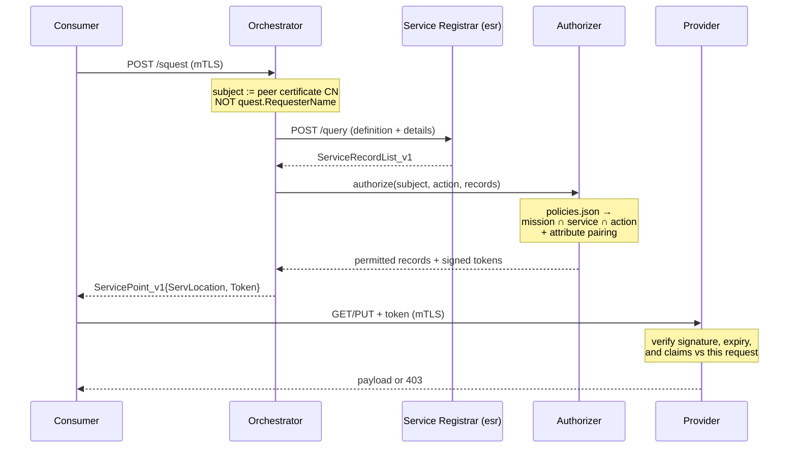

# mbaigo System: authorizer

**Status: implemented, not yet exercised on the testbed.** [MISSIONS.md](MISSIONS.md)
defines the mission taxonomy and the framework invariant it relies on;
[POLICY.md](POLICY.md) defines the policy file, the evaluation semantics and the
token. Both are normative — this file records the architecture and what remains.

The engine is `policy.go`, the system is `thing.go` and `authorizer.go`. It runs
on port 20104 (30104 over HTTPS) and provides one service, `authorize`.

## Purpose

The authorizer is the **second gate** of a two-gate chain:

1. **Authentication** (`ca` + `maitreD`): the running binary's SHA-256 hash is on
   the cloud-mastered whitelist, so the CA signs its CSR. The system *exists*.
2. **Authorization** (this system): the system's certificate CN matches a policy,
   so it receives tokens for specific (provider, asset, service, action) tuples.
   The system *acts*.

A binary that is whitelisted but not policy-authorized has cryptographic identity
and no permissions. A binary holding a token whose certificate has been revoked
fails at the TLS handshake before any policy is consulted.

## Architecture

The Orchestrator obtains candidate providers from the Service Registrar, has the
Authorizer filter them, and returns the survivors — each with a token — to the
requesting system. This mirrors Arrowhead core, where orchestration consults
authorization before answering.



Filtering at the Orchestrator is least privilege applied to discovery; the
provider's token check is what actually enforces. See POLICY.md, *Enforcement
model*, for why both are required.

## A worked policy: climate control

A local cloud with six systems — `ds18b20` (a 1-wire temperature sensor),
`thermostat` (a P controller), `parallax` (a servo driving a radiator valve),
`collector` (time-series logging into InfluxDB), and `kgrapher` and `modeler`
(which assemble the cloud's knowledge graph and SysML model).

What each of them registers:

| System | Asset | Mission | Service | Location |
|--------|-------|---------|---------|----------|
| `ds18b20` | `sensor_Id` | `measurement` | `temperature` | Kitchen |
| `parallax` | `Servo_1` | `actuation` | `rotation` | Kitchen |
| `thermostat` | `controller_1` | `control` | `setpoint` (`state`), `deviation`, `jitter` (`measurement`) | Kitchen |
| `collector` | `demo` | `logging` | `mquery` | — |
| `kgrapher` | `assembler` | `aggregation` | `cloudgraph`, `localOntologies` | — |
| `modeler` | `assembler` | `aggregation` | `cloudmodel` | — |

Only three of them consume anything, and **policies are written about consumers**.
`ds18b20` and `parallax` appear here only as objects — a provider that consumes
nothing never needs a rule of its own.

```json
{
  "policies": [
    {
      "subject": "thermostat",
      "missions": ["measurement"],
      "actions": ["read"],
      "must_match_attribute": "FunctionalLocation",
      "ttl": "5m"
    },
    {
      "subject": "thermostat",
      "missions": ["actuation"],
      "actions": ["read", "write"],
      "must_match_attribute": "FunctionalLocation",
      "ttl": "5m"
    },
    {
      "subject": "collector",
      "missions": ["measurement", "actuation", "state"],
      "actions": ["read"],
      "ttl": "15m"
    }
  ],
  "denials": [
    {"subject": "thermostat", "asset": "parallax/Servo_2"}
  ]
}
```

### Why it is written this way

**The thermostat gets two rules, not one.** A single rule listing both missions
and both actions would also let it *write* to the temperature sensor. Splitting
them costs three lines and means the controller can read what it measures and
drive only what it actuates.

**Both of its rules are location-paired.** `must_match_attribute` compares the
thermostat's own `FunctionalLocation`, read from the records it registers, with
the candidate's. A thermostat in the Bathroom is refused the Kitchen valve even
if it asks for it — the constraint comes from the registry, not from the request.

**The collector reads `actuation` but never writes it.** This is the distinction
mission alone cannot make: the logger and the controller face the same asset,
the same mission and the same service, and only `actions` separates them. It is
also why the collector needs no `must_match_attribute` — a cloud-wide historian
is legitimately unpaired, and the pairing rule lets an unpaired *subject* reach
only unpaired assets unless a rule omits the constraint.

**The TTLs differ on purpose.** Five minutes bounds how long a stale permission
can still drive a valve; fifteen is fine for a read-only historian, and costs the
orchestrator less traffic. Where several rules match, the shortest applies.

**`kgrapher` and `modeler` appear in no rule at all.** They consume no registered
service — they read `/kgraph` and `/smodel`, which are system-level endpoints
outside the authorization boundary, alongside `/doc` and `/cert`. That boundary
is deliberate (a provider must be able to fetch the authorizer's certificate
without a token), but it has a consequence worth stating plainly: **the cloud's
topology is readable by anything that can reach the port.** If that matters in a
given deployment, those endpoints need their own answer; policies are not it.

**The denial is a commissioning carve-out.** A second valve has been installed
but not yet accepted, so the controller must not drive it while the broad
`actuation` rule stands. Denials are for exceptions of that shape; if they
multiply, the rule above them is too broad.

### What this refuses

| Request | Outcome |
|---------|---------|
| `thermostat` reads `ds18b20/sensor_Id` | allow — `measurement`, both in the Kitchen |
| `thermostat` writes `parallax/Servo_1` | allow — `actuation`, both in the Kitchen |
| `thermostat` writes `ds18b20/sensor_Id` | **deny** — no rule grants `write` on `measurement` |
| `thermostat` writes `parallax/Servo_2` | **deny** — denied asset |
| a Bathroom thermostat writes `parallax/Servo_1` | **deny** — locations do not intersect |
| `collector` reads `parallax/Servo_1` | allow — `actuation` is readable, unpaired subject, no constraint |
| `collector` writes `parallax/Servo_1` | **deny** — the logger has no `write` |
| `collector` reads `thermostat/controller_1` setpoint | allow — `state` is in its list |
| anything else | **deny** — nothing matched |

Save this as `policies.json` in the authorizer's working directory. Edits take
effect on the next decision; tokens already issued remain valid until they
expire.

## What this needed from `mbaigo`

All of it is in place; listed because it is where the authorization concern
reaches into the framework, and where to look when something misbehaves.

| Piece | Where |
|-------|-------|
| Peer identity from the client certificate | `usecases/identity.go` — `PeerCN` |
| `Mission` on the registration record, and validation that refuses to start without one | `usecases/registration.go`, `usecases/missions.go` |
| `ProviderName` on the quest, so the authorizer can ask what a subject provides | `forms/servicequest_forms.go`, `systems/esr` — `FilterRecords` |
| `Action` on the quest, derived from the cervice mode | `usecases/service_discovery.go` — `ActionForMode` |
| The authorize request/response pair | `forms/authorization_forms.go` |
| Access token: mint, verify, and the claim-versus-request check | `forms/token_forms.go`, `usecases/token.go` |
| The authorizer's public key: acquired at startup, chain-validated, CN-pinned | `usecases/authorization.go` |
| Token on the wire to the provider | `components.NodeInfo`, `usecases/utilities.go` — `sendHTTPReqWithToken` |
| Verification before dispatch | `usecases/servers_handlers.go` — `permitted` |

`forms.ServicePoint_v1` already carried an unused `Token` field, and the existing
error path gives token renewal for free (POLICY.md, *Token renewal*).

## Transport: HTTPS is enabled cloud-wide

Authorization presumes an authenticated subject, and the subject is the verified
certificate CN — which exists only on an mTLS connection. Every system now
declares an HTTPS port alongside its HTTP one, by the convention that the HTTPS
port is the HTTP port with its leading `2` replaced by a `3`:

```json
"protocolsNports": { "coap": 0, "http": 20150, "https": 30150 }
```

Because registration omits zero ports and `preferredProtoPort` prefers HTTPS, a
provider that has bound TLS is handed to consumers as an `https://` URL, and the
consumer's request carries its client certificate. That is what makes `PeerCN`
return a subject rather than nothing.

Two consequences to expect when running this:

- **HTTPS binds only after enrollment.** `SetoutServers` waits for the
  certificate, so between boot and enrollment a system advertises a port that is
  not yet listening. A consumer reaching it gets a connection refused, the node
  cache is cleared, and the next call re-orchestrates. Transient, and visible in
  the logs.
- **The CA becomes load-bearing.** Plain HTTP keeps working during a CA outage,
  so the cloud degrades rather than stops — but authorization does not work over
  HTTP, because there is no peer certificate to identify the caller.

The one exception is `photographer`, whose configuration overrides HTTP to 8700;
that has no counterpart under this convention and its HTTPS port is still 0.

## How it was built

Each step was shippable on its own, and none of the first four could break a
running deployment.

1. **Peer CN extracted and logged, nothing enforced.** Established how much of the
   testbed presented a usable client certificate, continuously rather than as a
   one-off audit.
2. **`Mission` carried to the registrar, validated at startup, populated.** A
   system with a missing or unrecognized mission refuses to start.
3. **The policy engine, with no network.** `Decide(policies, request) → decision`
   as a pure function, table-driven against POLICY.md's worked examples.
4. **Wired into the Orchestrator as filtering only.** Observable end to end with
   nothing enforced, so a wrong policy cost nothing.
5. **Tokens issued, relayed and verified at the provider.** Last, because it is
   the only step that can lock a running cloud out of itself.

## What remains

- **No `policies.json` exists in any deployment.** `*.json` is gitignored, so each
  deployment writes its own; `writePoliciesTemplate` produces a loadable starting
  point. Until one exists the authorizer denies everything, which is the correct
  state for an uncommissioned cloud but will look like a fault.
- **Not in the Makefile's `SYSTEMS` list**, so CI does not lint, test or
  cross-compile it yet.
- **`messenger` has no mission** and no committed configuration, so it will refuse
  to start once it is looked at.
- **Never run end to end on the testbed.** Every layer is unit-tested; none of it
  has met a real Raspberry Pi.

## Related

- [MISSIONS.md](MISSIONS.md) — mission taxonomy, framework invariant
- [POLICY.md](POLICY.md) — policy schema, evaluation, tokens, deployment constraints
- [../ca/README.md](../ca/README.md) — certificate issuance and the whitelist
- [../maitreD/README.md](../maitreD/README.md) — executable-hash attestation
