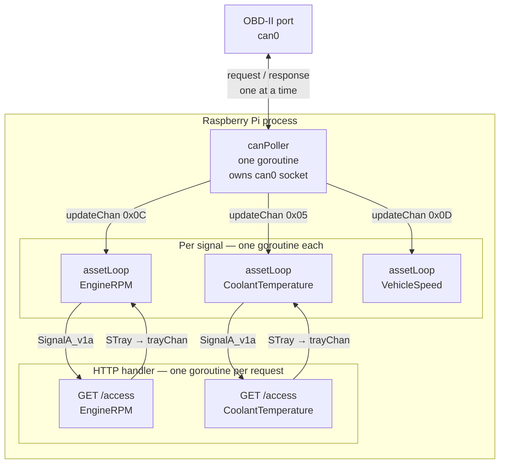
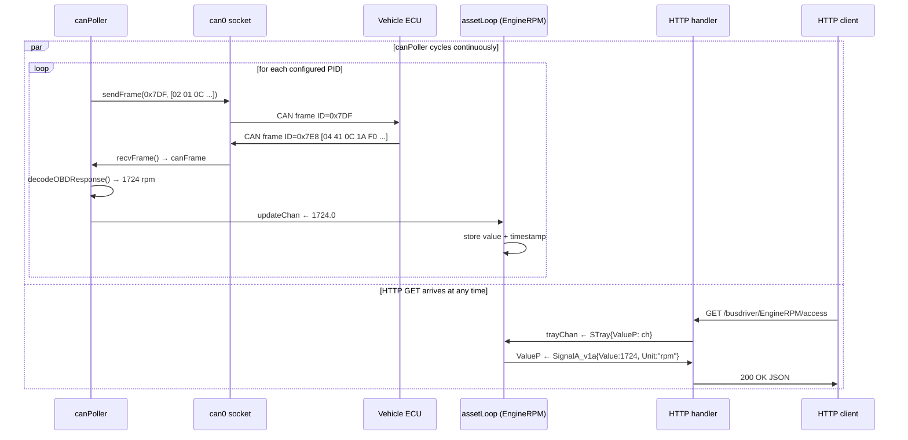
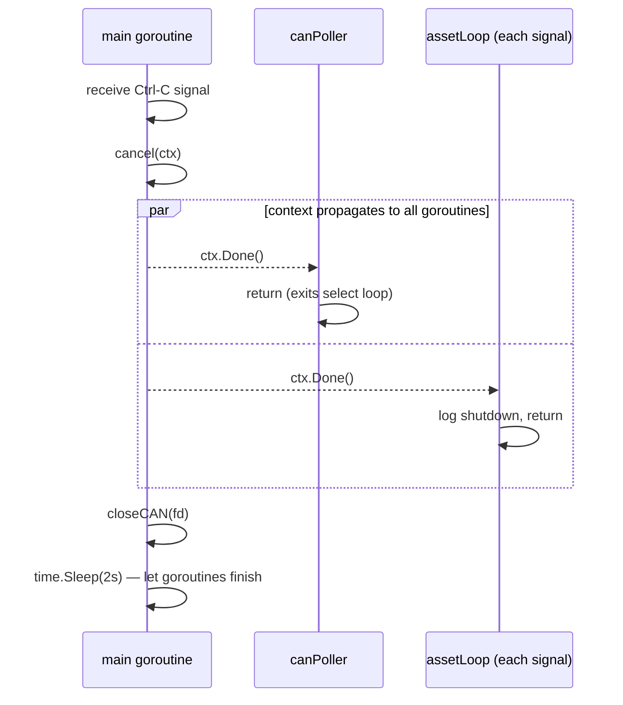

# mbaigo System: busdriver

Busdriver reads live OBD-II signals from a vehicle via a SocketCAN interface
and exposes each signal as a typed Arrowhead service.  It runs on a Raspberry
Pi fitted with a **Waveshare RS485 CAN HAT** (small size, MCP2515 controller).

Each configured PID becomes one unit asset reachable at:

```
GET /busdriver/<AssetName>/access  →  SignalA_v1a JSON
```

Signals monitored out of the box: engine RPM, coolant temperature, vehicle
speed.  Any OBD-II Mode 01 PID can be added in two minutes — see
[Adding new signals](#adding-new-signals).

---

## Hardware

### Wiring — standalone self-test (no vehicle)

The Pi and HAT are self-contained.  No external wiring is needed for the
loopback test.

```
┌──────────────────────────────┐
│  Raspberry Pi                │
│                              │
│  SPI0  ──────────────────────┼──> MCP2515 (on HAT)
│  GPIO25 (interrupt) ─────────┼──> MCP2515 INT
└──────────────────────────────┘
        (HAT sits on 40-pin header)
```

### Wiring — connected to the vehicle

Connect the HAT's screw-terminal CAN connector to the OBD-II port using a
breakout cable.  **Only CAN-H and CAN-L are needed — do not connect 12 V or
engine ground to the Pi.**

```
OBD-II port (under dashboard)        Waveshare HAT screw terminal
─────────────────────────────        ─────────────────────────────
Pin  6  CAN High  ───────────────────  CAN-H
Pin 14  CAN Low   ───────────────────  CAN-L
Pin 16  +12 V     ───  NOT CONNECTED
Pin  4  GND       ───  NOT CONNECTED
```

The Pi is powered from its own USB-C supply, not from the car.

> **Tip:** A cheap OBD-II DB9 breakout cable (about €5) exposes pin 6 and
> pin 14 on screw terminals and is the easiest way to make the connection.

---

## Raspberry Pi setup

### Step 1 — Enable SPI and the MCP2515 overlay

Edit `/boot/firmware/config.txt` (Raspberry Pi OS Bookworm) and add these
lines at the end:

```ini
dtparam=spi=on
dtoverlay=mcp2515-can0,oscillator=12000000,interrupt=25
```

> The Waveshare small HAT uses a **12 MHz** crystal and routes the MCP2515
> interrupt to **GPIO 25**.  Check the silk-screen on your board if in doubt.

Reboot:

```bash
sudo reboot
```

### Step 2 — Verify the driver loaded

```bash
ip link show can0
```

Expected output (interface is down but exists):

```
3: can0: <NOARP,ECHO> mtu 16 qdisc noop state DOWN mode DEFAULT group default qlen 10
    link/can
```

### Step 3 — Bring the interface up

```bash
sudo ip link set can0 up type can bitrate 500000
```

> Most CAN buses in cars made after 2008 run at **500 kbit/s**.  Some older
> vehicles use 250 kbit/s — try `bitrate 250000` if you get no responses
> when connected.

### Step 4 — Install can-utils (for testing)

```bash
sudo apt install can-utils
```

### Step 5 — Make the interface persistent across reboots

Create `/etc/systemd/network/can0.network`:

```ini
[Match]
Name=can0

[CAN]
BitRate=500000
```

Then enable systemd-networkd if it is not already running:

```bash
sudo systemctl enable systemd-networkd
sudo systemctl start systemd-networkd
```

---

## Testing without a vehicle — loopback test

With the HAT in place but not connected to a car, use CAN loopback mode to
verify the entire software stack end-to-end.

```bash
# Put the interface into loopback mode
sudo ip link set can0 down
sudo ip link set can0 up type can bitrate 500000 loopback on

# Send one frame and capture it (background + -n 1 avoids needing two terminals)
cansend can0 123#DEADBEEF &
candump can0 -n 1
```

Expected output:

```
  can0  123   [4]  DE AD BE EF
```

If you see the frame echoed back, the HAT and driver are fully functional.
Turn loopback off before connecting to the vehicle:

```bash
sudo ip link set can0 down
sudo ip link set can0 up type can bitrate 500000
```

---

## Testing with a vehicle — raw OBD-II

With the car ignition in **accessory / on** position (engine does not need
to be running for most PIDs):

```bash
# Request engine RPM (PID 0x0C)
cansend can0 7DF#02010C0000000000
candump can0 -n 1
```

A response from the ECU will look similar to:

```
  can0  7E8   [8]  04 41 0C 1A F0 00 00 00
```

Decode it manually:
- Bytes 1–2: `41 0C` — positive response to Mode 01 PID 0x0C
- Byte A: `1A` (26), Byte B: `F0` (240)
- RPM = (26 × 256 + 240) / 4 = **1724 rpm**

---

## Architecture

### Files

| File | Responsibility |
|---|---|
| `busdriver.go` | `main()` bootstrap, `serving()` dispatcher, `access()` handler |
| `thing.go` | `BusConfig`, `Traits`, `initTemplate`, `newResource`, `assetLoop` |
| `obd2.go` | PID table, `buildOBDRequest`, `decodeOBDResponse` — no build constraint |
| `can_linux.go` | SocketCAN socket open/read/write, `canPoller` goroutine — Linux only |
| `can_other.go` | Stub implementations for macOS / Windows (compile + test anywhere) |

### Concurrency

The system runs one `canPoller` goroutine that **owns the CAN socket** and
cycles through every configured PID.  Each signal has its own `assetLoop`
goroutine that owns the signal's cached value.  HTTP GET handlers communicate
with `assetLoop` through the channel tray pattern — no mutexes anywhere.



### Sequence diagram — one OBD-II request/response cycle



> `canPoller` and the HTTP handler run **in parallel**.  The only
> synchronisation point is the `updateChan` / `trayChan` channels — `assetLoop`
> handles them one at a time via `select`, which is sufficient because the
> CAN poll interval (100 ms per PID) is much slower than an HTTP round-trip.

### Sequence diagram — shutdown



---

## Configuration

Edit `systemconfig.json` to match your environment:

| Field | Description |
|---|---|
| `ipAddresses` | IP address(es) of the Pi |
| `protocolsNports` → `http` | HTTP port (default `20193`) |
| `traits[0].interface` | SocketCAN interface name (default `"can0"`) |
| `traits[0].bitrate` | Bus speed in bit/s (default `500000`) |
| `traits[0].signals` | Array of OBD-II signals to monitor |
| `signals[].name` | Asset name — appears in the URL and Arrowhead registry |
| `signals[].pid` | OBD-II PID in hex, e.g. `"0x0C"` |
| `signals[].unit` | Unit string for the response; blank uses the `pidTable` default |

---

## Adding new signals

### Step 1 — Check whether the PID is already in `pidTable`

Open [obd2.go](obd2.go) and look at `pidTable`.  The currently supported
PIDs are:

| PID | Signal | Unit | Formula |
|---|---|---|---|
| `0x04` | EngineLoad | % | A × 100 / 255 |
| `0x05` | CoolantTemperature | Celsius | A − 40 |
| `0x0C` | EngineRPM | rpm | (A × 256 + B) / 4 |
| `0x0D` | VehicleSpeed | km/h | A |
| `0x0E` | TimingAdvance | degrees | A / 2 − 64 |
| `0x0F` | IntakeAirTemperature | Celsius | A − 40 |
| `0x10` | MAFAirFlowRate | g/s | (A × 256 + B) / 100 |
| `0x11` | ThrottlePosition | % | A × 100 / 255 |
| `0x2F` | FuelTankLevel | % | A × 100 / 255 |
| `0x5C` | OilTemperature | Celsius | A − 40 |

If the PID you want is in the table, skip to Step 2.

### Step 1b — Add an entry to `pidTable` (if needed)

Append one line to `pidTable` in `obd2.go`:

```go
// example: absolute barometric pressure, PID 0x33, formula: A kPa
0x33: {"BarometricPressure", "kPa", func(a, _ byte) float64 { return float64(a) }},
```

The decode function receives byte A (`Data[3]`) and byte B (`Data[4]`) from
the ECU response frame.  The formulas for all standard PIDs are published in
SAE J1979 Annex B and on Wikipedia's OBD-II PIDs page.  No other code
changes are needed.

### Step 2 — Add the signal to `systemconfig.json`

Append one object to the `signals` array:

```json
{"name": "BarometricPressure", "pid": "0x33", "unit": "kPa"}
```

The `unit` field is optional — leave it blank (`""`) to use the default from
`pidTable`.

### Step 3 — Restart

```bash
./busdriver
```

The new signal is immediately available at:

```
GET /busdriver/BarometricPressure/access
```

and will be registered in the Arrowhead service registry under the definition
`"signal"` with the asset name `"BarometricPressure"`.

No recompilation is needed for PIDs already in `pidTable`.  Recompilation is
only needed when you add a new entry to `pidTable` itself.

---

## Building and deploying

```bash
# Build on the Pi directly
go build -o busdriver

# Cross-compile on a Mac or Linux desktop for Pi 4 / 5 (64-bit)
GOOS=linux GOARCH=arm64 go build -o busdriver_rpi64

# Copy to Pi
scp busdriver_rpi64 jan@canbus:~/busdriver/
```

---

## Running the tests

All tests run on any platform — no CAN hardware required.  The
`can_other.go` stubs replace the Linux SocketCAN calls.

```bash
go test ./...
```

| Test | What it checks |
|---|---|
| `TestInitTemplate` | Template name, `access` service, non-zero bitrate |
| `TestParsePID` | Hex and decimal parsing, overflow and invalid input |
| `TestLookupPID_Known` | PID 0x0C → name `"EngineRPM"`, unit `"rpm"` |
| `TestLookupPID_Unknown` | PID 0xFF → error |
| `TestBuildOBDRequest` | Correct CAN ID, DLC, Mode and PID bytes |
| `TestDecodeOBDResponse` | RPM, temperature, speed formulas; ECU 2 accepted; bad ID/service/PID rejected |
| `TestServing_InvalidPath` | Unknown path → 400 |
| `TestAccess_MethodNotAllowed` | POST → 405 |
| `TestAssetLoop_DeliversValues` | Full updateChan → trayChan round-trip |
| `TestAssetLoop_ContextCancel` | Goroutine exits cleanly on cancel |

---

## Troubleshooting

### `can0` does not appear after reboot

Check that the overlay is in `/boot/firmware/config.txt` and that SPI is
enabled.  Verify the MCP2515 is communicating:

```bash
dmesg | grep mcp251
```

Expected: `mcp251x spi0.0 can0: MCP2515 successfully initialized.`

### `candump` receives nothing when connected to the car

1. Confirm the ignition is in accessory / on position.
2. Try `bitrate 250000` — some older vehicles use 250 kbit/s.
3. Check CAN-H and CAN-L are not swapped.
4. Measure voltage between CAN-H and CAN-L with a multimeter — it should
   oscillate around 1–3 V when the bus is active.

### `busdriver: cannot open can0`

The interface is DOWN.  Bring it up first:

```bash
sudo ip link set can0 up type can bitrate 500000
```

### ECU does not respond to a specific PID

Not all vehicles support all PIDs.  You can query which PIDs are supported
using the supported-PIDs request (PID `0x00` returns a bitmask of PIDs
`0x01`–`0x20` that the ECU supports):

```bash
cansend can0 7DF#0201000000000000
candump can0 -n 1
```
