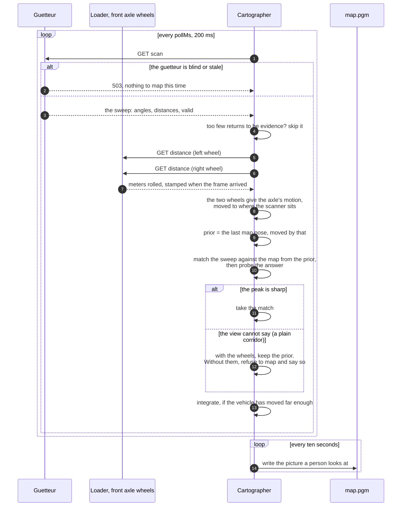

# cartographer

Consumes sweeps from a [guetteur](../guetteur) and builds an occupancy map,
working out as it goes where each sweep was taken from.

It maps and it localizes; it does not drive. Between sweeps it reads how far
the [loader](../loader)'s wheels have turned, and matches each sweep against the
map built so far starting from there. Without the wheels it starts from constant
velocity instead, and refuses to map where the view alone cannot place it.

## Services

| service | form | what it is |
|---|---|---|
| `map` | `MapA_v1a` | the occupancy grid built so far |
| `pose` | `PoseA_v1a` | where in the map the sensor is believed to be |
| `coverage` | `SignalA_v1a` | the share of the grid that has been observed at all |

A `map.pgm` is also written to disk every ten seconds. That is the artefact a
person looks at; the `map` service is what a system consumes.

## One sweep, start to finish

## What it is, and what it is not

This is a SLAM **front end**. There is no pose graph and no loop closure, so a
long circuit of a building will not snap shut when it returns to where it
started — the drift accumulated on the way round simply stays. For a hallway
driven up and back, which is the experiment the students are being given, that
is the right amount of machinery.

## Three things that are not obvious, and were each found by a failing test

**1. Walls must be recorded as surfaces, not points.** A sweep samples a wall at
intervals that grow with range, so recording only beam endpoints leaves a wall
as a row of dots. A later sweep then scores best by dropping its endpoints back
into those same dots — which is the pose the vehicle has already left. The
matcher fits the sampling pattern instead of the geometry and reports that
nothing has moved. `integrate` therefore joins adjacent returns that are within
30 cm of each other, and the range jump at a doorway is what stops it drawing a
wall across the opening.

**2. Matching scores against a distance transform, not the occupancy grid.**
A Euclidean distance field makes a wall uniformly attractive along its length,
so the along-wall direction carries no false evidence.

**3. A straight corridor cannot say how far along it you are.** Two parallel
walls look identical from everywhere between them. This is the aperture problem
and it is a property of the geometry, not a defect to be tuned away.

So the matcher probes its own answer: it nudges the winning pose and asks
whether the score actually falls. A flat peak is reported as flat, and then:

- **with odometry**, the odometry is taken as the pose and the matcher is not
  allowed to slide it along the direction the map is indifferent to;
- **without odometry**, the sweep is *not* integrated at all, and the system
  says so. A corridor mapped from a pose that cannot be known comes out the
  wrong length and looks entirely convincing.

## Odometry

**The consumed services are the loader's wheel `distance`** — meters rolled by
the two wheels of the scanner's own axle, found by definition `distance`, the
wheel's `NodeID` and the vehicle's `Model`. Between two sweeps the change in
each says how far each side moved. The wheel's size is the loader's business:
it converts revolutions to meters with the circumference in its own
configuration, so calibrating the wheel size means changing one number, there.

**One axle is enough, and the articulation angle is not needed.** An
articulated loader bends in the middle, so its two halves point in different
directions; but each half is a rigid body on two wheels that do not slide
sideways, which is exactly a differential-drive robot. Its axle moves at the
mean of the two wheel speeds and turns at their difference over the track. So
the cartographer tracks the half the scanner is mounted on, from that half's
wheels, and does not need the waist sensor.
The motion is integrated as an arc, and moved from the axle's center to where
the scanner sits (`scannerMount`).

**The motion is applied to the map, not the odometry's position.** The wheel
counters start from wherever the loader was switched on; the map starts from
the first sweep. The prior for each sweep is the previous map pose moved by the
wheels' change. (The first version used an odometry pose directly as the map
pose, and would also have discovered its *own* `pose` service as the odometry
source. Neither ever ran, because nothing provided a pose.)

**Where the view cannot place the vehicle, the wheels do.** Down a plain
corridor the matcher's peak is flat, and the wheel-derived pose is taken as it
is. `odometry_test.go` drives a simulated corridor: with the wheels the estimate
follows the vehicle to the centimeter; without them every sweep is refused.

**What the wheels get wrong, and what guards against it:**

- *Slip.* The loader drives each wheel at the speed the geometry asks for, but
  tires still creep and scrub, most in tight turns, so the heading from the
  encoders drifts. That is why the matcher still corrects wherever the view
  allows.
- *Counter wrap.* The encoder's own counter wraps every 204.8 revolutions; the
  loader unwraps it, so `distance` does not.
- *A loader restart* starts the distances again from zero. A jump larger than
  `maxWheelSpeedMetresPerSecond` allows in the time between readings is taken
  as a restart, not motion, and logged.
- *A dead encoder.* The loader re-sends its latest reading once a second even
  when nothing changes, stamped with when it arrived. A reading older than
  `maxAgeMs` (1.5 s) is not used. The loader and the cartographer must
  therefore agree on the time to within that — run NTP if they are on different
  hosts.
- *Timing.* The wheels are read when a sweep is processed, not when it was
  taken, and a sweep is not de-skewed for motion during it. At walking pace
  that is a few centimeters.

| `odometry` field | default | |
|---|---|---|
| `enabled` | true | absent means true |
| `vehicle` | `{"Model": ["artitrax"]}` | picks the loader |
| `leftNodeID` / `rightNodeID` | 1 / 2 | the **front** axle; 3 / 4 for the back |
| `trackMetres` | 0.6275 | measured |
| `scannerMount` | 0, 0, 0° | forward, left, and yaw of the scanner from that axle's center |
| `maxAgeMs` | 1500 | longer than the loader's one-second heartbeat |
| `maxWheelSpeedMetresPerSecond` | 3 | bounds plausible motion between readings |

**Check the defaults against the vehicle:** they assume the SF45/B is on the
**front** half, over the axle, facing forward. If it is mounted elsewhere, say
so in `scannerMount`, and pick the axle it is on.
