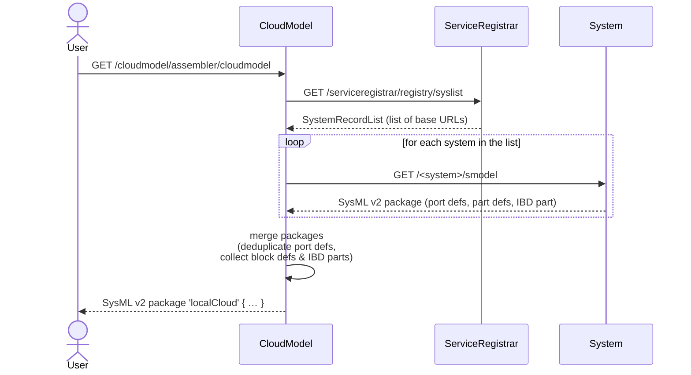

# mbaigo System: CloudModel

## Purpose

The CloudModel system assembles a complete **SysML v2** structural model of a local cloud — a distributed system of systems — by collecting the individual model fragment of each registered system and merging them into a single, coherent package.

The output covers both the **Block Definition Diagram (BDD)**, which defines the types of all systems and their unit assets with the services they provide and consume, and the **Internal Block Diagram (IBD)**, which shows the instantiated parts and their live service connections at the time of the request.

The model is generated on demand by issuing an HTTP GET to the `cloudmodel` service.
It is expressed in [SysML v2 textual notation](https://www.omg.org/spec/SysML/2.0) and returned as plain text.

## How it works



Each system's `/smodel` endpoint (provided by the `mbaigo` framework) generates a self-contained SysML v2 `package` with:
- **port defs** — one per unique service definition (provided or consumed)
- **part defs** — one for the system block and one per unit asset block, carrying `in`/`out` ports and the unit asset's `mission` attribute
- **IBD part** — the instantiated system with its host metadata, provided service URLs as comments, and `connect` statements for any already-resolved service providers

The CloudModel deduplicates `port def` declarations (the same service definition can appear in many systems) and concatenates the rest into a single top-level `package`.

## Output example

```sysml
package 'localCloud' {

    // ── Port Definitions ─────────────────────────────────────────────────────
    port def 'temperature';
    port def 'rotation';
    port def 'setpoint';
    ...

    // ── Block Definitions (BDD) ──────────────────────────────────────────────
    part def 'thermostatSystem' {
        attribute name : String = "thermostat";
        part 'controller_1' : 'controller_1Block';
    }

    part def 'controller_1Block' {
        attribute mission : String = "control_heater";
        out port 'setpoint'        : ~'setpoint';         // provided
        out port 'thermostaterror' : ~'thermostaterror';  // provided
        in port  'temperature'     : 'temperature';       // consumed
        in port  'rotation'        : 'rotation';          // consumed
    }
    ...

    // ── Internal Block Diagram (IBD) ─────────────────────────────────────────
    part 'thermostat' : 'thermostatSystem' {
        attribute host      : String  = "myhost";
        attribute ipAddress : String  = "192.168.1.10";
        attribute httpPort  : Integer = 20001;

        part 'controller_1' : 'controller_1Block' {
            // provides: http://192.168.1.10:20001/thermostat/controller_1/setpoint
            connect 'temperature' to 'myhost_ds18b20_sensor'; // http://...
            connect 'rotation'    to 'myhost_parallax_servo'; // http://...
        }
    }
    ...
}
```

## Configuration

The only configurable trait is the name of the merged package:

```json
"traits": [{ "cloudName": "myLocalCloud" }]
```

If omitted, the package is named `localCloud`.

## Compiling

Initialise the module once (already done if `go.mod` is present):

```bash
go mod init github.com/sdoque/systems/cloudmodel
go mod tidy
```

Run directly from the system's directory:

```bash
go run .
```

> It is **important** to start the program from within its own directory because it looks for `systemconfig.json` there. If the file is absent, a default one is generated and the program stops so the file can be reviewed and adjusted before the next start.

The address of the running web server is printed at startup and can be opened in any browser.

To build a binary for the local machine:

```bash
go build -o cloudmodel_local
```

## Cross-compiling

| Target | Command |
|--------|---------|
| Raspberry Pi 64-bit | `GOOS=linux GOARCH=arm64 go build -o cloudmodel_rpi64` |
| Linux x86-64 | `GOOS=linux GOARCH=amd64 CGO_ENABLED=0 go build -o cloudmodel_linux_amd64` |
| macOS Apple Silicon | `GOOS=darwin GOARCH=arm64 go build -o cloudmodel_mac_arm64` |

A full list of supported platforms: `go tool dist list`

To copy the binary to a remote host:

```bash
scp cloudmodel_rpi64 user@192.168.1.x:~/demo/cloudmodel/
```
