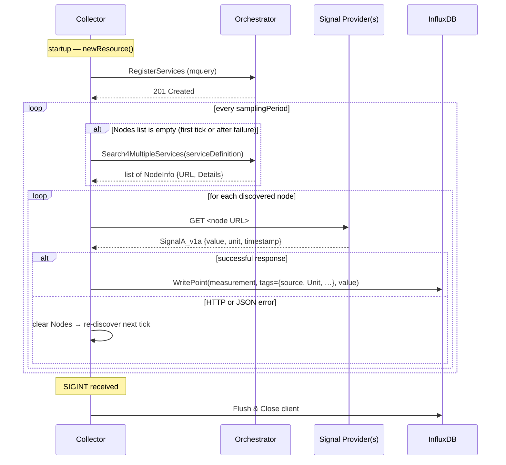

# mbaigo System: Collector

The Collector is an Arrowhead-compliant system whose asset is a time-series
database ([InfluxDB](https://en.wikipedia.org/wiki/InfluxDB)). It periodically
discovers every provider of each configured measurement type via the Arrowhead
Service Registry, queries all of them individually, and writes each reading as
a tagged data point into an InfluxDB bucket.

## Services

| Sub-path | Method | Description |
|----------|--------|-------------|
| `mquery` | GET    | Returns the list of measurements currently present in the configured InfluxDB bucket. |

## How it works

Each measurement entry in the configuration file describes:
- **serviceDefinition** — the Arrowhead service name to look up (e.g. `pressure`)
- **mdetails** — optional filter details passed to the orchestrator
- **samplingPeriod** — polling interval in seconds

On every tick the Collector:
1. Calls `Search4MultipleServices` to discover *all* registered providers of that measurement type.
2. Iterates over every discovered node; for each one it performs an HTTP GET to retrieve a `SignalA_v1a` form.
3. Writes one InfluxDB point per provider, tagged with the **source** node name and any metadata (e.g. `Unit`, `Location`) that the provider registered with the orchestrator.
4. If a provider returns an error its node entry is cleared so re-discovery happens on the next tick.

### Sequence diagram



### Configuration example (`systemconfig.json` traits section)

```json
{
  "db_url": "http://localhost:8086",
  "token": "<influxdb-token>",
  "organization": "myorg",
  "bucket": "demo",
  "measurements": [
    {
      "serviceDefinition": "pressure",
      "mdetails": {},
      "samplingPeriod": 4
    }
  ]
}
```

## Status

Prototype demonstrating that the mbaigo library can simultaneously collect the
same measurement type from multiple distributed providers and store them as
distinguishable time series in a single InfluxDB bucket.

## Compiling

Fetch the mbaigo module and tidy dependencies:

```bash
go get github.com/sdoque/mbaigo
go mod tidy
```

Run directly:

```bash
go run collector.go thing.go
```

> It is **important** to start the program from within its own directory because
> it looks for `systemconfig.json` there. If the file is missing it is generated
> automatically and the program exits so the file can be edited before the next
> start.

Build for the local machine:

```bash
go build -o Collector
```

## Cross-compiling

| Target | Command |
|--------|---------|
| Intel Mac | `GOOS=darwin GOARCH=amd64 go build -o Collector_imac` |
| ARM Mac | `GOOS=darwin GOARCH=arm64 go build -o Collector_amac` |
| Windows 64 | `GOOS=windows GOARCH=amd64 go build -o Collector.exe` |
| Raspberry Pi 64 | `GOOS=linux GOARCH=arm64 go build -o Collector_rpi64` |
| Linux x86-64 | `GOOS=linux GOARCH=amd64 go build -o Collector_linux` |

Full platform list: `go tool dist list`

Copy to a Raspberry Pi:

```bash
scp Collector_rpi64 jan@192.168.1.10:rpiExec/Collector/
```

## Deploying InfluxDB (Linux / Raspberry Pi)

Follow the [official instructions](https://docs.influxdata.com/influxdb/v2/install/?t=Linux):

```bash
# 1. Download the signing key
curl --silent --location -O https://repos.influxdata.com/influxdata-archive.key

# 2. Verify the checksum
echo "943666881a1b8d9b849b74caebf02d3465d6beb716510d86a39f6c8e8dac7515  influxdata-archive.key" \
  | sha256sum --check -

# 3. Trust the key
cat influxdata-archive.key | gpg --dearmor \
  | sudo tee /etc/apt/trusted.gpg.d/influxdata-archive.gpg > /dev/null

# 4. Add the repository
echo 'deb [signed-by=/etc/apt/trusted.gpg.d/influxdata-archive.gpg] https://repos.influxdata.com/debian stable main' \
  | sudo tee /etc/apt/sources.list.d/influxdata.list

# 5. Install
sudo apt-get update
sudo apt-get install influxdb2
```

Start and verify the service:

```bash
sudo service influxdb start
sudo service influxdb status
```
