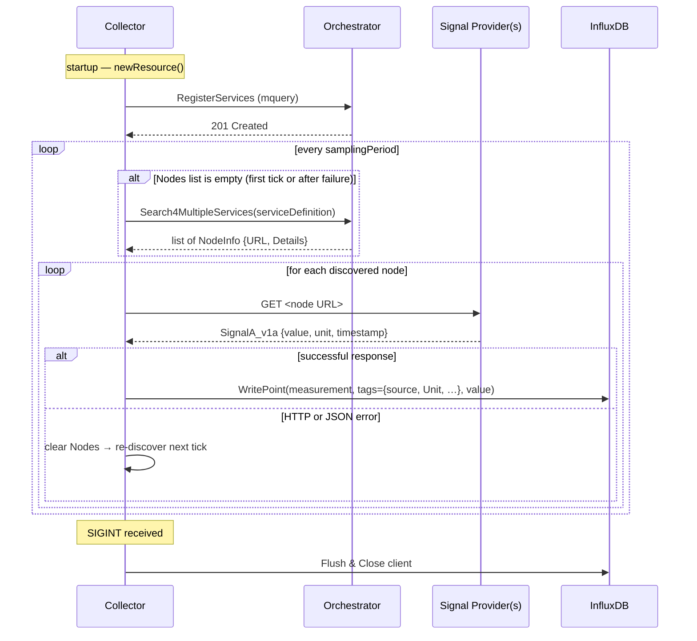

# mbaigo System: Collector

The Collector is an Arrowhead-compliant system whose asset is a time-series
database ([InfluxDB](https://en.wikipedia.org/wiki/InfluxDB)). It periodically
discovers every provider of each configured measurement type via the Arrowhead
Service Registry, queries all of them individually, and writes each reading as
a tagged data point into an InfluxDB bucket.

## Services

| Sub-path | Method | Description |
|----------|--------|-------------|
| `mquery` | GET    | Returns the list of measurements currently present in the configured InfluxDB bucket. |

## How it works

Each measurement entry in the configuration file describes:
- **serviceDefinition** — the Arrowhead service name to look up (e.g. `pressure`)
- **mdetails** — optional filter details passed to the orchestrator
- **samplingPeriod** — polling interval in seconds

On every tick the Collector:
1. Calls `Search4MultipleServices` to discover *all* registered providers of that measurement type.
2. Iterates over every discovered node; for each one it performs an HTTP GET to retrieve a `SignalA_v1a` form.
3. Writes one InfluxDB point per provider, tagged with the **source** node name and any metadata (e.g. `Unit`, `Location`) that the provider registered with the orchestrator.
4. If a provider returns an error its node entry is cleared so re-discovery happens on the next tick.

### Sequence diagram


```mermaid
sequenceDiagram
    participant Collector
    participant Orchestrator
    participant Provider as Signal Provider(s)
    participant InfluxDB

    note over Collector: startup — newResource()

    Collector->>Orchestrator: RegisterServices (mquery)
    Orchestrator-->>Collector: 201 Created

    loop every samplingPeriod
        alt Nodes list is empty (first tick or after failure)
            Collector->>Orchestrator: Search4MultipleServices(serviceDefinition)
            Orchestrator-->>Collector: list of NodeInfo {URL, Details}
        end

        loop for each discovered node
            Collector->>Provider: GET <node URL>
            Provider-->>Collector: SignalA_v1a {value, unit, timestamp}

            alt successful response
                Collector->>InfluxDB: WritePoint(measurement, tags={source, Unit, …}, value)
            else HTTP or JSON error
                Collector->>Collector: clear Nodes → re-discover next tick
            end
        end
    end

    note over Collector: SIGINT received
    Collector->>InfluxDB: Flush & Close client
```

### Configuration example (`systemconfig.json` traits section)

```json
{
  "db_url": "http://localhost:8086",
  "token": "<influxdb-token>",
  "organization": "myorg",
  "bucket": "demo",
  "measurements": [
    {
      "serviceDefinition": "pressure",
      "mdetails": {},
      "samplingPeriod": 4
    }
  ]
}
```

## Status

Prototype demonstrating that the mbaigo library can simultaneously collect the
same measurement type from multiple distributed providers and store them as
distinguishable time series in a single InfluxDB bucket.

## Compiling

Fetch the mbaigo module and tidy dependencies:

```bash
go get github.com/sdoque/mbaigo
go mod tidy
```

Run directly:

```bash
go run collector.go thing.go
```

> It is **important** to start the program from within its own directory because
> it looks for `systemconfig.json` there. If the file is missing it is generated
> automatically and the program exits so the file can be edited before the next
> start.

Build for the local machine:

```bash
go build -o Collector
```

## Cross-compiling

| Target | Command |
|--------|---------|
| Intel Mac | `GOOS=darwin GOARCH=amd64 go build -o Collector_imac` |
| ARM Mac | `GOOS=darwin GOARCH=arm64 go build -o Collector_amac` |
| Windows 64 | `GOOS=windows GOARCH=amd64 go build -o Collector.exe` |
| Raspberry Pi 64 | `GOOS=linux GOARCH=arm64 go build -o Collector_rpi64` |
| Linux x86-64 | `GOOS=linux GOARCH=amd64 go build -o Collector_linux` |

Full platform list: `go tool dist list`

Copy to a Raspberry Pi:

```bash
scp Collector_rpi64 jan@192.168.1.10:rpiExec/Collector/
```

## Deploying InfluxDB 2 (Linux / Raspberry Pi)

The collector uses `influxdb-client-go/v2` with a token, an organization and a
bucket, so it needs **InfluxDB 2.x**. Version 1.x has no such concepts and will
not work with this system.

### 1. Add InfluxData's repository

```bash
curl --silent --location -O https://repos.influxdata.com/influxdata-archive.key

# Verify the key by its GPG fingerprint. This prints nothing and exits 0 when
# the key is genuine.
gpg --show-keys --with-fingerprint --with-colons ./influxdata-archive.key 2>&1 \
  | grep -q '^fpr:\+24C975CBA61A024EE1B631787C3D57159FC2F927:$'

sudo mkdir -p /etc/apt/keyrings
cat influxdata-archive.key | gpg --dearmor \
  | sudo tee /etc/apt/keyrings/influxdata-archive.gpg > /dev/null

echo 'deb [signed-by=/etc/apt/keyrings/influxdata-archive.gpg] https://repos.influxdata.com/debian stable main' \
  | sudo tee /etc/apt/sources.list.d/influxdata.list
```

> **This step used to be a SHA-256 check against a hard-coded digest, and that
> digest went stale.** InfluxData re-published the key file, `sha256sum --check`
> then failed, and a failing checksum on a signing key is indistinguishable from
> an attack — so the correct response was to stop, which is where this
> walkthrough stranded at least one reader. The fingerprint above is a property
> of the key itself rather than of the file that carries it, so it survives
> re-publication. It was verified against the key as served, on an aarch64
> Raspberry Pi, when this was written.

### 2. Install and start

```bash
sudo apt-get update
sudo apt-get install influxdb2
sudo systemctl enable --now influxdb
systemctl status influxdb
```

`enable --now` starts it and makes it come back after a reboot, which the
earlier `service influxdb start` did not.

### 3. Set it up — the step that is easy to miss

**A freshly installed InfluxDB 2 is running and refuses everything.** There is
no user, no organization, no bucket and no token until you create them, and the
collector will fail with an authorization error that says nothing about setup
being incomplete.

Either from the command line:

```bash
influx setup \
  --username <you> \
  --password '<a real password>' \
  --org mbaigo \
  --bucket demo \
  --retention 0 \
  --force
```

or in a browser at `http://<pi-address>:8086`, which walks through the same
four answers.

`--retention 0` keeps data indefinitely. The organization and bucket names are
yours to choose; they must match `organization` and `bucket` in the collector's
`systemconfig.json`.

### 4. Get a token for the collector

Setup creates an **operator token**, which can do anything to anything. Read it:

```bash
influx auth list
# or, if the CLI is not configured:
sudo cat /etc/influxdb2/influx-configs
```

Use it to confirm the collector's write path works, then prefer a narrower one:

```bash
influx auth create \
  --org mbaigo \
  --write-bucket $(influx bucket list --org mbaigo --name demo --hide-headers | cut -f1) \
  --read-bucket  $(influx bucket list --org mbaigo --name demo --hide-headers | cut -f1) \
  --description "collector"
```

The collector reads and writes one bucket and needs nothing else. Giving it the
operator token means a compromised collector can delete every bucket on the
server, and the narrower token costs one command.

### 5. Check it before starting the collector

```bash
influx ping
influx bucket list --org mbaigo
```

If both answer, the collector's four settings — `db_url`, `token`,
`organization`, `bucket` — are the whole of what remains.

> **The token in `initTemplate` is a real one from a past deployment.** It is
> checked into this repository and written into every generated
> `systemconfig.json`, so it must be replaced, and it should be revoked on any
> server that still honours it: `influx auth delete --id <id>`.
