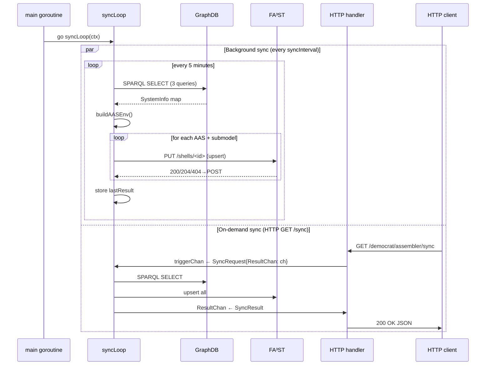
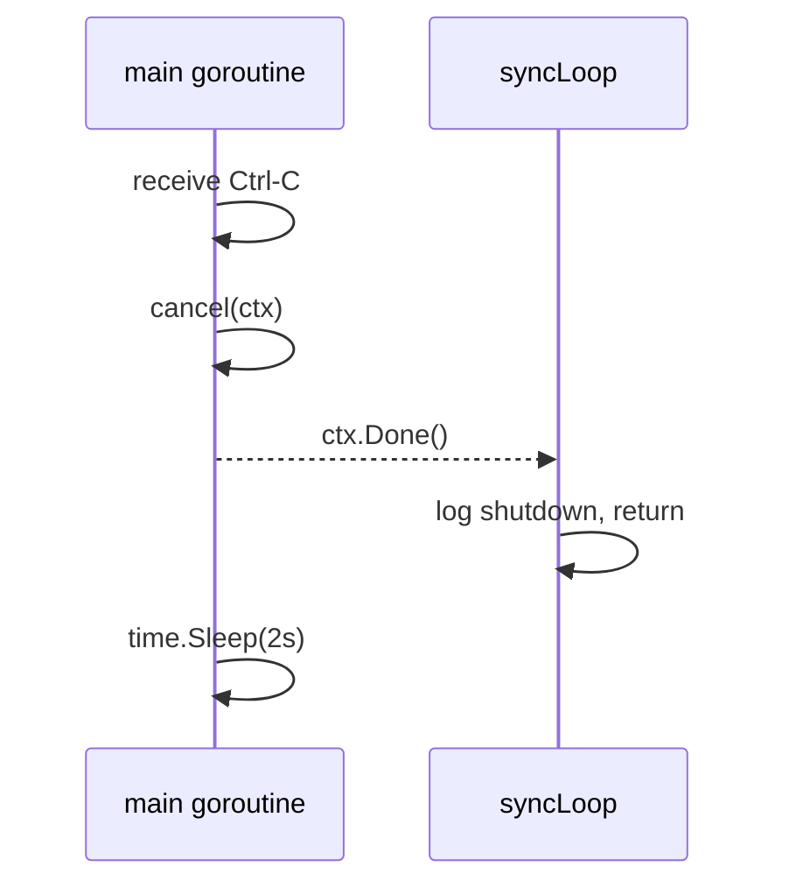

# mbaigo System: democrat

Democrat bridges an Arrowhead local cloud to Industry 4.0 **Asset Administration
Shell (AAS)** infrastructure.  It reads the semantic model of the local cloud
from a GraphDB knowledge graph — maintained by the
[kgrapher](../kgrapher/README.md) system — and upserts one AAS per Arrowhead
system into a [FA³ST](https://github.com/FraunhoferIOSB/FAAAST-Service) server.

```
GET /democrat/assembler/sync    →  trigger immediate sync, return SyncResult JSON
GET /democrat/assembler/status  →  return last SyncResult without triggering
```

---

## The problem: duplication of information entry

When a new Arrowhead system is deployed — say a `ds18b20` temperature sensor on
a Raspberry Pi — an engineer already describes it completely:

- Its **name** and **IP address** go into `systemconfig.json`
- Its **services** (definition, sub-path, URL) are registered with the Service
  Registrar
- Its **semantic type** (`afo:System`, `afo:UnitAsset`, `afo:Service`) is
  declared in its `/kgraph` endpoint, which kgrapher harvests

If the same organization also uses AAS tooling — a digital twin platform, a
maintenance system, an ERP connector — someone then has to open the FA³ST web
UI and *manually create an AAS* for that same system.  They re-enter the system
name, the host address, and every service URL that was already registered.

**This is duplication.**  Two places now hold the same facts.  When the system
moves to a new IP, or adds a service, both the Arrowhead registry and the AAS
store must be updated.  They will inevitably drift apart.

---

## The solution: single source of truth via the knowledge graph

The Arrowhead Framework already holds a complete, machine-readable description
of every system in the local cloud.  The kgrapher system assembles that
description into a semantic knowledge graph in RDF (Turtle format) and stores a
snapshot in GraphDB under the named graph `urn:state:current`.

Democrat then reads that snapshot via SPARQL and generates the AAS shells
automatically.  **No information is entered twice.**

```
┌─────────────────────────────────────────────────────────────────────────┐
│                         Arrowhead local cloud                           │
│                                                                         │
│  ds18b20 ──┐                                                            │
│  thermostat├──► Service Registrar ──► kgrapher ──► GraphDB             │
│  modboss  ──┘        (registry)       (harvest)   (knowledge graph)     │
│  ...                                                                    │
└───────────────────────────────────────────────────┬─────────────────────┘
                                                    │ SPARQL SELECT
                                                    ▼
                                              ┌──────────┐
                                              │ democrat  │
                                              │ (this     │
                                              │ system)   │
                                              └─────┬─────┘
                                                    │ AAS upsert (PUT/POST)
                                                    ▼
                                           ┌─────────────────┐
                                           │  FA³ST server   │
                                           │  (AAS store)    │
                                           └─────────────────┘
```

When a new system joins the cloud:

1. It starts, registers its services with the Service Registrar.
2. A browser request to kgrapher (or its periodic refresh) harvests the new
   system into the knowledge graph snapshot in GraphDB.
3. Democrat's background sync (every `syncInterval` seconds, default 5 minutes)
   queries GraphDB, builds an AAS for the new system, and upserts it into
   FA³ST.

The engineer does nothing beyond step 1.

---

## Why a knowledge graph specifically?

A plain service registry (like the Arrowhead Service Registrar) stores flat
records: *service X is available at URL Y*.  A knowledge graph goes further:
it captures **typed relationships** between entities — a system *has a husk*,
the husk *runs on a host*, the host *has an IP address*, a unit asset
*provides services* of a specific *definition*.

This richer structure is precisely what an AAS needs: the Identity submodel
needs the system URI and name, the Host submodel needs the hostname and IP,
the Services submodel needs the URL of each service.  All of that is already
in the knowledge graph because kgrapher builds it from the AFO ontology that
every mbaigo system exposes.

The SPARQL queries in [aas.go](aas.go) express exactly this:

```sparql
-- Query 1: system names
SELECT ?system ?name FROM <urn:state:current> WHERE {
  ?system a afo:System ;
          afo:hasName ?name .
}

-- Query 2: host information (via husk → host)
SELECT ?system ?hostName ?ip FROM <urn:state:current> WHERE {
  ?system a afo:System ;
          afo:hasHusk ?husk .
  ?husk afo:runsOnHost ?host .
  ?host afo:hasName ?hostName .
  OPTIONAL { ?host afo:hasIPaddress ?ip . }
}

-- Query 3: service endpoints
SELECT ?system ?svcName ?svcDef ?url FROM <urn:state:current> WHERE {
  ?system a afo:System ;
          afo:hasUnitAsset ?ua .
  ?ua afo:providesService ?svc .
  ?svc afo:hasName ?svcName ;
       afo:hasUrl ?url .
  OPTIONAL { ?svc afo:hasServiceDefinition ?svcDef . }
}
```

The `FROM <urn:state:current>` clause ensures democrat reads the latest
consistent snapshot written by kgrapher, not a partial or historical state.

---

## What democrat generates

Each Arrowhead system becomes one AAS with three submodels:

```
AAS  urn:alc:aas:<SystemName>
 ├─ Submodel: Identity
 │    ├─ SystemName   (xs:string)
 │    └─ SystemUri    (xs:anyURI)
 ├─ Submodel: Host           ← omitted when kgrapher has no host data
 │    ├─ HostName    (xs:string)
 │    ├─ IP_1        (xs:string)
 │    └─ IP_2 ...
 └─ Submodel: Services
      ├─ ServiceUrl_<name>   (xs:anyURI)  ← one per service name
      └─ <Definition>Url     (xs:anyURI)  ← shortcut when definition is unique
```

Example for a `thermostat` system with one temperature service:

```
AAS  urn:alc:aas:thermostat
 ├─ Identity
 │    SystemName = "thermostat"
 │    SystemUri  = "http://synecdoque.com/lcloud/thermostat"
 ├─ Host
 │    HostName = "pi-office"
 │    IP_1     = "192.168.1.10"
 └─ Services
      ServiceUrl_thermostat_temperature = "http://192.168.1.10:20185/thermostat/sensor1/temperature"
      TemperatureUrl                    = "http://192.168.1.10:20185/thermostat/sensor1/temperature"
```

The `TemperatureUrl` shortcut appears because there is exactly one service with
definition `"temperature"`.  When a system has two services with the same
definition (e.g. a modboss with multiple `OnOff` coils), only the per-name
properties are generated — no ambiguous shortcut.

---

## Architecture

### Files

| File | Responsibility |
|---|---|
| `democrat.go` | `main()` bootstrap, `serving()` dispatcher, `syncHandler`, `statusHandler` |
| `thing.go` | `DemocratConfig`, `Traits`, `SyncResult`, `initTemplate`, `newResource`, `syncLoop`, `runSync` |
| `aas.go` | AAS/Submodel types, SPARQL helpers, `loadSystems`, `buildAASEnv`, `upsertShell`, `upsertSubmodel` — no build constraints |

### Concurrency

Democrat uses the same **channel tray pattern** as every other mbaigo system.
One `syncLoop` goroutine owns the sync state; HTTP handlers send requests
through `triggerChan` rather than calling `runSync` directly.



> The HTTP handler and the periodic ticker both deliver work to `syncLoop` via
> the same `triggerChan`.  Because `syncLoop` processes them sequentially via
> `select`, a triggered sync and a timed sync cannot race.

### Shutdown



---

## Prerequisites

### GraphDB

GraphDB must be running with a repository named `Arrowhead` (configurable).
The easiest way is with Docker:

```bash
docker run -d -p 7200:7200 --name graphdb ontotext/graphdb:10.7.4
```

Then open `http://localhost:7200`, create a repository named `Arrowhead`, and
start kgrapher.  After one kgrapher invocation the named graph
`urn:state:current` will be populated.

See the [kgrapher README](../kgrapher/README.md) for full GraphDB setup
instructions.

### FA³ST

FA³ST Service provides the AAS REST API that democrat writes to.  With Docker:

```bash
docker run -d -p 8080:8080 \
  ghcr.io/fraunhoferioss/faaast-service:latest \
  --config /config.json
```

Or download the JAR from the
[FA³ST releases page](https://github.com/FraunhoferIOSB/FAAAST-Service/releases)
and run:

```bash
java -jar faaast-service-*.jar --config config.json
```

A minimal FA³ST `config.json` that accepts the democrat upsert calls:

```json
{
  "core": {
    "requestHandlerThreadPoolSize": 2
  },
  "endpoints": [
    {
      "@class": "de.fraunhofer.iosb.ilt.faaast.service.endpoint.http.HttpEndpoint",
      "port": 8080
    }
  ],
  "persistence": {
    "@class": "de.fraunhofer.iosb.ilt.faaast.service.persistence.memory.PersistenceInMemory"
  },
  "messageBus": {
    "@class": "de.fraunhofer.iosb.ilt.faaast.service.messageBus.internal.MessageBusInternal"
  }
}
```

---

## Configuration

Edit `systemconfig.json` to match your environment:

| Field | Description |
|---|---|
| `ipAddresses` | IP address of the machine running democrat |
| `protocolsNports` → `http` | HTTP port (default `20195`) |
| `traits[0].graphdbUrl` | SPARQL SELECT endpoint, e.g. `http://localhost:7200/repositories/Arrowhead` |
| `traits[0].faaastUrl` | FA³ST REST API v3 base URL, e.g. `http://localhost:8080/api/v3.0` |
| `traits[0].syncInterval` | Seconds between automatic background syncs (default `300`) |

---

## Usage

### Trigger a sync manually

```bash
curl http://localhost:20195/democrat/assembler/sync
```

Response (example with 4 systems in the cloud):

```json
{
  "time": "2025-04-13T08:00:00Z",
  "systems": 4,
  "upserted": 4,
  "duration": "312ms"
}
```

### Check the last sync result

```bash
curl http://localhost:20195/democrat/assembler/status
```

This never triggers a sync — it only returns the stored result from the last
automatic or manual sync.

### Verify the AAS in FA³ST

```bash
# list all shells
curl http://localhost:8080/api/v3.0/shells

# get the thermostat shell
curl http://localhost:8080/api/v3.0/shells/$(echo -n "urn:alc:aas:thermostat" | base64 | tr '+/' '-_' | tr -d '=')

# get its Services submodel
curl http://localhost:8080/api/v3.0/submodels/$(echo -n "urn:alc:sm:thermostat:Services" | base64 | tr '+/' '-_' | tr -d '=')
```

---

## Running the tests

All tests run without a running GraphDB or FA³ST instance — the SPARQL query
test uses an embedded HTTP stub server.

```bash
go test ./...
```

| Test | What it checks |
|---|---|
| `TestSanitizeIDShort` | 8 cases: spaces, digits, specials, leading/trailing underscores |
| `TestB64url_NoTrailingPadding` | FA³ST requires padding-free base64url |
| `TestTitleCaseURL` | "temperature" → "TemperatureUrl", empty → "" |
| `TestBuildAASEnv_OneSystem` | Full system with host → 1 AAS, 3 submodels |
| `TestBuildAASEnv_NoHost` | System without host data → 2 submodels, 2 AAS refs |
| `TestBuildAASEnv_MultipleServices_DefinitionShortcut` | Unique def → shortcut property added |
| `TestBuildAASEnv_DefinitionShortcut_NotUniqueIsSkipped` | Non-unique def → no shortcut |
| `TestBuildAASEnv_EmptyInput` | Empty map → empty AASEnv |
| `TestBuildAASEnv_StableOrder` | Output is deterministic across calls |
| `TestInitTemplate` | Name, both services, non-empty URLs |
| `TestServing_InvalidPath` | Unknown path → 400 |
| `TestStatusHandler_MethodNotAllowed` | POST → 405 |
| `TestSyncHandler_MethodNotAllowed` | PUT → 405 |
| `TestStatusHandler_ReturnsJSON` | Stored result serialised correctly |
| `TestSyncLoop_TriggerChanDelivery` | Full trigger → runSync → result reply round-trip |
| `TestSyncLoop_ContextCancel` | Goroutine exits cleanly on cancel |

---

## Building and deploying

```bash
# build locally
go build -o democrat

# cross-compile for the machine running GraphDB and FA³ST (Linux x86-64)
GOOS=linux GOARCH=amd64 go build -o democrat_linux

# cross-compile for Raspberry Pi 4/5
GOOS=linux GOARCH=arm64 go build -o democrat_rpi64
```

---

## Background

The design philosophy — single source of truth, knowledge graph as the
integration backbone — is described in:

> van Deventer, J. A. (2025). *Building Arrowhead-compliant IoT systems with
> mbaigo: a Go-based framework for service-oriented automation*.
> Zenodo. <https://doi.org/10.5281/zenodo.18504110>
