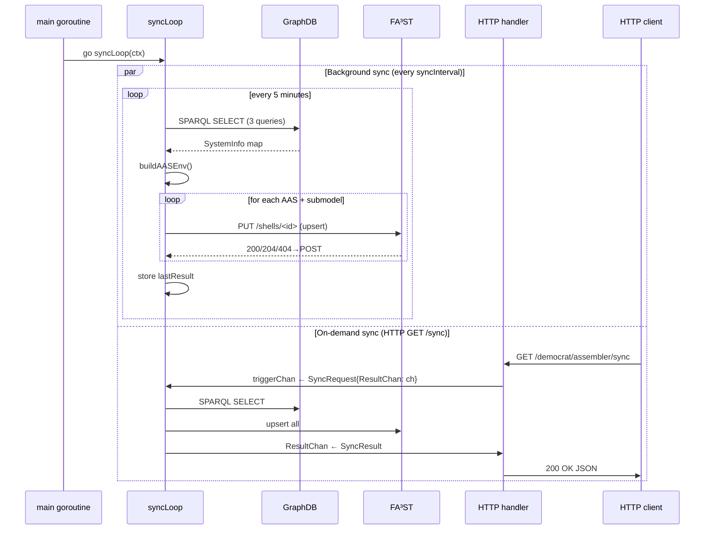
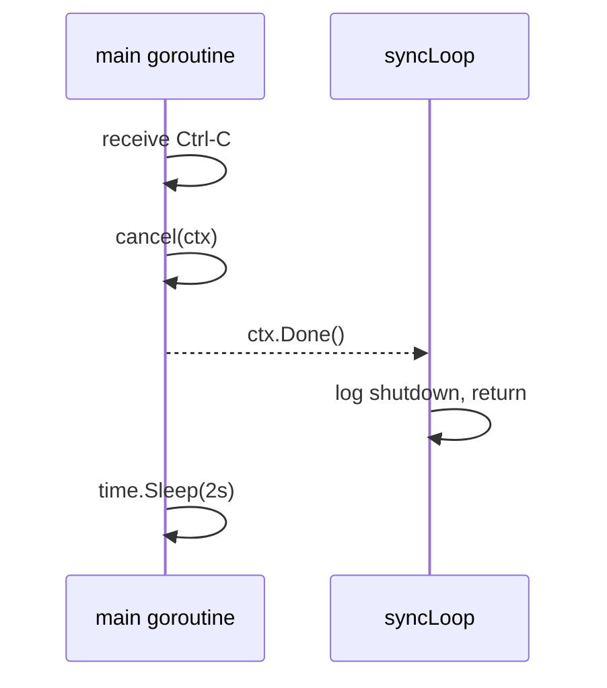

# mbaigo System: democrat

Democrat bridges an Arrowhead local cloud to Industry 4.0 **Asset Administration
Shell (AAS)** infrastructure.  It reads the semantic model of the local cloud
from a GraphDB knowledge graph — maintained by the
[kgrapher](../kgrapher/README.md) system — and upserts one AAS per Arrowhead
system into a [FA³ST](https://github.com/FraunhoferIOSB/FAAAST-Service) server.

```
GET /democrat/assembler/sync    →  trigger immediate sync, return SyncResult JSON
GET /democrat/assembler/status  →  return last SyncResult without triggering
```

---

## The problem: duplication of information entry

When a new Arrowhead system is deployed — say a `ds18b20` temperature sensor on
a Raspberry Pi — an engineer already describes it completely:

- Its **name** and **IP address** go into `systemconfig.json`
- Its **services** (definition, sub-path, URL) are registered with the Service
  Registrar
- Its **semantic type** (`afo:System`, `afo:UnitAsset`, `afo:Service`) is
  declared in its `/kgraph` endpoint, which kgrapher harvests

If the same organization also uses AAS tooling — a digital twin platform, a
maintenance system, an ERP connector — someone then has to open the FA³ST web
UI and *manually create an AAS* for that same system.  They re-enter the system
name, the host address, and every service URL that was already registered.

**This is duplication.**  Two places now hold the same facts.  When the system
moves to a new IP, or adds a service, both the Arrowhead registry and the AAS
store must be updated.  They will inevitably drift apart.

---

## The solution: single source of truth via the knowledge graph

The Arrowhead Framework already holds a complete, machine-readable description
of every system in the local cloud.  The kgrapher system assembles that
description into a semantic knowledge graph in RDF (Turtle format) and stores a
snapshot in GraphDB under the named graph `urn:state:current`.

Democrat then reads that snapshot via SPARQL and generates the AAS shells
automatically.  **No information is entered twice.**

```
┌─────────────────────────────────────────────────────────────────────────┐
│                         Arrowhead local cloud                           │
│                                                                         │
│  ds18b20 ──┐                                                            │
│  thermostat├──► Service Registrar ──► kgrapher ──► GraphDB              │
│  modboss  ──┘        (registry)       (harvest)   (knowledge graph)     │
│                                    (notifies on change)                 │
│  ...                                                                    │
└───────────────────────────────────────────────────┬─────────────────────┘
                                                    │ SPARQL SELECT
                                                    ▼
                                              ┌──────────┐
                                              │ democrat  │
                                              │ (this     │
                                              │ system)   │
                                              └─────┬─────┘
                                                    │ AAS upsert (PUT/POST)
                                                    ▼
                                           ┌─────────────────┐
                                           │  FA³ST server   │
                                           │  (AAS store)    │
                                           └─────────────────┘
```

When a new system joins the cloud:

1. It starts, registers its services with the Service Registrar.
2. The Service Registrar notifies kgrapher that the registry changed, and
   kgrapher harvests the new system into the knowledge graph snapshot in
   GraphDB.
3. Democrat's background sync (every `syncInterval` seconds, default 5 minutes)
   queries GraphDB, builds an AAS for the new system, and upserts it into
   FA³ST.

The engineer does nothing beyond step 1.

The registrar-to-kgrapher step used to be a poll, and the graph was therefore
only as fresh as the last time somebody opened kgrapher's page.  It is now
driven by the registrar's own subscription: kgrapher rebuilds when the registry
changes, so the snapshot democrat reads is current rather than merely recent.
That matters here more than it does for a browser looking at a graph — democrat
publishes into an AAS store that other organizations read, and a stale shell
that still lists a system which left the cloud is worse than no shell at all.

---

## Why a knowledge graph specifically?

A plain service registry (like the Arrowhead Service Registrar) stores flat
records: *service X is available at URL Y*.  A knowledge graph goes further:
it captures **typed relationships** between entities — a system *has a husk*,
the husk *runs on a host*, the host *has an IP address*, a unit asset
*provides services* of a specific *definition*.

This richer structure is precisely what an AAS needs: the Identity submodel
needs the system URI and name, the Host submodel needs the hostname and IP,
the Services submodel needs the URL of each service.  All of that is already
in the knowledge graph because kgrapher builds it from the AFO ontology that
every mbaigo system exposes.

The SPARQL queries in [aas.go](aas.go) express exactly this:

```sparql
-- Query 1: system names
SELECT ?system ?name FROM <urn:state:current> WHERE {
  ?system a afo:System ;
          afo:hasName ?name .
}

-- Query 2: host information (via husk → host)
SELECT ?system ?hostName ?ip FROM <urn:state:current> WHERE {
  ?system a afo:System ;
          afo:hasHusk ?husk .
  ?husk afo:runsOnHost ?host .
  ?host afo:hasName ?hostName .
  OPTIONAL { ?host afo:hasIPAddress ?ip . }
}

-- Query 3: service endpoints
SELECT ?system ?svcName ?svcDef ?url FROM <urn:state:current> WHERE {
  ?system a afo:System ;
          afo:hasUnitAsset ?ua .
  ?ua afo:providesService ?svc .
  ?svc afo:hasName ?svcName ;
       afo:hasUrl ?url .
  OPTIONAL { ?svc afo:hasServiceDefinition ?svcDef . }
}
```

The `FROM <urn:state:current>` clause ensures democrat reads the latest
consistent snapshot written by kgrapher, not a partial or historical state.

### The graph holds more than the running cloud

Everything above is the **runtime view**: what is deployed, where it runs, what
it offers.  It is the view mbaigo can produce by itself, because it is the only
view mbaigo knows anything about.  A `ds18b20` can say it provides a temperature
service at a URL; it cannot say which tag on the P&ID it was installed against,
who manufactured it, or what its serial number is.  Nothing in a
`systemconfig.json` carries that.

But the triple store democrat reads is not restricted to what kgrapher writes.
The same GraphDB repository can hold the **plant-design view** (a DEXPI-based
P&ID model, loaded once per design revision) and the **lifecycle view** (STEP
AP4K instance records, updated as physical units are installed or replaced),
aligned to the runtime view through the ISO 23726-3 Industrial Data Ontology.
That alignment is the subject of:

> Wintercorn, O., & van Deventer, J. A. *Ontology Alignment for Co-Engineering:
> Integrating Plant Design, Lifecycle, and Runtime Views through IDO*.
> (See `Research/GitPub/alignment`.)

The consequence for democrat is concrete.  With the three views in one
repository and one hand-authored `afo-lis:hasFunctionalLocation` assertion per
deployed unit asset, a single query goes from a registered service, through the
P&ID tag it was installed against, to the serial number of the unit physically
installed at that position today:

```sparql
SELECT ?svc ?tag ?unit WHERE {
  ?ua afo:providesService ?svc ;
      afo-lis:hasFunctionalLocation ?tag ;
      afo-lis:currentPhysicalUnit ?unit .
}
```

Democrat does not run that query yet — it reads the runtime view only.  It is
worth saying plainly what that changes: an AAS **Digital Nameplate** submodel
needs a manufacturer, a serial number and a year of construction, and the
correct statement is not that this data does not exist but that *mbaigo* does
not have it.  The graph can.  When democrat is extended to a Nameplate submodel,
the data will come from the lifecycle view through these bridges rather than
from anything an Arrowhead system says about itself — which is the right place
for it, since a system that is replaced by an identical spare keeps its
configuration and changes its serial number.

---

## What democrat generates

Each Arrowhead system becomes one AAS with three submodels:

```
AAS  urn:alc:aas:<SystemName>
 ├─ Submodel: Identity
 │    ├─ SystemName   (xs:string)
 │    └─ SystemUri    (xs:anyURI)
 ├─ Submodel: Host           ← omitted when kgrapher has no host data
 │    ├─ HostName    (xs:string)
 │    ├─ IP_1        (xs:string)
 │    └─ IP_2 ...
 ├─ Submodel: Services
 │    ├─ ServiceUrl_<name>   (xs:anyURI)  ← one per service name
 │    ├─ Methods_<name>      (xs:string)  ← when the service answers more than GET
 │    └─ <Definition>Url     (xs:anyURI)  ← shortcut when definition is unique
 └─ Submodel: AssetInterfacesDescription  ← IDTA 02017-1-0, see below
      └─ Interface<PROTOCOL> ...          ← one per protocol the husk opens
```

Example for a `thermostat` system with one temperature service:

```
AAS  urn:alc:aas:thermostat
 ├─ Identity
 │    SystemName = "thermostat"
 │    SystemUri  = "http://synecdoque.com/lcloud/thermostat"
 ├─ Host
 │    HostName = "pi-office"
 │    IP_1     = "192.168.1.10"
 └─ Services
      ServiceUrl_thermostat_temperature = "http://192.168.1.10:20185/thermostat/sensor1/temperature"
      TemperatureUrl                    = "http://192.168.1.10:20185/thermostat/sensor1/temperature"
```

The `TemperatureUrl` shortcut appears because there is exactly one service with
definition `"temperature"`.  When a system has two services with the same
definition (e.g. a modboss with multiple `OnOff` coils), only the per-name
properties are generated — no ambiguous shortcut.

A fourth submodel, the **Asset Interfaces Description**, is added for any system
whose services have an address.  It is described further down, because it is the
only one here that implements a published template rather than a local
convention.

---

## What makes a shell consumable: semanticIds

An AAS that parses is not the same thing as an AAS that can be used.  Given a
property called `ServiceUrl_thermostat_temperature`, a consumer can display the
string and do nothing else with it: there is nothing to look up, nothing to
compare against another vendor's shell, and no way to tell a URL from a serial
number except by reading the name and guessing.  Element names are for people.

Every submodel and every property democrat writes therefore carries a
`semanticId` — a reference to the concept the value came from:

```json
{
  "modelType": "Property",
  "idShort": "TemperatureUrl",
  "valueType": "xs:anyURI",
  "value": "https://192.168.1.10:30150/ds18b20/28-00000f030344/temperature",
  "semanticId": {
    "type": "ExternalReference",
    "keys": [
      { "type": "GlobalReference",
        "value": "http://www.synecdoque.com/2025/afo#hasServiceDefinition" }
    ]
  }
}
```

The identifiers are the **ontology's own predicate IRIs**, because that is
literally where the values came from: democrat reads a knowledge graph, and each
property is a literal that was the object of exactly one predicate.  Pointing at
that predicate is both true and useful.

| Element | Means |
|---|---|
| `Identity` submodel | `alc:aas/IdentitySubmodel` |
| `Host` submodel | `alc:aas/HostSubmodel` |
| `Services` submodel | `alc:aas/ServicesSubmodel` |
| `SystemName`, `HostName` | `afo:hasName` |
| `SystemUri` | `afo:System` |
| `IP_n` | `afo:hasIPAddress` |
| `ServiceUrl_<name>` | `afo:hasUrl` |
| `<Definition>Url` | `afo:hasServiceDefinition` |

The three submodel identifiers are minted in the local cloud's own namespace and
are honest about being local.  No IDTA submodel template describes an Arrowhead
system, and naming one anyway — pointing at an `admin-shell.io` template
identifier because it looks more official — would claim conformance to a
template democrat does not implement.  A local identifier that is true is worth
more in a data space than a standard identifier that is false.

The AFO identifiers, by contrast, are dereferenceable and published with a DOI,
so a consumer that has never seen an Arrowhead cloud can still find out what
`afo:hasServiceDefinition` means.

`TestEverySubmodelAndPropertyMeansSomething` walks the whole generated
environment — recursively, since the interface description below nests four deep
— rather than naming elements, so an element added later without a meaning fails
in the test run instead of reaching a data space.

---

## The Asset Interfaces Description

The three submodels above are the local cloud's own.  This one is not.

[IDTA 02017-1-0](https://industrialdigitaltwin.org/en/content-hub/submodels) is
a published submodel template, built on the W3C Web of Things Thing Description,
for saying how to talk to an asset.  An Arrowhead service registration turns out
to hold nearly everything it asks for — and three of the mappings are exact
rather than approximate:

| AID element | its semanticId | comes from |
|---|---|---|
| `observable` | `wot/td#isObservable` | `afo:isSubscribable` |
| `unit` | `schema.org/unitCode` | the QUDT unit IRI |
| `valueSemantics` | `.../1/0/valueSemantics` | the QUDT quantity kind |

`observable` in the Web of Things means a value you may follow rather than poll,
which is what mbaigo's subscription is; `unitCode` explicitly admits a URL, so
the QUDT IRI goes in whole instead of being flattened to a three-letter code;
and `valueSemantics` is a reference element that exists to point at what a value
means, which is exactly a quantity kind.  Nothing had to be bent to fit.

This is therefore the first submodel democrat emits that is entitled to an
`admin-shell.io` semanticId — it carries them because it implements the
template, not because they look more official than a local identifier.

For a thermostat listening on both ports:

```
AssetInterfacesDescription
 ├─ InterfaceHTTP                    ← one interface per protocol the husk opens
 │   ├─ title              "thermostat"
 │   ├─ EndpointMetadata
 │   │   ├─ base           "http://192.168.1.10:20185/thermostat/"
 │   │   ├─ contentType    "application/json"
 │   │   └─ securityDefinitions → nosec_sc
 │   └─ InteractionMetadata / properties / controller_setpoint
 │        ├─ key            "setpoint"
 │        ├─ type           "number"          ← from the payload form
 │        ├─ title          "controller/setpoint"
 │        ├─ observable     true
 │        ├─ unit           "http://qudt.org/vocab/unit/DEG_C"
 │        ├─ valueSemantics → quantitykind/ThermodynamicTemperature
 │        └─ forms
 │             ├─ href           "controller/setpoint"   ← relative to base
 │             ├─ contentType    "application/json"
 │             └─ htv_methodName "GET"
 └─ InterfaceHTTPS                   ← same properties, different security
     └─ EndpointMetadata / securityDefinitions → auto_sc
```

Two decisions in there are worth stating rather than leaving to be discovered.

**Security.**  The Web of Things offers `nosec`, `basic`, `digest`, `bearer`,
`psk`, `apikey`, `oauth2`, `combo` and `auto`.  None of them is "mutual TLS with
a cloud certificate authority, plus a per-action token from the authorizer".  So
the plain HTTP interface says `nosec_sc`, which is simply true — that port is
unauthenticated — and the HTTPS interface says `auto_sc`, the Web of Things term
for security arranged out of band.  That is honest about being underspecified.
Claiming `bearer_sc` would have described the token and quietly dropped the
certificate, and the certificate is the half that decides whether a connection
happens at all.

**Methods.**  AID 1.0 gives a property exactly one `forms` collection and that
form one `htv_methodName`, so a setpoint answering both GET and PUT cannot state
both there.  The form carries the method a consumer reads with — or the only
method, when the service does not read at all, since calling beehive's `toggle`
a GET would be worse than saying nothing.  What the template cannot hold is not
thrown away: the Services submodel carries the complete list.

```
Services
 ├─ Methods_controller_setpoint  "GET PUT"     ← semanticId alc:hasMethods
 └─ ServiceUrl_controller_setpoint  "https://…"
```

A consumer reading only the interface description learns how to read the value;
one reading the whole shell learns that the setpoint can also be written.

### Where the methods come from

Until recently nothing outside a provider's own `serving` switch knew that a
service could be written to.  The registration form did not carry it, the graph
did not say it, and the only record that a setpoint was settable was the English
in the service's `Description` — which never leaves the binary.  A consumer had
to send a PUT and read the status code.

`Details["Methods"]` now carries it, as W3C HTTP method IRIs:

```go
Details: map[string][]string{
    "Unit":    {"<http://qudt.org/vocab/unit/DEG_C>"},
    "Methods": components.HTTPMethods("GET", "PUT"),
},
```

IRIs rather than the bare strings, for the same reason `Unit` carries a QUDT IRI
instead of the word "Celsius": a detail value that looks like a name is written
into the graph as an entity in the local cloud's namespace — `alc:GET`, a thing
this cloud would have invented to stand for something the W3C already named.

Where the truth already exists in configuration it is derived rather than
restated: modboss reads it from the register map's access mode, uaclient from
the node's OPC UA access level, and beekeeper from the subpath.  A second place
to state it is a second place to be wrong.

The predicate reaches the graph as `alc:hasMethods`, since AFO does not define
it.  That makes it a candidate for the next ontology release, at which point it
becomes `afo:hasMethods` and one line changes in `kgraphing.go`.

---

## Architecture

### Files

| File | Responsibility |
|---|---|
| `democrat.go` | `main()` bootstrap, `serving()` dispatcher, `syncHandler`, `statusHandler` |
| `thing.go` | `DemocratConfig`, `Traits`, `SyncResult`, `initTemplate`, `newResource`, `syncLoop`, `runSync` |
| `aas.go` | AAS/Submodel types, SPARQL helpers, `loadSystems`, `buildAASEnv`, `upsertShell`, `upsertSubmodel` — no build constraints |
| `aid.go` | The Asset Interfaces Description: IDTA 02017-1-0 and Web of Things identifiers, `buildAID` and the elements below it |

### Concurrency

Democrat uses the same **channel tray pattern** as every other mbaigo system.
One `syncLoop` goroutine owns the sync state; HTTP handlers send requests
through `triggerChan` rather than calling `runSync` directly.


```mermaid
sequenceDiagram
    participant M   as main goroutine
    participant SL  as syncLoop
    participant GDB as GraphDB
    participant F   as FA³ST
    participant H   as HTTP handler
    participant C   as HTTP client

    M  ->> SL : go syncLoop(ctx)

    par Background sync (every syncInterval)
        loop every 5 minutes
            SL ->> GDB : SPARQL SELECT (3 queries)
            GDB -->> SL : SystemInfo map
            SL ->> SL  : buildAASEnv()
            loop for each AAS + submodel
                SL ->> F : PUT /shells/<id>  (upsert)
                F -->> SL : 200/204/404→POST
            end
            SL ->> SL  : store lastResult
        end
    and On-demand sync (HTTP GET /sync)
        C  ->> H  : GET /democrat/assembler/sync
        H  ->> SL : triggerChan ← SyncRequest{ResultChan: ch}
        SL ->> GDB : SPARQL SELECT
        SL ->> F   : upsert all
        SL ->> H   : ResultChan ← SyncResult
        H  ->> C   : 200 OK  JSON
    end
```

> The HTTP handler and the periodic ticker both deliver work to `syncLoop` via
> the same `triggerChan`.  Because `syncLoop` processes them sequentially via
> `select`, a triggered sync and a timed sync cannot race.

### Shutdown


```mermaid
sequenceDiagram
    participant M  as main goroutine
    participant SL as syncLoop

    M  ->> M  : receive Ctrl-C
    M  ->> M  : cancel(ctx)
    M  -->> SL : ctx.Done()
    SL ->> SL  : log shutdown, return
    M  ->> M  : time.Sleep(2s)
```

---

## Prerequisites

### GraphDB

GraphDB must be running with a repository named `Arrowhead` (configurable).
The easiest way is with Docker:

```bash
docker run -d -p 7200:7200 --name graphdb ontotext/graphdb:10.7.4
```

Then open `http://localhost:7200`, create a repository named `Arrowhead`, and
start kgrapher.  After one kgrapher invocation the named graph
`urn:state:current` will be populated.

See the [kgrapher README](../kgrapher/README.md) for full GraphDB setup
instructions.

### FA³ST

FA³ST Service provides the AAS REST API that democrat writes to.  With Docker:

```bash
docker run -d -p 8080:8080 \
  ghcr.io/fraunhoferioss/faaast-service:latest \
  --config /config.json
```

Or download the JAR from the
[FA³ST releases page](https://github.com/FraunhoferIOSB/FAAAST-Service/releases)
and run:

```bash
java -jar faaast-service-*.jar --config config.json
```

A minimal FA³ST `config.json` that accepts the democrat upsert calls:

```json
{
  "core": {
    "requestHandlerThreadPoolSize": 2
  },
  "endpoints": [
    {
      "@class": "de.fraunhofer.iosb.ilt.faaast.service.endpoint.http.HttpEndpoint",
      "port": 8080
    }
  ],
  "persistence": {
    "@class": "de.fraunhofer.iosb.ilt.faaast.service.persistence.memory.PersistenceInMemory"
  },
  "messageBus": {
    "@class": "de.fraunhofer.iosb.ilt.faaast.service.messageBus.internal.MessageBusInternal"
  }
}
```

---

## Configuration

Edit `systemconfig.json` to match your environment:

| Field | Description |
|---|---|
| `ipAddresses` | IP address of the machine running democrat |
| `protocolsNports` → `http` | HTTP port (default `20195`) |
| `traits[0].graphdbUrl` | SPARQL SELECT endpoint, e.g. `http://localhost:7200/repositories/Arrowhead` |
| `traits[0].faaastUrl` | FA³ST REST API v3 base URL, e.g. `http://localhost:8080/api/v3.0` |
| `traits[0].syncInterval` | Seconds between automatic background syncs (default `300`) |

---

## Usage

### Trigger a sync manually

```bash
curl http://localhost:20195/democrat/assembler/sync
```

Response (example with 4 systems in the cloud):

```json
{
  "time": "2025-04-13T08:00:00Z",
  "systems": 4,
  "upserted": 4,
  "duration": "312ms"
}
```

### Check the last sync result

```bash
curl http://localhost:20195/democrat/assembler/status
```

This never triggers a sync — it only returns the stored result from the last
automatic or manual sync.

### Verify the AAS in FA³ST

```bash
# list all shells
curl http://localhost:8080/api/v3.0/shells

# get the thermostat shell
curl http://localhost:8080/api/v3.0/shells/$(echo -n "urn:alc:aas:thermostat" | base64 | tr '+/' '-_' | tr -d '=')

# get its Services submodel
curl http://localhost:8080/api/v3.0/submodels/$(echo -n "urn:alc:sm:thermostat:Services" | base64 | tr '+/' '-_' | tr -d '=')
```

---

## Running the tests

All tests run without a running GraphDB or FA³ST instance — the SPARQL query
test uses an embedded HTTP stub server.

```bash
go test ./...
```

| Test | What it checks |
|---|---|
| `TestSanitizeIDShort` | 8 cases: spaces, digits, specials, leading/trailing underscores |
| `TestB64url_NoTrailingPadding` | FA³ST requires padding-free base64url |
| `TestTitleCaseURL` | "temperature" → "TemperatureUrl", empty → "" |
| `TestBuildAASEnv_OneSystem` | Full system with host → 1 AAS, 3 submodels |
| `TestBuildAASEnv_NoHost` | System without host data → 2 submodels, 2 AAS refs |
| `TestBuildAASEnv_MultipleServices_DefinitionShortcut` | Unique def → shortcut property added |
| `TestBuildAASEnv_DefinitionShortcut_NotUniqueIsSkipped` | Non-unique def → no shortcut |
| `TestBuildAASEnv_EmptyInput` | Empty map → empty AASEnv |
| `TestBuildAASEnv_StableOrder` | Output is deterministic across calls |
| `TestEverySubmodelAndPropertyMeansSomething` | Every submodel and property carries a dereferenceable `semanticId` |
| `TestTheMeaningsComeFromTheOntologyTheValuesCameFrom` | The local submodels use AFO's identifiers; only the AID claims an IDTA template |
| `TestOneInterfacePerProtocol` | http and https become separate interfaces, with their own base and security |
| `TestTheExactMappings` | `observable`, `unit` and `valueSemantics` still come from subscribability, QUDT unit and quantity kind |
| `TestHrefIsRelativeToTheBase` | A form's href does not repeat the host |
| `TestAWriteIsNotSilentlyDropped` | The form states the read method; the Services submodel states all of them |
| `TestAServiceThatOnlyWritesSaysSo` | A PUT-only service is not described as readable |
| `TestSilenceAboutMethodsStaysSilent` | A service that declared no methods gets no claim made for it |
| `TestNoAddressNoInterfaceDescription` | A system with no addresses gets no empty interface description |
| `TestInitTemplate` | Name, both services, non-empty URLs |
| `TestServing_InvalidPath` | Unknown path → 400 |
| `TestStatusHandler_MethodNotAllowed` | POST → 405 |
| `TestSyncHandler_MethodNotAllowed` | PUT → 405 |
| `TestStatusHandler_ReturnsJSON` | Stored result serialized correctly |
| `TestSyncLoop_TriggerChanDelivery` | Full trigger → runSync → result reply round-trip |
| `TestSyncLoop_ContextCancel` | Goroutine exits cleanly on cancel |

---

## Building and deploying

```bash
# build locally
go build -o democrat

# cross-compile for the machine running GraphDB and FA³ST (Linux x86-64)
GOOS=linux GOARCH=amd64 go build -o democrat_linux

# cross-compile for Raspberry Pi 4/5
GOOS=linux GOARCH=arm64 go build -o democrat_rpi64
```

---

## Background

The design philosophy — single source of truth, knowledge graph as the
integration backbone — is described in:

> van Deventer, J. A. (2025). *Building Arrowhead-compliant IoT systems with
> mbaigo: a Go-based framework for service-oriented automation*.
> Zenodo. <https://doi.org/10.5281/zenodo.18504110>
