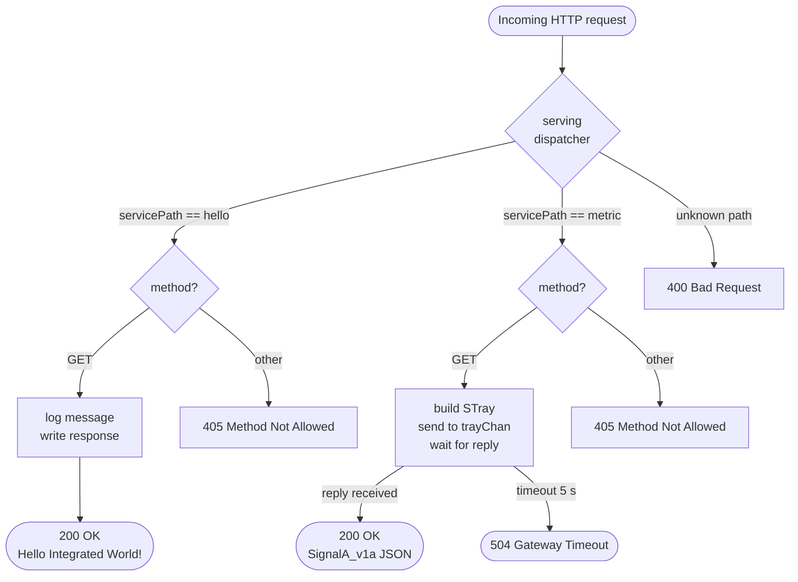
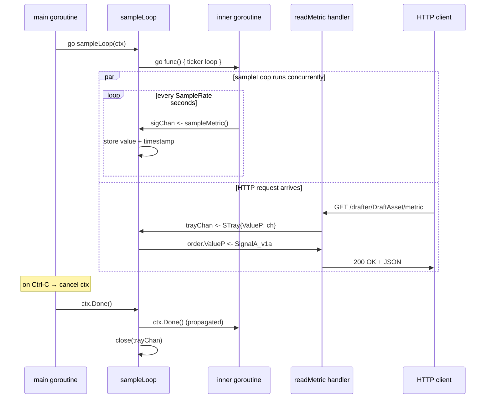
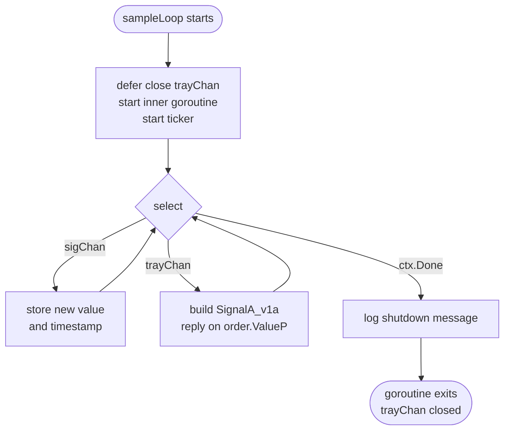

# mbaigo System: Drafter

Drafter is a skeleton / template for building mbaigo unit-asset systems.
It is intended as a starting point for students learning the architecture.

The system exposes **two services** that illustrate the two most common
handler patterns:

| Service | Sub-path | Pattern | Description |
|---|---|---|---|
| `greeting` | `/drafter/<asset>/hello` | Stateless | Returns `Hello Integrated World!` |
| `metric` | `/drafter/<asset>/metric` | Channel (tray) | Returns the live goroutine count |

---

## Architecture

Every mbaigo system is split into two source files:

| File | Responsibility |
|---|---|
| `drafter.go` | `main()` bootstrap and `serving()` HTTP dispatcher |
| `thing.go` | Unit-asset logic — traits, goroutines, service handlers |

### Diagram 1 — Request routing

Every incoming HTTP request is dispatched by `serving()` in `drafter.go`.
The diagram below shows both service paths and their method guards.



### Diagram 2 — Concurrent goroutines

This is where the concurrency lives.  The system runs **three goroutines
simultaneously** after startup: the main HTTP server, the `sampleLoop`, and
an inner ticker goroutine inside `sampleLoop`.  A sequence diagram with a
`par` block shows all three running in parallel.



> **Key insight:** The inner goroutine and the `readMetric` handler never
> talk to each other directly.  All shared state flows through `sampleLoop`,
> which acts as the single owner.  The `par` block above shows that a sensor
> tick and an HTTP request can arrive at the same time — `sampleLoop` handles
> them one at a time via `select`, eliminating the need for a mutex.

### Diagram 3 — The `sampleLoop` select loop

This diagram zooms into `sampleLoop` itself and shows how the three branches
of the `select` statement map to activity paths.



The `sampleLoop` never blocks on I/O itself.  The blocking call
(`sampleMetric()`) happens in the **inner goroutine** and its result is
delivered via `sigChan`.  This means `sampleLoop` can always respond
instantly to an incoming HTTP request, even while a slow sensor read is in
progress.

### The `hello` service — stateless handler

`hello` shows the simplest possible pattern: receive an HTTP request, write
a response, done.  No shared state, no goroutines, no channels.

### The `metric` service — channel tray pattern

`metric` demonstrates the idiomatic Go approach to safe concurrent access.
A background goroutine (`sampleLoop`) owns all mutable state.  HTTP handlers
never touch that state directly; instead they send a *request envelope* (an
`STray`) into a channel and block until `sampleLoop` replies.

Because only one goroutine reads and writes `value` / `tStamp`, there is no
data race and no mutex is needed.  This is the pattern used by every
hardware-facing service in the `systems` repository (see `ds18b20`,
`revolutionary`, `emulator`).

The "sensor" value used here is `runtime.NumGoroutine()` — the number of
live goroutines in the process.  It is built into Go, works on every
platform (Windows, macOS, Linux, Raspberry Pi), and changes in real time as
requests arrive.

---

## Quick start

```bash
# build
go build -o drafter

# run (no Arrowhead core systems required for basic testing)
./drafter
```

On first run without a `systemconfig.json` the binary generates one and
exits so you can review the defaults.  The file is already included in this
repository with sensible starting values.

Test the two services with `curl` or a browser:

```bash
# stateless greeting
curl http://localhost:20192/drafter/DraftAsset/hello

# live goroutine count (SignalA_v1a JSON)
curl http://localhost:20192/drafter/DraftAsset/metric
```

---

## Running the tests

```bash
go test ./...
```

The test suite covers every layer without requiring any hardware or external
services:

| Test | What it checks |
|---|---|
| `TestInitTemplate` | Template name, both services, `SampleRate > 0` |
| `TestSampleMetric` | `sampleMetric()` returns a positive value |
| `TestHello_GET` | Response contains the greeting string |
| `TestHello_MethodNotAllowed` | POST/PUT/DELETE → 405 |
| `TestReadMetric_GET` | Handler receives tray reply → 200 |
| `TestReadMetric_MethodNotAllowed` | POST → 405 |
| `TestServing_Hello` | Dispatcher routes `"hello"` correctly |
| `TestServing_InvalidPath` | Unknown path → 400 |
| `TestSampleLoop_DeliversValues` | Goroutine produces values after first tick |
| `TestSampleLoop_ContextCancel` | Goroutine exits cleanly on cancel |

---

## Adapting Drafter to your own sensor

Four targeted edits in `thing.go` are all that is needed for most sensors:

**1. Replace the sensor read** (one function, one file):

```go
// thing.go – replace the body of sampleMetric()
func sampleMetric() float64 {
    // example: read a DS18B20 temperature sensor
    data, err := os.ReadFile("/sys/bus/w1/devices/28-xxxx/w1_slave")
    ...
    return tempCelsius
}
```

**2. Change the unit string** in `sampleLoop`:

```go
f.Unit = "Celsius"   // was "goroutines"
```

**3. Update `SampleRate`** in `systemconfig.json` if a different interval is needed.

**4. Add or remove services** by editing `initTemplate` in `thing.go` and
adding a matching `case` in `serving()` in `drafter.go`.

---

## Configuration

Edit `systemconfig.json` to match your environment:

| Field | Description |
|---|---|
| `ipAddresses` | IP address(es) of the machine running Drafter |
| `protocolsNports` → `http` | HTTP port (default: `20192`) |
| `unit_assets[0].name` | Asset name, appears in the URL path |
| `unit_assets[0].traits[0].sampleRate` | Seconds between sensor samples (default: `1`) |
| `coreSystems` | URLs for the Arrowhead service registrar, orchestrator, CA, and maitreD |

---

## Building for other platforms

```bash
# Raspberry Pi 4 / 5  (64-bit)
GOOS=linux GOARCH=arm64 go build -o drafter_rpi64

# Windows
GOOS=windows GOARCH=amd64 go build -o drafter.exe
```

---

## Background

The design philosophy behind this system — how unit assets, services, and the
channel tray pattern compose into a larger mbaigo system — is described in:

> van Deventer, J. A. (2025). *A Model Based Implementation of an IoT Framework*.
> Zenodo. <https://doi.org/10.5281/zenodo.18504110>
