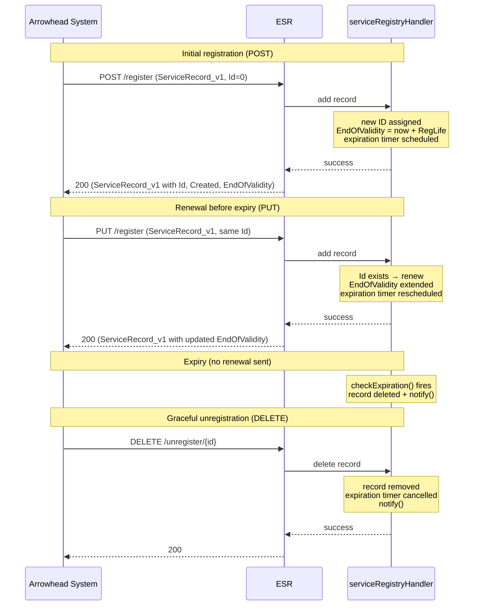
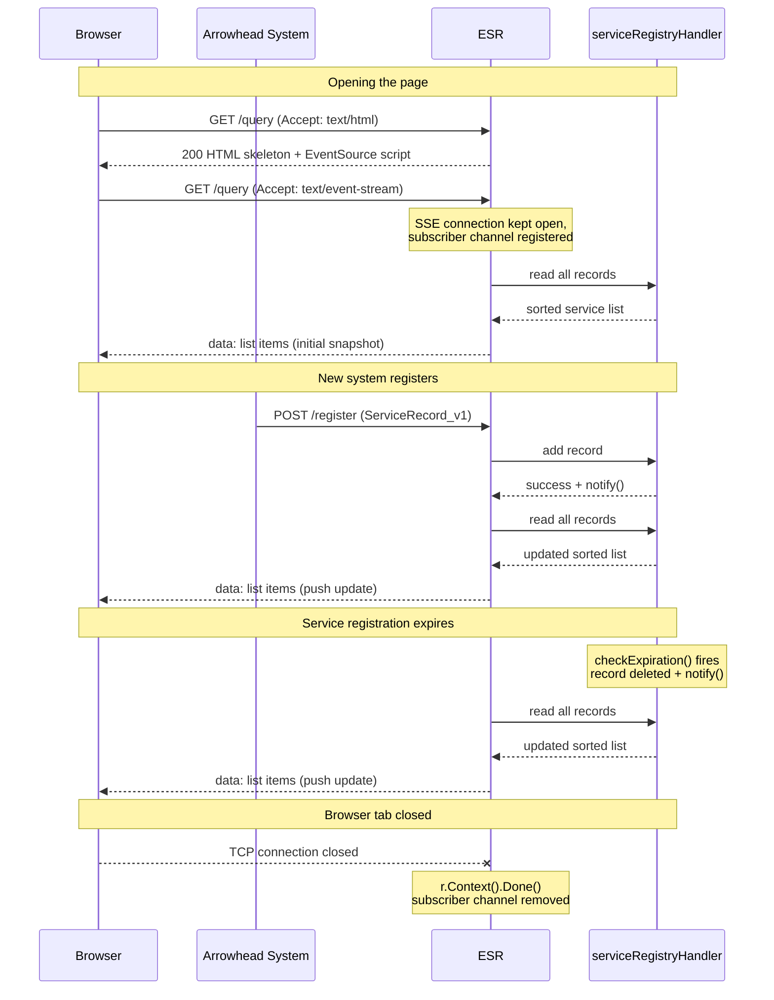

# Ephemeral Service Registry System

The Ephemeral Service Registry (ESR) is a mandatory Arrowhead core system that
tracks the currently available services in a local cloud. It uses an in-memory
map (keyed by a unique integer ID) rather than an SQL database, reflecting the
fact that only the *currently* available services need to be kept — hence
"ephemeral".

If permanent history is needed, the Modeler system with its graph database is
the right complement.

## Services

| Sub-path    | Methods      | Description |
|-------------|--------------|-------------|
| `register`  | POST, PUT    | Register a new service (POST) or renew its expiry time (PUT). |
| `query`     | GET, POST    | Browser view of all registered services (GET) or orchestrator lookup by definition and details (POST). |
| `unregister`| DELETE       | Remove a service record by ID. |
| `status`    | GET          | Reports whether this instance is the leading registrar or on standby. |

## Registration service

An Arrowhead system registers itself by sending a POST to `/register` with a
`ServiceRecord_v1` payload. The ESR assigns an ID, sets the validity window, and
returns the completed record. The system must renew its registration before the
`EndOfValidity` time passes by sending a PUT with the same record (including the
assigned ID); if it does not, `checkExpiration` removes the record automatically.

### Sequence diagram



## Live browser view (Server-Sent Events)

Opening `http://<host>:<port>/serviceregistrar/registry/query` in a browser
returns a page that immediately opens a persistent
[Server-Sent Events](https://developer.mozilla.org/en-US/docs/Web/API/Server-sent_events)
connection back to the same URL. Every time the registry changes — a service
registers, renews, is unregistered, or expires — the server pushes a fresh
sorted snapshot to every open browser tab with no polling and no manual refresh
required.

### Sequence diagram



### Why not polling?

| Approach | Requests while idle | Requests per change |
|---|---|---|
| Browser auto-refresh every 5 s | 12 / min continuously | 1 |
| Server-Sent Events | 0 | 1 push per open tab |

Each open browser tab costs one persistent TCP connection and one goroutine.
For a deployment tool used by a handful of engineers this overhead is
negligible.

## Compilation

After cloning the *Systems* repository, navigate to the `esr` directory and
initialise the module (once only):

```bash
go mod init github.com/sdoque/systems/esr
go mod tidy
```

Run directly:

```bash
go run .
```

On first run the program generates `systemconfig.json` and exits so you can
edit it. On the next run the system starts, prints the URL of its web server,
and is ready to use.

Build for the local machine:

```bash
go build -o esr
```

## Cross-compilation

| Target | Command |
|--------|---------|
| Intel Mac | `GOOS=darwin GOARCH=amd64 go build -o esr_imac` |
| ARM Mac | `GOOS=darwin GOARCH=arm64 go build -o esr_amac` |
| Windows 64 | `GOOS=windows GOARCH=amd64 go build -o esr_win64.exe` |
| Raspberry Pi 64 | `GOOS=linux GOARCH=arm64 go build -o esr_rpi64` |
| Linux x86-64 | `GOOS=linux GOARCH=amd64 go build -o esr_amd64` |

## Testing shutdown

To test graceful shutdown use the terminal (not the IDE debugger):

```bash
go run .
```

Press **Ctrl+C** to send SIGINT. Using the IDE debugger instead simulates
device failure (process kill), which is a different scenario.
