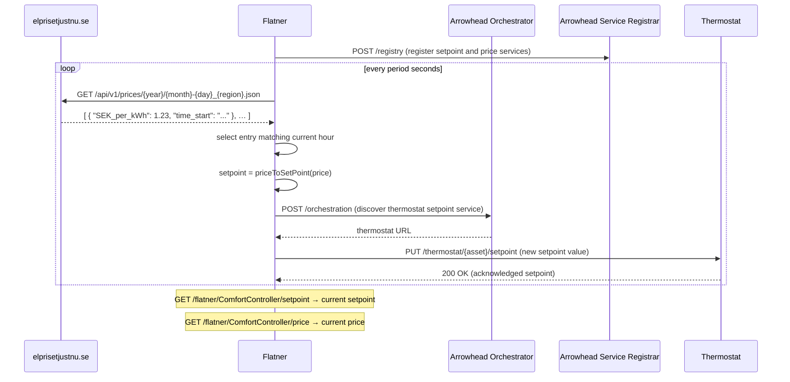

# mbaigo System: Flatner

The word *flatner* refers to the goal of flattening electricity demand peaks. By adjusting a thermostat's setpoint in response to the current spot price of electricity, the system shifts heating load away from expensive peak hours — reducing both cost and grid stress.

The Flatner consumes the hourly electricity spot price from [elprisetjustnu.se](https://www.elprisetjustnu.se) and applies a linear inverse mapping: when the price is high, the setpoint is lowered; when the price is low, the setpoint is raised. The result is pushed directly to the thermostat via the Arrowhead orchestrator.

---

## How the mapping works

The setpoint is computed from the current price using a linear inverse relationship:

```
setpoint = maxSetPoint − (price − minPrice) / (maxPrice − minPrice) × (maxSetPoint − minSetPoint)
```

The ratio is clamped to [0, 1], so prices outside the configured range always resolve to one of the setpoint bounds. The result is rounded to 0.1 °C.

| Price (SEK/kWh) | Setpoint (°C) |
|-----------------|---------------|
| ≤ minPrice      | maxSetPoint   |
| midpoint        | midpoint      |
| ≥ maxPrice      | minSetPoint   |

---

## Sequence diagram



---

## Services

| Sub-path   | Method | Description                                      |
|------------|--------|--------------------------------------------------|
| `setpoint` | GET    | Currently calculated temperature setpoint (°C)  |
| `price`    | GET    | Current electricity spot price (SEK/kWh)        |

---

## Configuration

Traits are set in `systemconfig.json`:

| Field         | Type    | Default | Description                                         |
|---------------|---------|---------|-----------------------------------------------------|
| `minSetPoint` | float64 | 18.0    | Setpoint (°C) when price ≥ maxPrice                 |
| `maxSetPoint` | float64 | 22.0    | Setpoint (°C) when price ≤ minPrice                 |
| `minPrice`    | float64 | 0.50    | Price floor (SEK/kWh) that maps to maxSetPoint      |
| `maxPrice`    | float64 | 3.00    | Price ceiling (SEK/kWh) that maps to minSetPoint    |
| `region`      | string  | "SE2"   | Swedish price region: SE1, SE2, SE3, or SE4         |
| `period`      | int     | 3600    | Update interval in seconds (3600 = once per hour)   |

Example `systemconfig.json` excerpt:

```json
{
    "name": "ComfortController",
    "traits": [{
        "minSetPoint": 18.0,
        "maxSetPoint": 22.0,
        "minPrice": 0.50,
        "maxPrice": 3.00,
        "region": "SE2",
        "period": 3600
    }]
}
```

The Flatner also needs an orchestration rule so it can discover the thermostat's `setpoint` service. Ensure the orchestrator is configured to match a consumer with `definition: "setpoint"` to the thermostat provider.

---

## Price regions

Sweden is divided into four electricity price areas:

| Region | Area          |
|--------|---------------|
| SE1    | Luleå (north) |
| SE2    | Sundsvall     |
| SE3    | Stockholm     |
| SE4    | Malmö (south) |

---

## Compiling

```bash
go build -o flatner
```

Cross-compile for Raspberry Pi 4/5 (64-bit):

```bash
GOOS=linux GOARCH=arm64 go build -o flatner_rpi64
```

Run from its own directory — the system reads and writes `systemconfig.json` locally. If the file is missing, a template is generated and the program exits so you can edit it.
