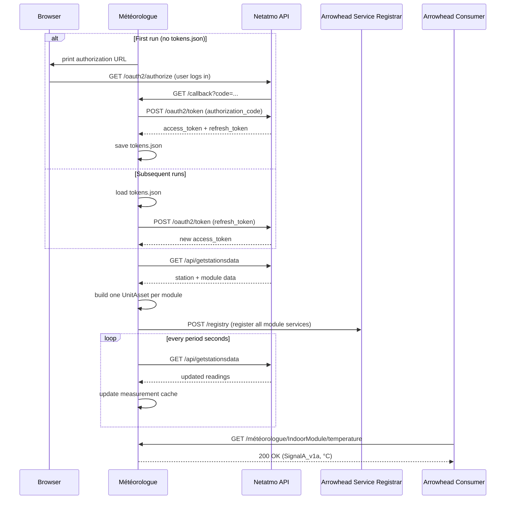

# mbaigo System: Météorologue

The word *météorologue* is French for meteorologist — a nod to Netatmo, a French company. The system bridges a Netatmo personal weather station and an Arrowhead local cloud by exposing each physical sensor module as a set of typed Arrowhead services.

Each Netatmo module type maps to a stable unit asset name, independent of the user-defined names given in the Netatmo app:

| Netatmo type | Asset name      | Services                                              |
|--------------|-----------------|-------------------------------------------------------|
| `NAMain`     | `IndoorModule`  | temperature, humidity, co2, pressure, noise           |
| `NAModule1`  | `OutdoorModule` | temperature, humidity                                 |
| `NAModule2`  | `WindModule`    | wind_speed, wind_angle, gust_speed, gust_angle        |
| `NAModule3`  | `RainModule`    | rain (mm/h), rain_24h (mm)                            |
| `NAModule4`  | `IndoorModule2` | temperature, humidity, co2                            |

The user-defined module name (e.g., `"Kälkholmen Outdoor"`) is carried as `Details["ModuleName"]`, and the station name as `Details["FunctionalLocation"]`, so consumers that discover these services via the orchestrator can filter by location.

---

## Authentication

Netatmo removed password-based API access in 2022. The météorologue uses the **OAuth2 Authorization Code** flow:

1. **First run** — the system starts a local callback server on port 9999, prints an authorization URL, and waits for you to open it in a browser and log in. The resulting tokens are saved to `tokens.json`.
2. **Every subsequent run** — the system loads `tokens.json` and silently refreshes the access token. No browser interaction required.
3. **If the refresh token expires** (after 60 days of non-use) — the browser flow repeats automatically.

You need a free Netatmo developer app to obtain a `clientID` and `clientSecret`: [dev.netatmo.com](https://dev.netatmo.com). These go into `systemconfig.json` and never change.

---

## Sequence diagram



---

## Services

All services are **GET only**. A `SignalA_v1a` form is returned with `value`, `unit`, and `timestamp`.

| Asset           | Sub-path      | Unit   | Description                          |
|-----------------|---------------|--------|--------------------------------------|
| `IndoorModule`  | `temperature` | °C     | Indoor temperature                   |
| `IndoorModule`  | `humidity`    | %      | Indoor relative humidity             |
| `IndoorModule`  | `co2`         | ppm    | CO₂ concentration                    |
| `IndoorModule`  | `pressure`    | mbar   | Atmospheric pressure                 |
| `IndoorModule`  | `noise`       | dB     | Noise level                          |
| `OutdoorModule` | `temperature` | °C     | Outdoor temperature                  |
| `OutdoorModule` | `humidity`    | %      | Outdoor relative humidity            |
| `WindModule`    | `wind_speed`  | km/h   | Wind speed                           |
| `WindModule`    | `wind_angle`  | °      | Wind direction                       |
| `WindModule`    | `gust_speed`  | km/h   | Gust speed                           |
| `WindModule`    | `gust_angle`  | °      | Gust direction                       |
| `RainModule`    | `rain`        | mm/h   | Rainfall in the last hour            |
| `RainModule`    | `rain_24h`    | mm     | Rainfall in the last 24 hours        |

If a module has not yet reported since startup, the service returns `503 Service Unavailable`.

---

## Configuration

Edit `systemconfig.json`:

| Field         | Description                                          |
|---------------|------------------------------------------------------|
| `clientID`    | Netatmo developer app client ID                      |
| `clientSecret`| Netatmo developer app client secret                  |
| `stationName` | Filter to a specific station name; leave empty for the first station found |
| `period`      | Polling interval in seconds (default: 300)           |

Example:

```json
{
    "name": "MeteoStation",
    "traits": [{
        "clientID": "your_netatmo_client_id",
        "clientSecret": "your_netatmo_client_secret",
        "stationName": "",
        "period": 300
    }]
}
```

Netatmo modules report to the cloud every 5–10 minutes, so a `period` below 300 s will not yield fresher data.

---

## Compiling

```bash
go build -o météorologue
```

Cross-compile for Raspberry Pi 4/5 (64-bit):

```bash
GOOS=linux GOARCH=arm64 go build -o météorologue_rpi64
```

Run from its own directory — the system reads `systemconfig.json` and writes `tokens.json` locally.
