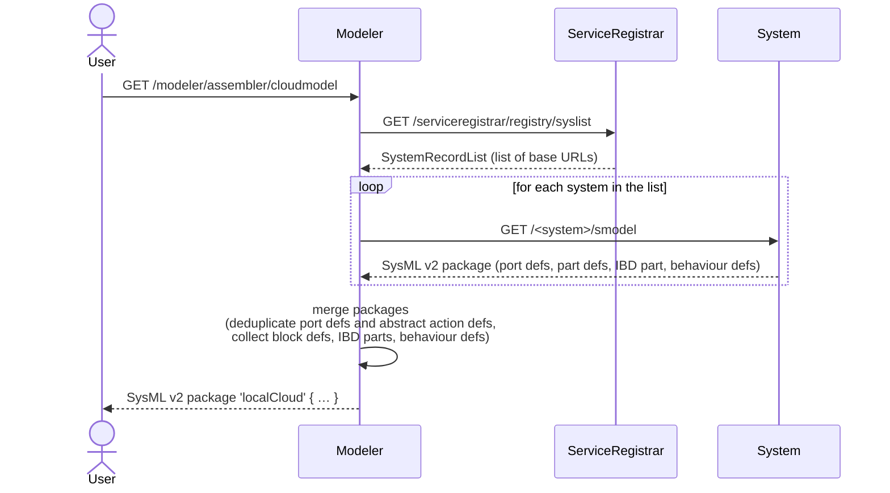

# mbaigo System: Modeler

## Purpose

The Modeler system assembles a complete **SysML v2** structural and behavioural model of a local cloud — a distributed system of systems — by collecting the individual model fragment of each registered system and merging them into a single, coherent package.

The output covers:
- **mAF library** — a SysML v2 package that defines the Arrowhead vocabulary (`ArrowheadSystem`, `ServiceRegistrar`, `Orchestrator`, `CertificateAuthority`, `UnitAsset`, `Host`, `LocalCloud`, plus the abstract actions `GetState`/`SetState`/`Compute`). Emitted inline at the top of every assembled cloud package so the output is self-contained. The library source lives in [`mAF.sysml`](mAF.sysml) and is embedded at compile time via `go:embed`.
- **Block Definition Diagram (BDD)** — concrete part defs for each system and unit asset, all specialised from mAF abstractions (`:> ArrowheadSystem`, `:> UnitAsset`, etc.) plus a `<cloudName>Def` specialisation of `LocalCloud` that lists the hosts and systems in the deployment
- **Internal Block Diagram (IBD)** — the instantiated parts with their host metadata and live service connections at the time of the request
- **Behaviour Definitions** — per-asset action sequences derived from each unit asset's consumed services, when those cervices carry a `Mode` ("get" or "set")

The model is generated on demand by issuing an HTTP GET to the `cloudmodel` service.
It is expressed in [SysML v2 textual notation](https://www.omg.org/spec/SysML/2.0) and returned as plain text.

## Relationship to AFO

The [AFO OWL ontology](https://github.com/sdoque/kgrapher) and the mAF SysML library describe the same domain — an Arrowhead local cloud — from two complementary angles:

| Concern                         | AFO (OWL)       | mAF (SysML v2)                   |
|---------------------------------|-----------------|----------------------------------|
| Class reasoning                 | Yes             | Limited (specialisation only)    |
| Property chains, inverses       | Yes             | No                               |
| Structural composition          | Weak            | First-class (`part def`, `part`) |
| Ports, items, data flows        | No              | First-class                      |
| Behaviour (action sequences)    | No              | First-class (`action def`)       |
| Connections between parts       | Derivable       | First-class (`connect`)          |

The kgrapher emits AFO instances; the modeler emits mAF-specialised SysML v2. The two outputs are views of the same runtime topology, each suited to different tooling.

## How it works



Each system's `/smodel` endpoint (provided by the `mbaigo` framework) generates a SysML v2 fragment with:
- **port defs** — one per unique service definition (provided or consumed)
- **part defs** — one for the system (named `<system>System`, specialised from an mAF type — `ServiceRegistrar`/`Orchestrator`/`CertificateAuthority` for core systems, `ArrowheadSystem` for domain systems) and one per unit asset (named `<system>_<asset>UnitAsset`, specialised from `UnitAsset`). Asset type names are qualified by the system to prevent collisions when two systems happen to use the same asset name.
- **IBD part** — the instantiated system with its host metadata, provided service URLs as comments, and `@connect` annotations for any already-resolved service providers
- **behaviour defs** — one `action def` per unit asset whose cervices carry a `Mode`, with a linear `first X then Y;` sequence referencing mAF's abstract `GetState`/`SetState`/`Compute` action defs

The Modeler deduplicates `port def` declarations, emits the mAF library inline at the top of the output, wraps the per-system defs in a `package '<cloudName>' { import mAF::*; ... }`, emits a concrete `<cloudName>Def :> LocalCloud` type listing the hosts and systems, and produces a `LocalCloud` IBD instance that holds the actual host/system attribute values (via `redefines`) plus **formal `connect` statements** resolved from each consumer's `@connect` URL against the providers seen in the same assembly pass.

## Output example

```sysml
// mAF — the mbaigo Arrowhead Framework library (emitted inline at the top)
package mAF {
    abstract action def GetState;
    abstract action def SetState;
    abstract action def Compute;

    part def Host {
        attribute name : String;
        attribute ipAddress : String[*];
    }

    abstract part def UnitAsset {
        attribute mission : String;
    }

    abstract part def ArrowheadSystem {
        attribute name : String;
        attribute host : String;
    }
    abstract part def CoreSystem             :> ArrowheadSystem;
    abstract part def ServiceRegistrar       :> CoreSystem;
    abstract part def Orchestrator           :> CoreSystem;
    abstract part def CertificateAuthority   :> CoreSystem;

    abstract part def LocalCloud {
        attribute name : String;
    }
}

package 'AlphaCloud' {

    import mAF::*;

    // ── Port Definitions ─────────────────────────────────────────────────────
    port def 'temperature';
    port def 'rotation';
    port def 'setpoint';
    ...

    // ── Block Definitions (BDD) ──────────────────────────────────────────────
    part def 'thermostatSystem' :> ArrowheadSystem {
        attribute name : String = "thermostat";
        attribute host : String;
        attribute httpPort : Integer;
        part 'controller_1' : 'thermostat_controller_1UnitAsset';
    }

    part def 'thermostat_controller_1UnitAsset' :> UnitAsset {
        attribute mission : String = "control_heater";
        out port 'setpoint'     : 'setpoint';      // provided
        out port 'thermalerror' : 'thermalerror';  // provided
        in port  'temperature'  : 'temperature';   // consumed
        in port  'rotation'     : 'rotation';      // consumed
        perform action behave : 'thermostat_controller_1Behavior';
    }

    part def 'serviceregistrarSystem' :> ServiceRegistrar { ... }
    part def 'orchestratorSystem'     :> Orchestrator     { ... }
    ...

    part def 'AlphaCloudDef' :> LocalCloud {
        part canbus : Host;
        part thermostat : 'thermostatSystem';
        part ds18b20    : 'ds18b20System';
        ...
    }

    // ── Behaviour Definitions ────────────────────────────────────────────────
    action def 'thermostat_controller_1Behavior' {
        action 'get_temperature' : GetState;
        action compute           : Compute;
        action 'set_rotation'    : SetState;

        first 'get_temperature' then compute;
        first compute then 'set_rotation';
    }
    ...

    // ── Internal Block Diagram (IBD) ─────────────────────────────────────────
    part 'AlphaCloud' : 'AlphaCloudDef' {
        attribute name : String = "AlphaCloud";

        part redefines canbus {
            attribute name : String = "canbus";
            attribute ipAddress : String = "192.168.1.10";
        }

        part redefines thermostat {
            attribute host : String = "canbus";
            attribute httpPort : Integer = 20152;
            // provides: http://192.168.1.10:20152/thermostat/controller_1/setpoint
        }
        ...

        // ── Connections ──────────────────────────────────────────────────────
        connect thermostat.controller_1.temperature to ds18b20.'28-00000f030344'.temperature;
    }
}
```

## Behaviour generation

A behaviour block is emitted for a unit asset when at least one of its consumed services (cervices) carries a `Mode` field set to `"get"` or `"set"`.  The sequence is always linear:

1. all `"get"` cervices (sorted alphabetically) — each becomes a `GetState` action
2. a `compute` step (`Compute`) — inserted only when both gets and sets are present
3. all `"set"` cervices (sorted alphabetically) — each becomes a `SetState` action

Consecutive steps are linked with `first X then Y;` pairs.

## Extending the mAF library

The [`mAF.sysml`](mAF.sysml) file is the source of truth for the Arrowhead vocabulary in SysML v2 terms. If you add a new core system category, a new kind of action, or want to tighten cardinality constraints on `LocalCloud`, edit that file directly — the change takes effect on the next `go build` because the library is embedded at compile time. No Go code needs to be touched unless you also change how concrete systems specialise from it (that logic lives in `mbaigo/usecases/smodeling.go`).

Guidelines:
- Keep mAF **abstract**. Concrete part defs belong in the generated output, not in the library.
- Keep mAF **aligned with AFO**. If you add a class to AFO, add the equivalent abstract part def to mAF (or explain why it doesn't map).
- mAF expresses what SysML v2 can natively express. Reasoning that belongs in OWL (property chains, class intersections) stays in AFO.

## Configuration

The only configurable trait is the name of the merged package:

```json
"traits": [{ "cloudName": "myLocalCloud" }]
```

If omitted, the package is named `localCloud`.

## Compiling

Initialise the module once (already done if `go.mod` is present):

```bash
go mod init github.com/sdoque/systems/modeler
go mod tidy
```

Run directly from the system's directory:

```bash
go run .
```

> It is **important** to start the program from within its own directory because it looks for `systemconfig.json` there. If the file is absent, a default one is generated and the program stops so the file can be reviewed and adjusted before the next start.

The address of the running web server is printed at startup and can be opened in any browser.

To build a binary for the local machine:

```bash
go build -o modeler_local
```

## Cross-compiling

| Target | Command |
|--------|---------|
| Raspberry Pi 64-bit | `GOOS=linux GOARCH=arm64 go build -o modeler_rpi64` |
| Linux x86-64 | `GOOS=linux GOARCH=amd64 CGO_ENABLED=0 go build -o modeler_linux_amd64` |
| macOS Apple Silicon | `GOOS=darwin GOARCH=arm64 go build -o modeler_mac_arm64` |

A full list of supported platforms: `go tool dist list`

To copy the binary to a remote host:

```bash
scp modeler_rpi64 user@192.168.1.x:~/demo/modeler/
```
