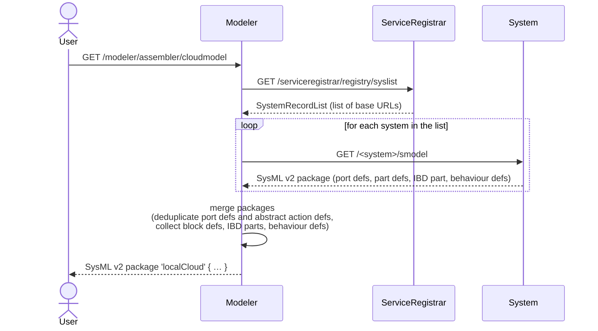

# mbaigo System: Modeler

## Purpose

The Modeler system assembles a complete **SysML v2** structural and behavioural model of a local cloud — a distributed system of systems — by collecting the individual model fragment of each registered system and merging them into a single, coherent package.

The output covers:
- **Block Definition Diagram (BDD)** — the types of all systems and their unit assets, with the services they provide and consume
- **Internal Block Diagram (IBD)** — the instantiated parts with their host metadata and live service connections at the time of the request
- **Behaviour Definitions** — per-asset action sequences derived from each unit asset's consumed services, when those cervices carry a `Mode` ("get" or "set")

The model is generated on demand by issuing an HTTP GET to the `cloudmodel` service.
It is expressed in [SysML v2 textual notation](https://www.omg.org/spec/SysML/2.0) and returned as plain text.

## How it works



Each system's `/smodel` endpoint (provided by the `mbaigo` framework) generates a self-contained SysML v2 `package` with:
- **port defs** — one per unique service definition (provided or consumed)
- **part defs** — one for the system (named `<system>System`) and one per unit asset (named `<system>_<asset>UnitAsset`), carrying `in`/`out` ports and the unit asset's `mission` attribute. Asset type names are qualified by the system to prevent collisions when two systems happen to use the same asset name.
- **IBD part** — the instantiated system with its host metadata, provided service URLs as comments, and `@connect` annotations for any already-resolved service providers
- **abstract action defs** — `GetState`, `SetState`, `Compute` (only those actually used)
- **behaviour defs** — one `action def` per unit asset whose cervices carry a `Mode`, with a linear `first X then Y;` sequence

The Modeler deduplicates `port def` and `abstract action def` declarations, emits a `Host` type and a `LocalCloud` type whose body lists every host and every system as a part usage, and wraps everything in a single `LocalCloud` IBD instance that holds the actual host/system attribute values plus **formal `connect` statements** resolved from each consumer's `@connect` URL against the providers seen in the same assembly pass.

## Output example

```sysml
package 'AlphaCloud' {

    // ── Port Definitions ─────────────────────────────────────────────────────
    port def 'temperature';
    port def 'rotation';
    port def 'setpoint';
    ...

    // ── Abstract Action Definitions ──────────────────────────────────────────
    abstract action def GetState;
    abstract action def SetState;
    abstract action def Compute;

    // ── Host Definition ──────────────────────────────────────────────────────
    part def 'Host' {
        attribute name : String;
        attribute ipAddress : String[*];
    }

    // ── Block Definitions (BDD) ──────────────────────────────────────────────
    part def 'thermostatSystem' {
        attribute name : String = "thermostat";
        part 'controller_1' : 'thermostat_controller_1UnitAsset';
    }

    part def 'thermostat_controller_1UnitAsset' {
        attribute mission : String = "control_heater";
        out port 'setpoint'     : ~'setpoint';      // provided
        out port 'thermalerror' : ~'thermalerror';  // provided
        in port  'temperature'  : 'temperature';    // consumed
        in port  'rotation'     : 'rotation';       // consumed
        perform 'thermostat_controller_1Behavior';
    }
    ...

    part def 'LocalCloud' {
        attribute name : String;
        part canbus : 'Host';
        part thermostat : 'thermostatSystem';
        part ds18b20    : 'ds18b20System';
        ...
    }

    // ── Behaviour Definitions ────────────────────────────────────────────────
    action def 'thermostat_controller_1Behavior' {
        action 'get_temperature' : GetState;
        action compute           : Compute;
        action 'set_rotation'    : SetState;

        first 'get_temperature' then compute;
        first compute then 'set_rotation';
    }
    ...

    // ── Internal Block Diagram (IBD) ─────────────────────────────────────────
    part 'AlphaCloud' : 'LocalCloud' {
        attribute name : String = "AlphaCloud";

        part canbus : 'Host' {
            attribute name : String = "canbus";
            attribute ipAddress : String = "192.168.1.10";
        }

        part thermostat : 'thermostatSystem' {
            attribute host : String = "canbus";
            attribute httpPort : Integer = 20152;
            // provides: http://192.168.1.10:20152/thermostat/controller_1/setpoint
        }
        ...

        // ── Connections ──────────────────────────────────────────────────────
        connect thermostat.controller_1.temperature to ds18b20.'28-00000f030344'.temperature;
    }
}
```

## Behaviour generation

A behaviour block is emitted for a unit asset when at least one of its consumed services (cervices) carries a `Mode` field set to `"get"` or `"set"`.  The sequence is always linear:

1. all `"get"` cervices (sorted alphabetically) — each becomes a `GetState` action
2. a `compute` step (`Compute`) — inserted only when both gets and sets are present
3. all `"set"` cervices (sorted alphabetically) — each becomes a `SetState` action

Consecutive steps are linked with `first X then Y;` pairs.

## Configuration

The only configurable trait is the name of the merged package:

```json
"traits": [{ "cloudName": "myLocalCloud" }]
```

If omitted, the package is named `localCloud`.

## Compiling

Initialise the module once (already done if `go.mod` is present):

```bash
go mod init github.com/sdoque/systems/modeler
go mod tidy
```

Run directly from the system's directory:

```bash
go run .
```

> It is **important** to start the program from within its own directory because it looks for `systemconfig.json` there. If the file is absent, a default one is generated and the program stops so the file can be reviewed and adjusted before the next start.

The address of the running web server is printed at startup and can be opened in any browser.

To build a binary for the local machine:

```bash
go build -o modeler_local
```

## Cross-compiling

| Target | Command |
|--------|---------|
| Raspberry Pi 64-bit | `GOOS=linux GOARCH=arm64 go build -o modeler_rpi64` |
| Linux x86-64 | `GOOS=linux GOARCH=amd64 CGO_ENABLED=0 go build -o modeler_linux_amd64` |
| macOS Apple Silicon | `GOOS=darwin GOARCH=arm64 go build -o modeler_mac_arm64` |

A full list of supported platforms: `go tool dist list`

To copy the binary to a remote host:

```bash
scp modeler_rpi64 user@192.168.1.x:~/demo/modeler/
```
