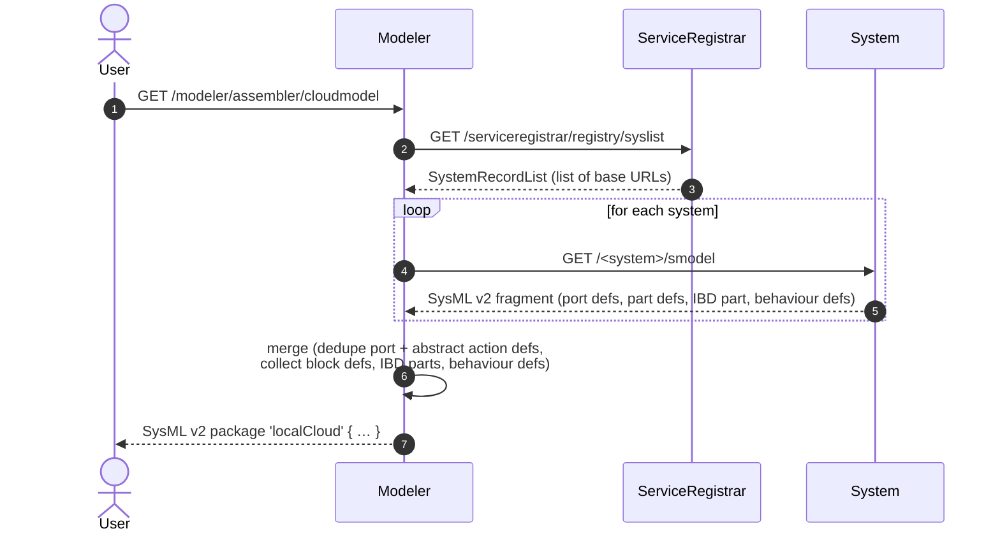

# mbaigo System: Modeler

## Purpose

The *Modeler* assembles a complete **SysML v2** structural and behavioural
model of an Arrowhead local cloud — a distributed system of systems — by
collecting the per-system model fragment from each registered system and
merging them into a single, coherent SysML v2 package. The result is what
SysML v2 tooling reads when it wants to visualise, validate, or reason
about the cloud as a whole.

The output covers:

- **mAF library** — a SysML v2 package that defines the Arrowhead
  vocabulary (`ArrowheadSystem`, `ServiceRegistrar`, `Orchestrator`,
  `CertificateAuthority`, `UnitAsset`, `Host`, `LocalCloud`, plus the
  abstract actions `GetState` / `SetState` / `Compute`). Emitted inline at
  the top of every assembled cloud package so the output is
  self-contained. The library source lives in [`mAF.sysml`](mAF.sysml)
  and is embedded at compile time via `go:embed`.
- **Block Definition Diagram (BDD)** — concrete part defs for each system
  and unit asset, all specialised from mAF abstractions
  (`:> ArrowheadSystem`, `:> UnitAsset`, etc.) plus a `<cloudName>Def`
  specialisation of `LocalCloud` listing the hosts and systems.
- **Internal Block Diagram (IBD)** — the instantiated parts with host
  metadata and live service connections resolved at request time.
- **Behaviour Definitions** — per-asset action sequences derived from
  each unit asset's consumed services when those cervices carry a
  `Mode` (`"get"` or `"set"`).

The model is generated **on demand** by issuing an HTTP GET to the
`cloudmodel` service. It is expressed in [SysML v2 textual
notation](https://www.omg.org/spec/SysML/2.0) and returned as plain text.

## Architecture

The Modeler is an **aggregator system**, the SysML v2 sibling of the
[kgrapher](../kgrapher/) (which plays the same role for OWL/RDF). Both
discover every system via the Service Registrar, fetch each system's
per-system meta-view, deduplicate and merge, hand back the combined
result. The Modeler does no per-system model generation; it only
orchestrates collection and merging.

The Modeler is **demand-driven** — there is no background timer. Each
GET on `/cloudmodel` triggers a fresh collect + merge. Consumers that
want a current view ask for one.

## Relationship to AFO

The [AFO OWL ontology](https://github.com/sdoque/kgrapher) and the mAF
SysML library describe the same domain — an Arrowhead local cloud — from
two complementary angles:

| Concern                         | AFO (OWL)       | mAF (SysML v2)                   |
|---------------------------------|-----------------|----------------------------------|
| Class reasoning                 | Yes             | Limited (specialisation only)    |
| Property chains, inverses       | Yes             | No                               |
| Structural composition          | Weak            | First-class (`part def`, `part`) |
| Ports, items, data flows        | No              | First-class                      |
| Behaviour (action sequences)    | No              | First-class (`action def`)       |
| Connections between parts       | Derivable       | First-class (`connect`)          |

The kgrapher emits AFO instances; the modeler emits mAF-specialised
SysML v2. The two outputs are views of the same runtime topology, each
suited to different tooling.

## How it fits in the cloud



Each system's `/smodel` endpoint (provided by the `mbaigo` framework)
generates a SysML v2 fragment with:

- **port defs** — one per unique service definition (provided or consumed).
- **part defs** — one for the system (named `<system>System`, specialised
  from an mAF type — `ServiceRegistrar` / `Orchestrator` /
  `CertificateAuthority` for core systems, `ArrowheadSystem` for domain
  systems) and one per unit asset (named `<system>_<asset>UnitAsset`,
  specialised from `UnitAsset`). Asset type names are qualified by the
  system to prevent collisions when two systems happen to use the same
  asset name.
- **IBD part** — the instantiated system with its host metadata,
  provided service URLs as comments, and `@connect` annotations for any
  already-resolved service providers.
- **behaviour defs** — one `action def` per unit asset whose cervices
  carry a `Mode`, with a linear `first X then Y;` sequence referencing
  mAF's abstract `GetState` / `SetState` / `Compute` action defs.

The Modeler deduplicates `port def` declarations, emits the mAF library
inline at the top of the output, wraps the per-system defs in a
`package '<cloudName>' { import mAF::*; ... }`, emits a concrete
`<cloudName>Def :> LocalCloud` type listing hosts and systems, and
produces a `LocalCloud` IBD instance that holds the actual host/system
attribute values (via `redefines`) plus **formal `connect` statements**
resolved from each consumer's `@connect` URL against the providers seen
in the same assembly pass.

## Services

### Provided

| Service definition | Subpath | Methods | Description |
|--------------------|---------|---------|-------------|
| `cloudmodel` | `cloudmodel` | `GET` | Assembles the cloud's SysML v2 model from every registered system and returns the merged package as `text/plain` |

### Consumed (via Arrowhead orchestration)

| Service definition | Used for |
|--------------------|----------|
| Pulled from every registered system via `/<system>/smodel` | Per-system SysML v2 fragments to merge |

## Configuration

```json
{
    "systemname": "modeler",
    "unit_assets": [
        {
            "name": "assembler",
            "details": { "Type": ["Interactive"] },
            "services": [
                {
                    "definition": "cloudmodel",
                    "subpath": "cloudmodel",
                    "details": { "Format": ["SysML v2"] },
                    "registrationPeriod": 61
                }
            ],
            "traits": [
                { "cloudName": "myLocalCloud" }
            ]
        }
    ],
    "protocolsNports": { "coap": 0, "http": 20106, "https": 0 },
    "coreSystems": [ /* serviceregistrar, orchestrator, ca, maitreD */ ]
}
```

### Trait reference

| Field | Type | Default | Description |
|-------|------|---------|-------------|
| `cloudName` | string | `"localCloud"` | Name used for the merged SysML v2 package and for the concrete `<cloudName>Def :> LocalCloud` type |

## Behaviour generation

A behaviour block is emitted for a unit asset when at least one of its
consumed services (cervices) carries a `Mode` field set to `"get"` or
`"set"`. The sequence is always linear:

1. all `"get"` cervices (sorted alphabetically) — each becomes a
   `GetState` action.
2. a `compute` step (`Compute`) — inserted only when both gets and sets
   are present.
3. all `"set"` cervices (sorted alphabetically) — each becomes a
   `SetState` action.

Consecutive steps are linked with `first X then Y;` pairs.

## Extending the mAF library

The [`mAF.sysml`](mAF.sysml) file is the source of truth for the
Arrowhead vocabulary in SysML v2 terms. If you add a new core system
category, a new kind of action, or want to tighten cardinality
constraints on `LocalCloud`, edit that file directly — the change takes
effect on the next `go build` because the library is embedded at compile
time. No Go code needs to be touched unless you also change how concrete
systems specialise from it (that logic lives in
`mbaigo/usecases/smodeling.go`).

Guidelines:

- Keep mAF **abstract**. Concrete part defs belong in the generated
  output, not in the library.
- Keep mAF **aligned with AFO**. If you add a class to AFO, add the
  equivalent abstract part def to mAF (or explain why it doesn't map).
- mAF expresses what SysML v2 can natively express. Reasoning that
  belongs in OWL (property chains, class intersections) stays in AFO.

## Output example

```sysml
// mAF — the mbaigo Arrowhead Framework library (emitted inline at the top)
package mAF {
    private import ScalarValues::String;
    private import ScalarValues::Integer;

    abstract action def GetState;
    abstract action def SetState;
    abstract action def Compute;

    part def Host {
        attribute name : String;
        attribute ipAddress : String[*];
    }

    abstract part def UnitAsset {
        attribute mission : String;
    }

    abstract part def ArrowheadSystem {
        attribute name : String;
        attribute host : String;
    }
    abstract part def CoreSystem             :> ArrowheadSystem;
    abstract part def ServiceRegistrar       :> CoreSystem;
    abstract part def Orchestrator           :> CoreSystem;
    abstract part def CertificateAuthority   :> CoreSystem;

    abstract part def LocalCloud {
        attribute name : String;
    }
}

package 'AlphaCloud' {

    private import ScalarValues::String;
    private import ScalarValues::Integer;
    private import mAF::*;

    // ── Port Definitions ─────────────────────────────────────────────────────
    port def 'Temperature';
    port def 'Rotation';
    port def 'Setpoint';
    // …

    // ── Block Definitions (BDD) ──────────────────────────────────────────────
    part def 'thermostatSystem' :> ArrowheadSystem {
        attribute redefines name : String = "thermostat";
        attribute redefines host : String;
        attribute httpPort : Integer;
        part 'controller_1' : 'thermostat_controller_1UnitAsset';
    }

    part def 'thermostat_controller_1UnitAsset' :> UnitAsset {
        attribute redefines mission : String = "control_heater";
        out port 'setpoint'     : 'Setpoint';      // provided
        out port 'thermalerror' : 'Thermalerror';  // provided
        in port  'temperature'  : 'Temperature';   // consumed
        in port  'rotation'     : 'Rotation';      // consumed
        perform action behave : 'thermostat_controller_1Behavior';
    }

    part def 'serviceregistrarSystem' :> ServiceRegistrar { /* … */ }
    part def 'orchestratorSystem'     :> Orchestrator     { /* … */ }

    part def 'AlphaCloudDef' :> LocalCloud {
        part canbus : Host;
        part thermostat : 'thermostatSystem';
        part ds18b20    : 'ds18b20System';
        // …
    }

    // ── Behaviour Definitions ────────────────────────────────────────────────
    action def 'thermostat_controller_1Behavior' {
        action 'get_temperature' : GetState;
        action compute           : Compute;
        action 'set_rotation'    : SetState;

        first 'get_temperature' then compute;
        first compute then 'set_rotation';
    }

    // ── Internal Block Diagram (IBD) ─────────────────────────────────────────
    part 'AlphaCloud' : 'AlphaCloudDef' {
        attribute redefines name : String = "AlphaCloud";

        part redefines canbus {
            attribute redefines name : String = "canbus";
            attribute redefines ipAddress : String = "192.168.1.10";
        }

        part redefines thermostat {
            attribute redefines host : String = "canbus";
            attribute redefines httpPort : Integer = 20152;
            // provides: http://192.168.1.10:20152/thermostat/controller_1/setpoint
        }

        // ── Connections ──────────────────────────────────────────────────────
        connect thermostat.controller_1.temperature to ds18b20.'28-00000f030344'.temperature;
    }
}
```

## Building and running

```bash
# Run from source (development)
go run .

# Build a binary for the current machine
go build -o modeler_amac .

# Cross-compile for a 64-bit Raspberry Pi
GOOS=linux GOARCH=arm64 go build -o modeler_rpi64 .

# Deploy
scp modeler_rpi64 jan@<pi-host>:oslo/modeler/
```

Run the binary from **inside its own directory** so it can find (or
auto-generate) `systemconfig.json`. A full list of supported platforms:
`go tool dist list`.

## Startup order

```
Arrowhead core systems  →  Modeler  →  any consumer
```

The Modeler is **demand-driven and stateless** — it pulls from the
registrar on each request, so application systems can join after it's
already running. The first `/cloudmodel` request after a system joins
will include that system's fragment automatically.

## Development with a local mbaigo clone

Add both modules to the workspace `go.work` at the repository root:

```
use ./mbaigo
use ./systems/modeler
```

Or add a `replace` directive to `go.mod`:

```
require github.com/sdoque/mbaigo v0.x.x
replace github.com/sdoque/mbaigo => ../../mbaigo
```
