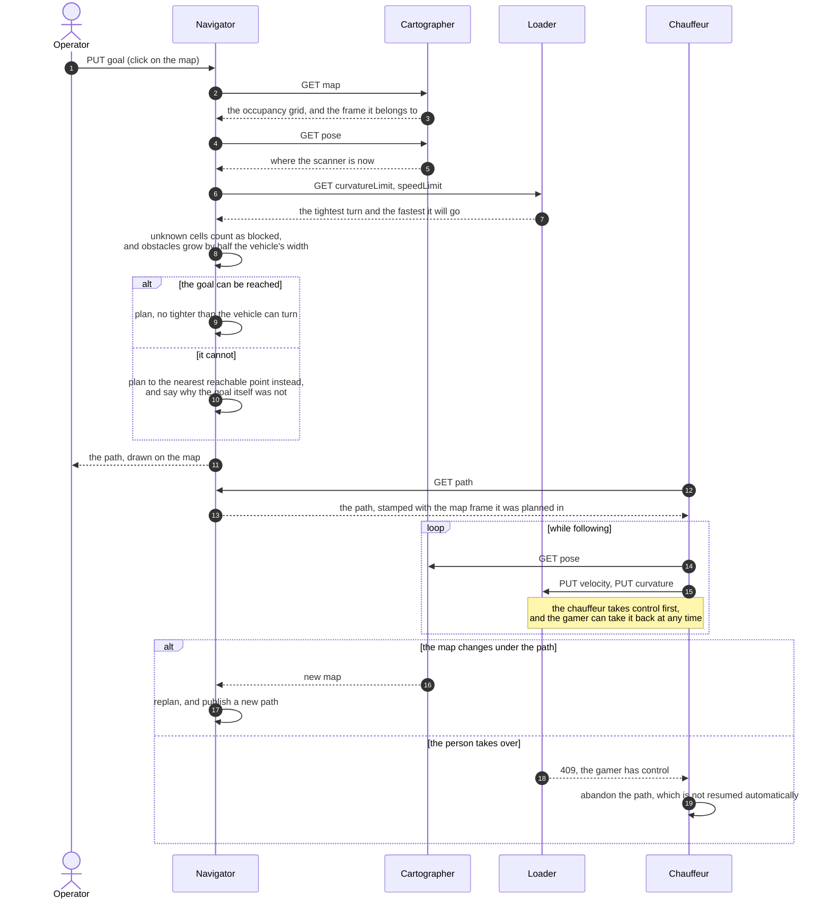

# navigator

> **Not built yet.** There is no code in this directory: this is the design, so
> that the shape is agreed before it is written, and so the diagram below can be
> read alongside the [cartographer](../cartographer/), the
> [loader](../loader/) and the chauffeur that will follow it. Nothing here has
> run.

Plans a path through the map the [cartographer](../cartographer/) is building,
to wherever someone wants the vehicle to go, and hands that path to the
chauffeur, which follows it.

The split is the usual one: the navigator is the **global planner**, working in
the map and thinking in meters; the chauffeur is the **local controller**,
working from the pose and thinking in velocity and curvature. Neither touches a
motor — both command the loader, which is the vehicle.

## Services

| service | what it is |
|---|---|
| `goal` | **PUT** where the vehicle should go, in the map frame; **GET** the goal it is working to |
| `path` | the planned path: a series of poses from where the vehicle is to where it can get |
| `status` | planning, following, arrived, or why it could not |
| a browser view | the map, the pose and the path, with the goal set by clicking on it |

## Planning a route

## Decisions already made

- **The goal may be unreachable, and saying so is part of the job.** The
  navigator plans to the closest point it can reach and reports why the goal
  itself was refused — occupied, unknown, outside the map.
- **Unknown is not free.** Cells the laser has never seen are obstacles for
  planning purposes.
- **The path carries the map frame it was planned in.** The cartographer's map
  begins where its first sweep was taken, so a restart invalidates every path
  and every goal. The chauffeur refuses a path whose frame does not match the
  pose it is reading.
- **The curvature limit comes from the loader**, which owns the geometry. At
  full articulation the Artitrax turns on about a 1.7 m radius, so a corridor
  is too narrow to turn round in: turning places have to be planned for.
- **Reversing is blind.** There is no sensor on the back, so a reversing leg may
  only cross space the laser has already seen, slowly and briefly.
- **A path is not resumed after a person takes over.** They may have moved the
  machine; the goal is posted again.

## Still open

- Which planner: a grid search with inflated obstacles is enough for forward
  driving in corridors; turning round needs one that plans reversing legs.
- Whether the path is a new form in mbaigo, or a series of poses in the forms
  that exist.
- Who may set a goal, once setting one makes the vehicle move.
