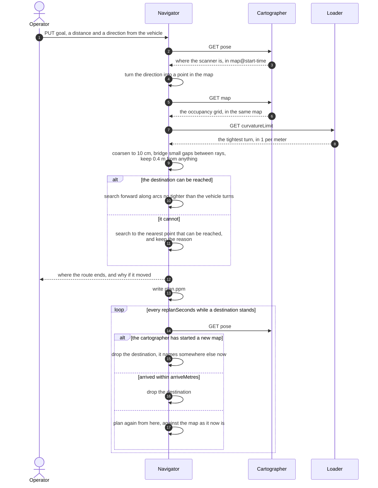

# navigator

Plans a route through the map the [cartographer](../cartographer/) is building,
to wherever it is asked to go — forward only, no tighter than the vehicle can
turn, and to the nearest point it can reach when the destination itself cannot
be reached, saying why.

It plans; it does not drive. The route is a service that a chauffeur will
follow. Until there is one, the navigator is how to see what the vehicle
*would* do: set a destination by curl, and look at the picture.

> **Tested on the bench, not yet on the vehicle.** Run against the simulated
> guetteur and the cartographer on a laptop: routes of 8 and 15 m down a
> simulated corridor in about 25 ms, the loop case in unit tests. Not yet run on
> the Artitrax's own maps.

## Services

| service | form | what it does |
|---|---|---|
| `goal` | `PolarA_v1a` or `PoseA_v1a` | **PUT** a destination and a route is planned to it; **GET** where the route ends; **DELETE** drops it |
| `path` | `PathA_v1a` | the planned route, stamped with the map it was planned in |

It consumes the cartographer's `map` and `pose`, and the loader's
`curvatureLimit`.

## Setting a destination with curl

**By distance and direction from the vehicle** — the easy one to type:

```bash
curl -i -X PUT http://<host>:20204/navigator/Planner/goal \
     -H "Content-Type: application/json" \
     -d '{"magnitude": 12, "direction": 0, "frame": "vehicle", "version": "PolarA_v1.0"}'
```

That is 12 m straight ahead. The direction is in degrees, **0 straight ahead and
positive to the left** (ISO 8855): `90` is 12 m to the left, `-30` is ahead and
to the right.

**At a point in the map**, when you know one — from the picture, say:

```bash
curl -i -X PUT http://<host>:20204/navigator/Planner/goal \
     -H "Content-Type: application/json" \
     -d '{"x": 14.5, "y": 2.0, "version": "PoseA_v1.0"}'
```

The answer is the point the route actually ends at. If that is not what was
asked for, the reason is in the log and in the response's `Warning` header —
which `curl -i` shows:

```
HTTP/1.1 200 OK
Warning: 299 navigator "the goal is closer than 0.40 m to a wall; planned to the nearest point that can be reached"
```

Then read the route, and drop it when you are done:

```bash
curl http://<host>:20204/navigator/Planner/path
curl -X DELETE http://<host>:20204/navigator/Planner/goal
```

**`plan.ppm`** is written next to the binary after every plan: the map, the
route in red, the vehicle in green and the end of the route in blue, cropped to
the ground that has been seen. Any image viewer opens it. It is the quickest way
to judge a route.

## What it answers

| answer | when |
|---|---|
| `200` | a route, to the destination or to the nearest point that can be reached |
| `200` + `Warning` | the destination was moved, and why: outside the map, never seen, on an obstacle, too close to a wall, or not connected |
| `409` | no route at all: nothing forward reaches it, or the only reachable point is where the vehicle already is |
| `422` | a destination that cannot be read: a compass bearing, a distance not in meters, a point in a previous map |
| `503` | no map or no pose yet from the cartographer |

## How it plans


```mermaid
sequenceDiagram
    autonumber
    actor Operator
    participant N as Navigator
    participant C as Cartographer
    participant L as Loader

    Operator->>N: PUT goal, a distance and a direction from the vehicle
    N->>C: GET pose
    C-->>N: where the scanner is, in map@start-time
    N->>N: turn the direction into a point in the map
    N->>C: GET map
    C-->>N: the occupancy grid, in the same map
    N->>L: GET curvatureLimit
    L-->>N: the tightest turn, in 1 per meter

    N->>N: coarsen to 10 cm, bridge small gaps between rays,<br/>keep 0.4 m from anything
    alt the destination can be reached
        N->>N: search forward along arcs no tighter than the vehicle turns
    else it cannot
        N->>N: search to the nearest point that can be reached,<br/>and keep the reason
    end
    N-->>Operator: where the route ends, and why if it moved
    N->>N: write plan.ppm

    loop every replanSeconds while a destination stands
        N->>C: GET pose
        alt the cartographer has started a new map
            N->>N: drop the destination, it names somewhere else now
        else arrived within arriveMetres
            N->>N: drop the destination
        else
            N->>N: plan again from here, against the map as it now is
        end
    end
```

**Forward only.** The Artitrax has nothing looking backwards, and the corridors
it works in loop, as a B or an 8, so a destination behind the vehicle is reached
by going on round. The unit tests drive a 4 m-behind destination round a 16 by
12 m loop: 44.7 m, every step forward. Where there is no loop there is no route,
and the answer is `409`, not a reversing maneuver.

**No tighter than the vehicle turns.** The search moves only along arcs the
vehicle can drive — its tightest left, half that, straight, and the same to the
right — using 80 % of the loader's own curvature limit, so a follower has room
to correct. A grid path would turn corners on the spot; this one turns on a
radius of about 2.5 m.

**Unseen ground is an obstacle, with one exception.** Far from the scanner its
rays spread apart and the map is striped: seen along each ray, unseen between.
A gap of up to 30 cm with ground seen free on both sides and nothing occupied
between is bridged — a planning assumption, made here and not in the map, which
goes on saying unseen. Without it the route could not see past about three
meters down a twenty-meter corridor.

**The ground under the vehicle is free.** The scanner cannot see beneath
itself, so the vehicle's own position is often unseen in the map. Unseen cells
there are cleared; cells seen occupied are not.

**A route belongs to one map.** The cartographer names each run's map by its
start time, `map@2026-09-27T06:13:50Z`, and starts again from nothing when it
restarts. A route or destination from another map is refused, and a standing
destination is dropped when the map changes.

## Configuration

| field | default | |
|---|---|---|
| `planningResolutionMetres` | 0.1 | the cell size routes are planned on |
| `clearanceMetres` | 0.4 | how far the vehicle's middle keeps from anything: half its width and a margin |
| `maxCurvature` | 0.5 | used only when the loader does not answer; the log says so once |
| `vehicle` | `{"Model": ["artitrax"]}` | picks the loader |
| `replanSeconds` | 5 | how often a standing destination is planned again |
| `arriveMetres` | 0.5 | how near counts as there |
| `picturePath` | `plan.ppm` | |

In an authorized cloud the navigator must be allowed to read the
cartographer's `map` and `pose` and the loader's `curvatureLimit`.

## Not here yet

- **The chauffeur**, which follows the route. The route is ready for it: a
  `PathA` whose frame it must compare with the pose's, and which it must refuse
  when they differ.
- **A view in the browser.** `plan.ppm` for now.
- **Reversing**, and turning round. Not needed while the corridors loop.
