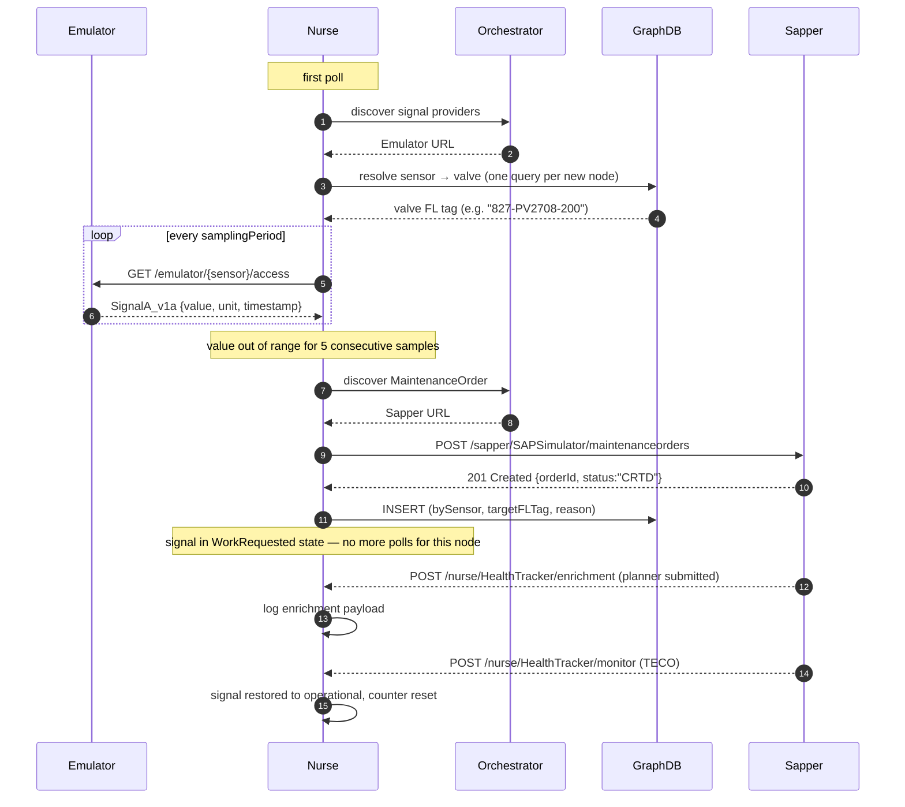

# mbaigo System: Nurse

## Purpose

The *Nurse* is the condition-monitoring consumer of an Arrowhead local cloud.
Like a duty nurse on a ward, it watches a set of physical signals against a
range, raises a maintenance request when one of them goes — and stays — out
of bounds, and stops bothering anyone about that signal until the requested
work is done.

The Nurse's value-add over a thermostat-style controller is its **diagnostic
context**: it knows, for every sensor it polls, which downstream **actuator**
that sensor diagnoses (resolved from a knowledge graph), and it raises the
work order against the *actuator*, not the sensor that observed the symptom.
A pressure-differential sensor reads low → the work order targets the valve
the sensor is observing, with the sensor identity preserved in the request
for traceability.

## Architecture

Four moving pieces:

1. **Per-signal samplers.** One goroutine per signal in `Signals[]`, each
   polling every `samplingPeriod` seconds and counting consecutive
   out-of-range readings per source. Five in a row trips the alarm.
2. **Range-based threshold.** Each signal carries a `lowerThreshold` and
   `upperThreshold`. Alert fires on `value < lower || value > upper`. Resets
   when the value comes back in range. Direction-agnostic — caught equally
   by a collapse or a spike.
3. **Sensor → actuator resolver.** At first discovery of each new provider
   node, the Nurse queries a GraphDB triple store with the sensor's name and
   caches the actuator's functional-location tag. A node whose actuator
   cannot be resolved is marked **unresolvable** and skipped permanently —
   raising a misdirected work order is worse than raising none.
4. **Two endpoints back from the Sapper.** Beyond the polling loop, the
   Nurse exposes `/monitor` (the standard `SignalMonitoring` callback for
   TECO completion) and `/enrichment` (the `EnrichmentNotification`
   endpoint where the human planner's submitted operations payload
   arrives at REL). Both are dispatched at the same `HealthTracker`
   asset.

## How it fits in the cloud

```
Emulator/sensor ──poll──► Nurse ─┬─► Sapper (raise CRTD order)
                                  │
                                  └─► GraphDB (publish sensor-side facts)
       ◄───────── REL enrichment ─────── Sapper
       ◄───────── TECO completion ────── Sapper
```

The Nurse polls a signal provider (e.g. the `emulator` replaying a CSV), and
when it fires it (a) discovers the Sapper via Arrowhead's `MaintenanceOrder`
service definition and POSTs the order, and (b) publishes the sensor-side
context to GraphDB so the order's full lineage is queryable. Later, the
Sapper's REL and TECO events arrive at `/enrichment` and `/monitor`
respectively, and the Nurse logs the enrichment payload and restores the
signal to operational status.

## Sequence diagram



## Services

### Provided

| Service definition | Subpath | Methods | Description |
|--------------------|---------|---------|-------------|
| `SignalMonitoring` | `monitor` | `GET` | Plain-text status of every monitored signal: range, consecutive out-of-range counts per node, operational flag |
| `SignalMonitoring` | `monitor` | `POST` | TECO completion callback (called by the Sapper). Marks the signal back to operational |
| `EnrichmentNotification` | `enrichment` | `POST` | REL enrichment notification (called by the Sapper). Logs the planner's operations payload |

### Consumed (via Arrowhead orchestration)

| Service definition | Used for |
|--------------------|----------|
| `<signal-name>` (one per entry in `signals[]`, e.g. `pressure`) | The numeric signal the Nurse polls |
| `MaintenanceOrder` | Discovered fresh at the moment a work order needs to be raised; replaces the previous hardcoded `sap_url` |

The Nurse also queries a GraphDB triple store directly. That URL **is**
configured (it identifies the policy source, not a peer system), so it
isn't part of the Arrowhead orchestration.

## Configuration

```json
{
    "systemname": "nurse",
    "unit_assets": [
        {
            "name": "HealthTracker",
            "services": [
                { "definition": "SignalMonitoring",       "subpath": "monitor",    "registrationPeriod": 22 },
                { "definition": "EnrichmentNotification", "subpath": "enrichment", "registrationPeriod": 22,
                  "details": { "Forms": ["application/json"] } }
            ],
            "traits": [
                {
                    "graphdb_url": "http://<graphdb-host>:7200/repositories/<repo>",
                    "signals": [
                        {
                            "serviceDefinition": "pressure",
                            "details": { "Unit": ["kPa"] },
                            "samplingPeriod": 4,
                            "lowerThreshold": 10.0,
                            "upperThreshold": 25.0,
                            "spareParts": []
                        }
                    ]
                }
            ]
        }
    ],
    "protocolsNports": { "coap": 0, "http": 20181, "https": 0 },
    "coreSystems": [ /* serviceregistrar, orchestrator, ca, maitreD */ ]
}
```

### Trait reference

| Field | Type | Description |
|-------|------|-------------|
| `graphdb_url`     | string | Base URL of the GraphDB repository (no `/statements`). Probed at startup with an ASK; the Nurse refuses to run if it cannot reach it |
| `signals[]`       | array  | One entry per measurement the Nurse monitors |

### Per-signal fields

| Field | Type | Description |
|-------|------|-------------|
| `serviceDefinition` | string  | The Arrowhead service definition the Nurse discovers and polls |
| `samplingPeriod`    | integer | Seconds between successive polls |
| `lowerThreshold`    | float   | Lower edge of the allowed range |
| `upperThreshold`    | float   | Upper edge of the allowed range |
| `spareParts`        | array   | Optional SAP-side parts list passed through to the maintenance order |

A reading outside `[lowerThreshold, upperThreshold]` for **five consecutive
polls on the same source** fires the alarm. The counter resets the moment a
value comes back in range.

## GraphDB prerequisites

The Nurse refuses to start without a reachable GraphDB and refuses to monitor
any sensor whose actuator it cannot resolve. The graph must contain, for
every sensor the Nurse will poll:

```turtle
<sensor-IRI>  afo:hasName             "<sensor-tag>" .
<sensor-IRI>  afo:diagnosesActuator   <valve-FL-IRI> .
<valve-FL-IRI> arrowhead:functionalLocation "<valve-FL-tag>" .
```

The third triple typically already exists in upstream data (DEXPI / CFIHOS
imports). The first two come from the cloud's RDF — the
[kgrapher](../kgrapher/) emits `afo:hasName` automatically; the
`afo:diagnosesActuator` link is added once per sensor with a SPARQL
INSERT…WHERE that joins by literal name:

```sparql
PREFIX afo:       <http://www.synecdoque.com/2025/afo#>
PREFIX arrowhead: <https://arrowheadweb.org/ont/arrowhead#>
INSERT {
  GRAPH <https://example.org/graph/nurse-demo> {
    ?sensor afo:diagnosesActuator ?valveFL .
  }
}
WHERE {
  ?sensor  afo:hasName "<sensor-tag>" .
  ?valveFL arrowhead:functionalLocation "<valve-tag>" .
}
```

The Nurse will issue the equivalent SELECT at runtime; if it returns no rows
the corresponding node is marked unresolvable in the log and skipped.

## Order request shape

When a signal fires, the Nurse builds and POSTs a `MaintenanceOrderEvent` to
the discovered Sapper URL. Pre-populated from the cached resolution:

```json
{
    "equipmentId":          "827PD2708",
    "functionalLocation":   "827-PV2708-200",
    "plant":                "1000",
    "description":          "Signal pressure out of range [10.00, 25.00]",
    "priority":             "3",
    "maintenanceOrderType": "PM01",
    "plannedStartTime":     "<startTime>",
    "plannedEndTime":       "<endTime>",
    "operations": [ { "text": "...", "workCenter": "MAINT-WC01", "duration": 4, "durationUnit": "H" } ]
}
```

After a successful response, the Nurse pushes a small set of sensor-side
context triples to GraphDB — `ex:bySensor`, `ex:targetFLTag`, `ex:reason` —
keyed by the same order IRI the Sapper writes the lifecycle to.

## Building and running

```bash
# Run from source (development)
go run .

# Build a binary for the current machine
go build -o nurse_amac .

# Cross-compile for a 64-bit Raspberry Pi
GOOS=linux GOARCH=arm64 go build -o nurse_rpi64 .

# Deploy
scp nurse_rpi64 jan@<pi-host>:oslo/nurse/
```

Run the binary from **inside its own directory** so it can find (or
auto-generate) `systemconfig.json`.

## Startup order

```
Arrowhead core + GraphDB  →  Sapper  →  Nurse  →  signal providers (Emulator, ...)
```

The Nurse's GraphDB probe is fail-loud — if the triple store doesn't answer,
the Nurse won't start. The Sapper discovery is fail-tolerant — if the Sapper
isn't yet registered when an order needs to be raised, the call logs the
failure and the signal stays in `WorkRequested` until the next process
restart. Signal providers can join after the Nurse is already running; the
poll loop discovers them on the next tick.

## Development with a local mbaigo clone

Add both modules to the workspace `go.work` at the repository root:

```
use ./mbaigo
use ./systems/nurse
```

Or add a `replace` directive to `go.mod`:

```
require github.com/sdoque/mbaigo v0.x.x
replace github.com/sdoque/mbaigo => ../../mbaigo
```
