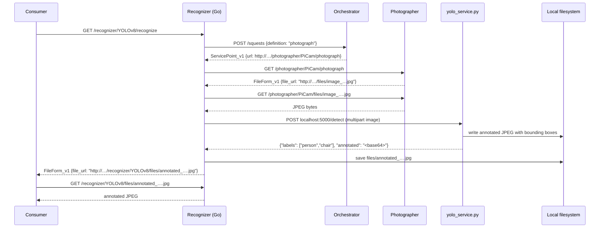

# mbaigo System: Recognizer

The Recognizer system performs object detection on images captured by a Raspberry Pi camera. It consumes the `photograph` service from the Arrowhead local cloud, sends the JPEG to a local **YOLO microservice** for inference, and returns the URL of the annotated image (with bounding boxes drawn around every detected object). Detected object names are printed to the terminal log.

The system requires no direct knowledge of the camera hardware — it locates a photographer via the Orchestrator. If more than one camera is registered (e.g., entrance and parking lot), the `functionalLocation` trait filters the search to a specific one.

---

## Architecture

The recognizer runs as **two independent processes**:

| Process | Language | Responsibility |
|---|---|---|
| `recognizer` | Go | Arrowhead service registration, orchestration, HTTP API |
| `yolo_service.py` | Python | YOLOv8 inference via Ultralytics, image annotation |

The Go binary calls the Python service over `localhost` using a plain HTTP POST. The two processes start, stop, and restart independently — if the Python service crashes or needs reloading with a different model, the Go binary keeps running and will resume as soon as the service comes back.

```
Consumer → GET /recognizer/YOLOv8/recognize
              ↓
         Go binary
              ↓ GET /photographer/.../photograph (via Orchestrator)
         Photographer → FileForm_v1 { file_url }
              ↓ GET file_url
         JPEG bytes
              ↓ POST localhost:5000/detect  (multipart, field 'image')
         yolo_service.py → {"labels": [...], "annotated": "<base64 JPEG>"}
              ↓ save to files/annotated_<timestamp>.jpg
         FileForm_v1 { file_url: http://.../recognizer/YOLOv8/files/annotated_... }
              ↓
Consumer → GET .../files/annotated_...jpg → annotated JPEG
```

---

## Sequence diagram



---

## Services

| Service | Path | Method | Response | Description |
|---|---|---|---|---|
| `recognize` | `/recognizer/<asset>/recognize` | GET | `FileForm_v1` | Triggers capture + detection; returns URL of annotated image |
| *(files)* | `/recognizer/<asset>/files/<filename>` | GET | JPEG | Serves a previously annotated image file |

The YOLO microservice also exposes:

| Endpoint | Method | Description |
|---|---|---|
| `/detect` | POST | Accepts multipart image, returns JSON with labels and base64 annotated JPEG |
| `/health` | GET | Returns `{"status": "ok", "model": "<name>"}` |

---

## Installing the YOLO microservice

### Requirements

- Raspberry Pi 4 or 5 (64-bit OS strongly recommended)
- Raspberry Pi OS Bookworm 64-bit
- Python 3.9 or later
- At least 2 GB free disk space (model weights + dependencies)

### Conventions used below

The Pi has two path conventions that show up in this project:

- `~/yolo-env/` — the Python virtual environment. Lives in **your home directory** because several systems can share it.
- `~/mbaigo/recognizer/` — the recognizer's working directory. Contains the Go binary (`recognizer_rpi64`), the Python service (`yolo_service.py`), the model weights (`yolov8n.pt`), and the generated `systemconfig.json`. Use the path your `downloader.sh` actually deploys to — if yours is `~/rpiExec/recognizer/`, substitute that everywhere below.

Every shell command below names the directory you should be in at its prompt (`~` or `~/mbaigo/recognizer`), so copying and pasting in order should work without guesswork.

### Step 1 — Update the system

Working directory: anywhere.

```bash
sudo apt update && sudo apt upgrade -y
sudo apt install -y python3-pip python3-venv libopenblas-dev libatlas-base-dev
```

### Step 2 — Create a virtual environment in your home directory

```bash
cd ~
python3 -m venv ~/yolo-env
source ~/yolo-env/bin/activate
```

After activating, your prompt gains a `(yolo-env)` prefix. Every `pip` and `python3` below assumes the venv is active. Run `source ~/yolo-env/bin/activate` again in any new terminal where you want to use it.

### Step 3 — Install Python dependencies

```bash
pip install flask ultralytics opencv-python-headless
```

`opencv-python-headless` omits the GUI libraries, which are not needed on a headless Pi and are significantly smaller.

### Step 4 — Verify the installation

```bash
python3 -c "from ultralytics import YOLO; YOLO('yolov8n.pt'); print('OK')"
```

The first run downloads `yolov8n.pt` (~6 MB) from the Ultralytics CDN. Subsequent runs use the cached file from `~/.config/Ultralytics/`.

### Step 5 — Put the Python service and the model in the recognizer directory

`yolo_service.py` ships with the recognizer source. Copy it (and the downloaded model weights) into the recognizer's working directory so the Go binary and the Python service sit side by side:

```bash
# From the host machine where you built the binary:
scp yolo_service.py recognizer_rpi64 jan@<pi-ip>:~/mbaigo/recognizer/

# On the Pi, once the file is there:
cd ~/mbaigo/recognizer
mv ~/yolov8n.pt .        # only if Step 4 downloaded the model into $HOME
```

You should now have at least these files in `~/mbaigo/recognizer/`:

```
recognizer_rpi64    yolo_service.py    yolov8n.pt
```

### Step 6 — Start the microservice

```bash
cd ~/mbaigo/recognizer
source ~/yolo-env/bin/activate   # if not already active
python3 yolo_service.py --model yolov8n.pt --port 5000
```

Expected output:

```
Loading yolov8n.pt …
Model ready. Listening on 127.0.0.1:5000
```

Leave this terminal open — the service runs in the foreground. Stop it with Ctrl+C when you're done.

### Step 7 — Sanity-check the microservice

In a **second terminal** (working directory: `~/mbaigo/recognizer`):

```bash
curl -s http://localhost:5000/health
# expected: {"model": "yolov8n.pt", "status": "ok"}
```

To test `/detect` you need a real JPEG on disk. If you don't have one handy, grab the canonical Ultralytics test image:

```bash
wget https://ultralytics.com/images/bus.jpg

curl -s -X POST http://localhost:5000/detect \
     -F "image=@bus.jpg" \
  | python3 -m json.tool
# expected: {"labels": ["bus", "person", ...], "annotated": "<long base64 string>"}
```

There is **no** `detect.py` CLI; the service is accessed only over HTTP.

### Step 8 — Start the Go binary

Still in a second terminal:

```bash
cd ~/mbaigo/recognizer
./recognizer_rpi64
```

On first run it generates `systemconfig.json` and exits; review the file, then run it again. From that point on the Go binary and the Python service run as a pair — restart either one independently.

---

## Running as a systemd service

Create `/etc/systemd/system/yolo.service`:

```ini
[Unit]
Description=YOLO detection microservice
After=network.target

[Service]
Type=simple
User=jan
WorkingDirectory=/home/jan/mbaigo/recognizer
ExecStart=/home/jan/yolo-env/bin/python3 yolo_service.py --model yolov8n.pt --port 5000
Restart=on-failure

[Install]
WantedBy=multi-user.target
```

Adjust `User=` and the paths if your setup uses a different username or deploys under `/home/jan/rpiExec/recognizer`.

Enable and start:

```bash
sudo systemctl daemon-reload
sudo systemctl enable yolo
sudo systemctl start yolo
sudo systemctl status yolo
```

---

## Available YOLO models

| Model | Size | Speed | Accuracy | Good for |
|---|---|---|---|---|
| `yolov8n.pt` | 6 MB | fastest | lowest | Raspberry Pi, real-time |
| `yolov8s.pt` | 22 MB | fast | medium | Pi 4/5 with acceptable latency |
| `yolov8m.pt` | 50 MB | moderate | good | desktop / Pi 5 |
| `yolov8l.pt` | 83 MB | slow | better | GPU-equipped machine |
| `yolov8x.pt` | 131 MB | slowest | best | GPU-equipped machine |

On a Raspberry Pi 4 or 5, `yolov8n.pt` is the practical choice. To switch models, restart `yolo_service.py` with `--model yolov8s.pt` — the Go binary does not need to be restarted.

---

## Configuration

Edit `systemconfig.json` to match your setup:

| Field | Description |
|---|---|
| `ipAddresses` | IP addresses of the machine running the Recognizer |
| `protocolsNports` → `http` | Port the system listens on (default: 20164) |
| `unit_assets[0].traits[0].functionalLocation` | Filter the photograph service by location (e.g. `"Entrance"`). Leave empty to use the first available camera. |
| `unit_assets[0].traits[0].yoloServiceURL` | URL of the YOLO microservice (default: `http://localhost:5000`) |
| `unit_assets[0].traits[0].yoloModel` | Model name forwarded to the microservice (default: `yolov8n.pt`) |
| `coreSystems` | URLs of the Service Registrar, Orchestrator, CA, and maitreD |

---

## Compiling the Go binary

Build for the current machine:

```bash
go build -o recognizer
```

Cross-compile for Raspberry Pi 4/5 (64-bit):

```bash
GOOS=linux GOARCH=arm64 go build -o recognizer_rpi64
```

Copy binary and Python service to the Raspberry Pi:

```bash
scp recognizer_rpi64 yolo_service.py jan@192.168.1.x:~/mbaigo/recognizer/
```

Run from the system's own directory:

```bash
cd ~/mbaigo/recognizer

# Terminal 1 — start the YOLO microservice
source ~/yolo-env/bin/activate
python3 yolo_service.py

# Terminal 2 — start the Go binary
./recognizer_rpi64
```

On first run without a `systemconfig.json`, the Go binary generates one and exits so you can fill in the correct values.

---

## Troubleshooting

### `python3: can't open file '.../yolo_service.py': [Errno 2] No such file or directory`

Python is looking for the script in your current working directory. Either `cd ~/mbaigo/recognizer` first and run `python3 yolo_service.py`, or pass the full path: `python3 ~/mbaigo/recognizer/yolo_service.py`. If the file genuinely isn't there, copy it from the source repo (see Step 5 of the install).

There is **no** `detect.py` — the recognizer talks to the YOLO service only over HTTP, not via a Python CLI.

### `YOLO service unreachable at http://localhost:5000`

`yolo_service.py` is not running, or it is bound to a different port. Start it first, or check `systemctl status yolo`.

### `getting photograph: service discovery failed`

The Orchestrator cannot find a registered `photograph` service. Check that the Photographer system is running and that its services are registered. If `functionalLocation` is set, verify it matches exactly what the Photographer has in its asset details.

### Detection is very slow

On a Raspberry Pi 4, a single inference with `yolov8n.pt` takes roughly 1–3 seconds. Larger models will be proportionally slower. The Pi 5 is roughly twice as fast as the Pi 4 for CPU inference.

### Annotated image is blank

Check that `yolo_service.py` has write access to its working directory and that the `files/` subdirectory is writable by the Go binary.
