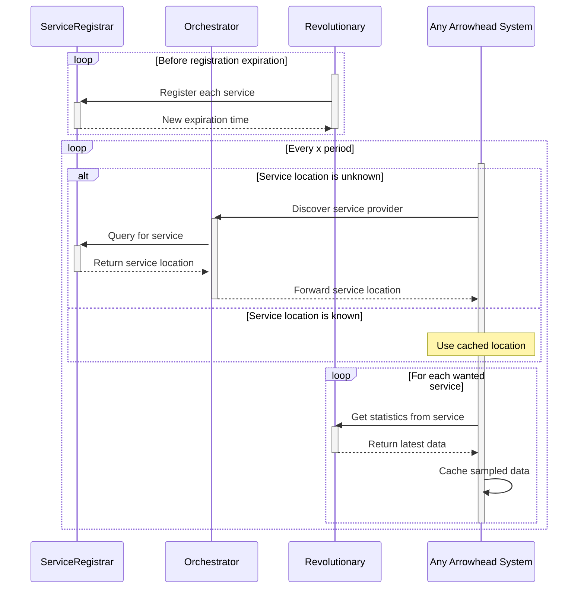

# mbaigo System: revolutionary

## Purpose
The revolutionary system runs on [Revolution Pi Connect 4](https://revolutionpi.com/documentation/revpi-connect-4/) PLC with an analogue input/output module within a pump station demonstrator. 
It measures the level of two upper tanks (-10 to +10 Volts) and outputs a control signal to the pump (0 to +10 Volts).


## Sequence of events
This system offers three services: the two level sensors and the pump speed signal.
For the services to be discoverable, they must be in the registry of currently available services.
The consuming system asks the Orchestrator for the desired service by describing it.
The orchestrator inquires with the Service Registrar if the service is available and if so provides the service URL.
The consuming system will request the service directly from the Revolutionary system via this URL until it stops working.



## Configuration
The default configuration using the [Rev Pi AIO](https://revolutionpi.com/documentation/revpi-aio/) module is the upper tank level sensor (v+ @ pin 28, GND @ pin 24). Its name is **InputValue_1**

At deploment, the two other unit assets need to be provided (into the array of unit assets in the *systemconfig.json* file):
- the middle tank level sensor (v+ @ pin 17, GND @ pin 23) has the name **InputValue_1**. 
- The pump signal (v+ @ pin 1 with GND @ pin 5) has the name **OutputValue_1**.

## Compiling
To compile the code, one needs to get the mbaigo module
```go get github.com/sdoque/mbaigo```
and initialize the *go.mod* file with ``` go mod init github.com/sdoque/systems/Revolutionary``` before running *go mod tidy*.

To run the code, one just needs to type in ```go run .``` within a terminal or at a command prompt. (But that works only on a Revolution Pi, since it is accessing that hardware.)

It is **important** to start the program from within its own directory (and each system should have their own directory) because program looks for its configuration file there. If it does not find it there, it will generate one and shutdown to allow the configuration file to be updated.

The configuration and operation of the system can be verified using the system's web server using a standard web browser, whose address is provided by the system at startup.

## Cross compiling/building
The following commands enable one to build for a different platform:

- Raspberry Pi 64: ```GOOS=linux GOARCH=arm64 go build -o revolutionary_rpi64```

If one wants to secure copy it to a Revolution pi,
```scp revolutionary_rpi64 pi@192.168.1.9:station/revolutionary/``` where user is the *pi* @ the *IP address* of the Raspberry Pi with a relative (to the user's home directory) destination (the *station/Revolutionary/* directory in this case).
