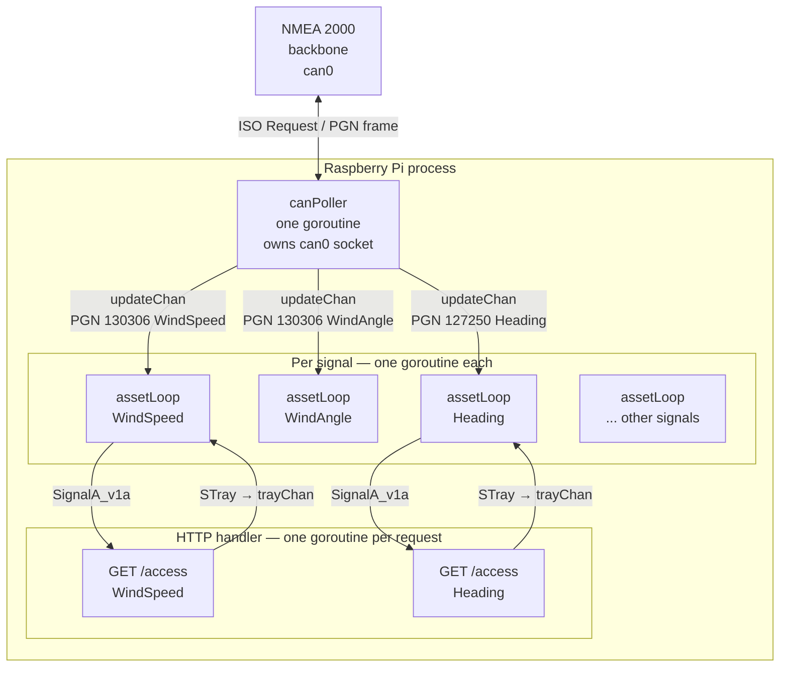
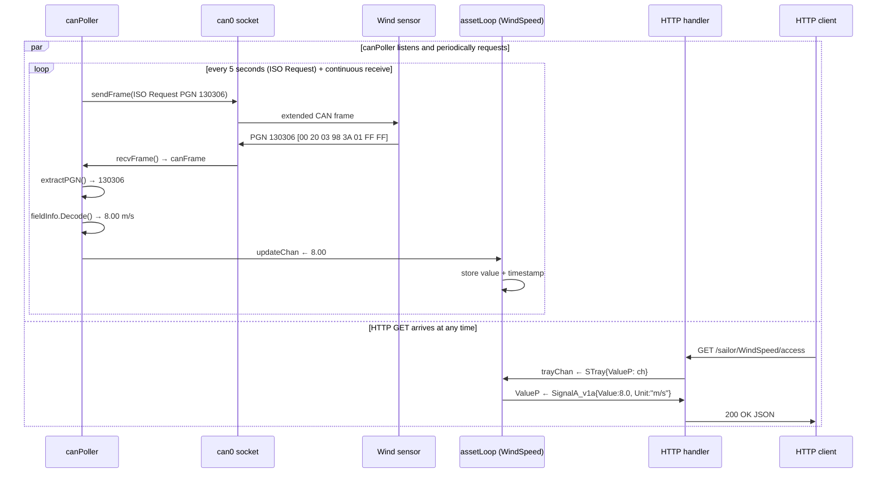
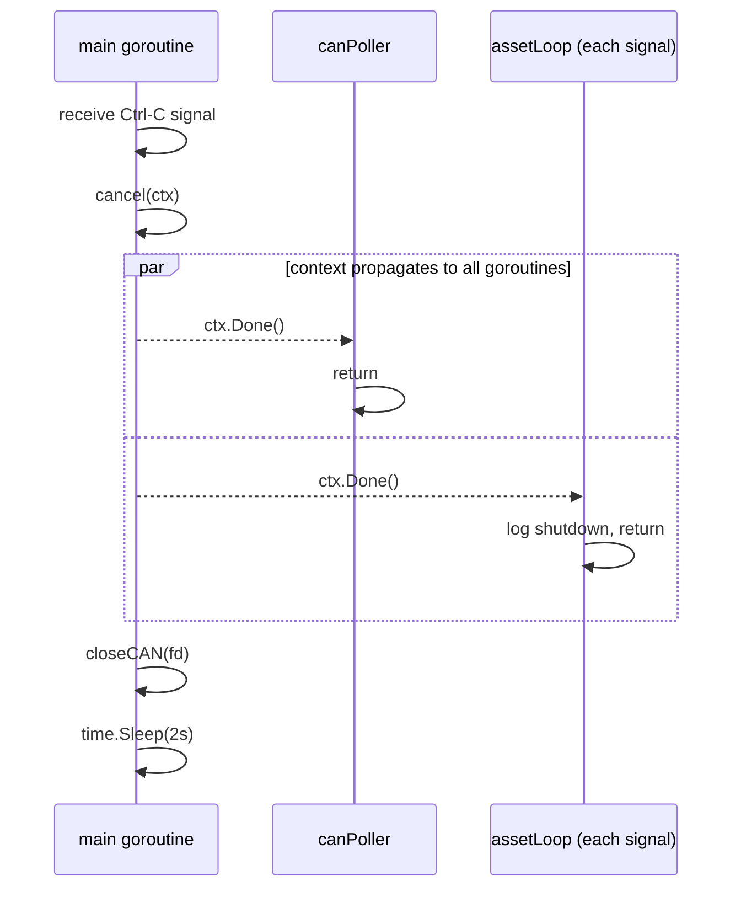

# mbaigo System: sailor

Sailor reads live NMEA 2000 signals from a vessel's CAN bus and exposes each
signal as a typed Arrowhead service.  It runs on a Raspberry Pi fitted with a
**SK Pang Electronics PiCAN-M** HAT (RSP-PICAN-M), which provides both NMEA
2000 CAN and NMEA 0183 serial on a single board.

Each configured signal becomes one unit asset reachable at:

```
GET /sailor/<SignalName>/access  →  SignalA_v1a JSON
```

Signals monitored out of the box: wind speed, wind angle, water speed,
heading, COG, SOG, and depth.  Any NMEA 2000 PGN can be added in minutes — see
[Adding new signals](#adding-new-signals).

---

## Hardware

### PiCAN-M HAT

| Property | Value |
|---|---|
| Manufacturer | SK Pang Electronics Ltd |
| Model | RSP-PICAN-M |
| CAN controller | MCP2515 via SPI0 |
| Crystal | 16 MHz |
| MCP2515 interrupt | GPIO 25 |
| NMEA 2000 connector | Micro-C (5-pin) or DeviceNet M12 |
| Termination | 120 Ω switchable on board |

### NMEA 2000 network wiring

NMEA 2000 uses a powered backbone (12 V DC from the vessel's electrical
system).  The PiCAN-M connects to the backbone as a drop device.

```
NMEA 2000 backbone (Micro-C)     PiCAN-M Micro-C socket
────────────────────────────     ───────────────────────
Pin 1  Shield / Drain   ─────────  Pin 1  Shield
Pin 2  NET-S (+12V)     ─────────  Pin 2  NET-S  (powers the HAT's CAN side)
Pin 3  NET-C (GND)      ─────────  Pin 3  NET-C
Pin 4  CAN-H            ─────────  Pin 4  CAN-H
Pin 5  CAN-L            ─────────  Pin 5  CAN-L
```

> **Important:** The Raspberry Pi itself is powered from its own USB-C supply.
> NET-S (pin 2) powers only the isolated CAN side of the HAT — the two grounds
> are separated by the on-board opto-isolation.

### NMEA 2000 network layout

```
          120 Ω                                              120 Ω
  ┌────[terminator]────────────────────────────────[terminator]────┐
  │                        backbone                                │
  │        │                    │                    │             │
  │   [drop cable]         [drop cable]         [drop cable]      │
  │        │                    │                    │             │
  │  [wind sensor]       [depth sounder]     [Pi + PiCAN-M]       │
  │   PGN 130306          PGN 128267          (this system)       │
  └────────────────────────────────────────────────────────────────┘
```

Two 120 Ω terminators are required — one at each end of the backbone.  The
PiCAN-M does **not** act as a terminator (the on-board 120 Ω jumper is for
bench testing only; leave it open on a live vessel network).

---

## Raspberry Pi setup

### Step 1 — Enable SPI and the MCP2515 overlay

Edit `/boot/firmware/config.txt` (Raspberry Pi OS Bookworm) and add these
lines at the end:

```ini
dtparam=spi=on
dtoverlay=mcp2515-can0,oscillator=16000000,interrupt=25
```

> The PiCAN-M uses a **16 MHz** crystal and routes the MCP2515 interrupt to
> **GPIO 25**.  These values differ from some other CAN HATs — use exactly these
> numbers for the PiCAN-M.

Reboot:

```bash
sudo reboot
```

### Step 2 — Verify the driver loaded

```bash
ip link show can0
```

Expected output (interface is down but present):

```
3: can0: <NOARP,ECHO> mtu 16 qdisc noop state DOWN mode DEFAULT group default qlen 10
    link/can
```

If `can0` does not appear, run `dmesg | grep mcp251` and check that the
overlay loaded cleanly — see [Troubleshooting](#troubleshooting).

### Step 3 — Bring the interface up

NMEA 2000 runs at a fixed **250 kbit/s** — this is part of the standard and
cannot be changed.

```bash
sudo ip link set can0 up type can bitrate 250000
```

### Step 4 — Install can-utils (for testing)

```bash
sudo apt install can-utils
```

### Step 5 — Make the interface persistent across reboots

Create `/etc/systemd/network/can0.network`:

```ini
[Match]
Name=can0

[CAN]
BitRate=250000
```

Enable systemd-networkd if it is not already active:

```bash
sudo systemctl enable systemd-networkd
sudo systemctl start systemd-networkd
```

---

## Testing without a vessel — loopback test

With the HAT installed but not connected to a NMEA 2000 network, use CAN
loopback mode to verify that the MCP2515, driver, and SocketCAN stack are all
working correctly.

```bash
# Put the interface into loopback mode
sudo ip link set can0 down
sudo ip link set can0 up type can bitrate 250000 loopback on

# Send one frame and capture it
cansend can0 123#DEADBEEF &
candump can0 -n 1
```

Expected output:

```
  can0  123   [4]  DE AD BE EF
```

Turn loopback off before connecting to the vessel:

```bash
sudo ip link set can0 down
sudo ip link set can0 up type can bitrate 250000
```

---

## Testing on a live NMEA 2000 network

With the Pi connected to the vessel's NMEA 2000 backbone and the network
powered, you should immediately see frames from other devices:

```bash
candump can0
```

NMEA 2000 frames have **29-bit extended CAN IDs** (8-digit hex in candump).
Example output from a vessel with wind and GPS instruments:

```
  can0  19FD0205   [8]  00 20 03 98 3A 01 FF FF
  can0  19F80205   [8]  00 01 A8 61 F4 01 FF FF
  can0  19F11305   [8]  00 98 3A 7F FF 7F FF 02
```

To send an ISO Request for wind data (PGN 130306 = 0x01FD02) and capture the
response:

```bash
# PGN 130306 in LSB-first 3 bytes: 02 FD 01
cansend can0 18EAFF23#02FD01FFFFFFFFFF
candump can0 -n 1
```

Example response frame and manual decode:

```
  can0  19FD0205   [8]  00 20 03 98 3A 01 FF FF
```

| Bytes | Raw | Decoded |
|---|---|---|
| 0 | `00` | SID = 0 |
| 1–2 | `20 03` | Wind Speed = 0x0320 = 800 → 800 × 0.01 = **8.00 m/s** |
| 3–4 | `98 3A` | Wind Angle = 0x3A98 = 15000 → 15000 × 0.0001 = **1.5000 rad** |
| 5 | `01` | Reference = Apparent wind |

---

## Architecture

### Files

| File | Responsibility |
|---|---|
| `sailor.go` | `main()` bootstrap, `serving()` dispatcher, `access()` handler |
| `thing.go` | `NMEAConfig`, `Traits`, `initTemplate`, `newResource`, `assetLoop` |
| `nmea2000.go` | PGN table, `extractPGN`, `buildISORequest`, field decoders — no build constraint |
| `can_linux.go` | SocketCAN open/read/write, `canPoller` goroutine — Linux only |
| `can_other.go` | Stub implementations for macOS / Windows (compile + test anywhere) |

### Concurrency

One `canPoller` goroutine **owns the CAN socket**.  It listens continuously for
incoming frames and sends ISO Requests every 5 seconds for each configured PGN.
Each signal has its own `assetLoop` goroutine that owns the signal's cached
value.  HTTP GET handlers communicate with `assetLoop` through the channel tray
pattern — no mutexes anywhere.



### Sequence diagram — receiving and serving a NMEA 2000 signal



> `canPoller` and the HTTP handler run **in parallel**.  The only
> synchronisation points are the `updateChan` and `trayChan` channels —
> `assetLoop` handles them one at a time via `select`.

### Sequence diagram — shutdown



---

## Configuration

Edit `systemconfig.json` to match your vessel and network:

| Field | Description |
|---|---|
| `ipAddresses` | IP address(es) of the Pi on your vessel network |
| `protocolsNports` → `http` | HTTP port (default `20194`) |
| `traits[0].interface` | SocketCAN interface name (default `"can0"`) |
| `traits[0].signals` | Array of NMEA 2000 signals to expose |
| `signals[].name` | Asset name — appears in the URL and Arrowhead registry |
| `signals[].pgn` | NMEA 2000 PGN as a decimal string, e.g. `"130306"` |
| `signals[].field` | Field name within that PGN, e.g. `"WindSpeed"` |
| `signals[].unit` | Unit string; leave blank `""` to use the `pgnTable` default |

---

## Adding new signals

### Step 1 — Check whether the PGN and field are already in `pgnTable`

Open [nmea2000.go](nmea2000.go) and look at `pgnTable`.  The currently
supported PGNs and fields are:

| PGN | Name | Field | Unit | Byte offset | Resolution |
|---|---|---|---|---|---|
| 127250 | Vessel Heading | `Heading` | rad | 1–2 | 0.0001 rad/bit |
| 127250 | Vessel Heading | `Deviation` | rad | 3–4 | 0.0001 rad/bit |
| 128259 | Vessel Speed | `WaterSpeed` | m/s | 1–2 | 0.01 m/s per bit |
| 128259 | Vessel Speed | `GroundSpeed` | m/s | 3–4 | 0.01 m/s per bit |
| 128267 | Water Depth | `Depth` | m | 1–4 | 0.01 m per bit |
| 129026 | COG & SOG Rapid | `COG` | rad | 2–3 | 0.0001 rad/bit |
| 129026 | COG & SOG Rapid | `SOG` | m/s | 4–5 | 0.01 m/s per bit |
| 130306 | Wind Data | `WindSpeed` | m/s | 1–2 | 0.01 m/s per bit |
| 130306 | Wind Data | `WindAngle` | rad | 3–4 | 0.0001 rad/bit |

If the PGN and field you want are already in the table, skip to Step 2.

### Step 1b — Add the PGN entry to `pgnTable` (if needed)

Append an entry to `pgnTable` in `nmea2000.go`.  Look up the byte layout for
your PGN in the [canboat PGN database](https://canboat.github.io/canboat/canboat.html)
or the NMEA 2000 standard.

Example — adding engine RPM (PGN 127488):

```go
// PGN 127488 — Engine Parameters, Rapid Update (single frame, 8 bytes)
//   Byte 0:    Engine instance
//   Bytes 1–2: Speed  UINT16, 0.25 rpm
//   Bytes 3–4: Boost pressure  UINT16, 100 Pa
//   Byte 5:    Tilt/trim  INT8
127488: {
    Name: "Engine Parameters Rapid",
    Fields: map[string]fieldInfo{
        "RPM": {
            Unit: "rpm",
            Decode: func(d [8]byte) float64 {
                v := binary.LittleEndian.Uint16(d[1:3])
                if v == 0xFFFF {
                    return math.NaN()
                }
                return float64(v) * 0.25
            },
        },
    },
},
```

Rules for the `Decode` function:

- All multi-byte integers are **little-endian**.
- Return `math.NaN()` for the "not available" sentinel value (`0xFFFF` for
  UINT16, `0xFFFFFFFF` for UINT32, `0x7FFF` for INT16).
- `canPoller` discards NaN values and keeps the last known good reading.

### Step 2 — Add the signal to `systemconfig.json`

Append one object to the `signals` array:

```json
{"name": "EngineRPM", "pgn": "127488", "field": "RPM", "unit": "rpm"}
```

### Step 3 — Restart

```bash
./sailor
```

The new signal is immediately available at:

```
GET /sailor/EngineRPM/access
```

No recompilation is needed for PGNs already in `pgnTable`.  Recompilation is
only needed when you add a new entry to `pgnTable` itself.

---

## Building and deploying

```bash
# Build on the Pi directly
go build -o sailor

# Cross-compile on a Mac or Linux desktop for Pi 4 / 5 (64-bit ARM)
GOOS=linux GOARCH=arm64 go build -o sailor_rpi64

# Copy to Pi
scp sailor_rpi64 jan@sailboat:~/sailor/
```

---

## Running the tests

All tests run on any platform — no CAN hardware required.  The `can_other.go`
stubs replace the Linux SocketCAN calls.

```bash
go test ./...
```

| Test | What it checks |
|---|---|
| `TestInitTemplate` | Template name, `access` service, non-empty signal list |
| `TestParsePGN` | Decimal and hex PGN parsing; invalid input rejected |
| `TestLookupPGNField_Known` | PGN 130306 + `"WindSpeed"` → unit `"m/s"` |
| `TestLookupPGNField_UnknownPGN` | Unknown PGN → error |
| `TestLookupPGNField_UnknownField` | Known PGN + bad field name → error |
| `TestBuildISORequest` | CAN_EFF_FLAG set; PGN encoded LSB-first in payload |
| `TestExtractPGN` | PDU1 (ISO Request) and PDU2 (wind, COG/SOG) CAN IDs decoded correctly |
| `TestDecodeWindSpeed` | 0x0320 → 8.00 m/s |
| `TestDecodeWindAngle` | 0x3A98 → 1.5000 rad |
| `TestDecodeWaterSpeed` | 0x0258 → 6.00 m/s |
| `TestDecodeHeading` | 0x3A98 → 1.5000 rad |
| `TestDecodeCOG` | 0x61A8 → 2.5000 rad |
| `TestDecodeSOG` | 0x01F4 → 5.00 m/s |
| `TestDecodeDepth` | 0x09C4 → 25.00 m |
| `TestDecodeNotAvailable` | 0xFFFF sentinel → NaN |
| `TestServing_InvalidPath` | Unknown path → 400 |
| `TestAccess_MethodNotAllowed` | POST → 405 |
| `TestAssetLoop_DeliversValues` | Full updateChan → trayChan round-trip |
| `TestAssetLoop_ContextCancel` | Goroutine exits cleanly on cancel |

---

## Troubleshooting

### `can0` does not appear after reboot

Verify the overlay loaded:

```bash
dmesg | grep mcp251
```

Expected: `mcp251x spi0.0 can0: MCP2515 successfully initialized.`

If not, check that `dtparam=spi=on` and the `dtoverlay=mcp2515-can0,...` line
are both present in `/boot/firmware/config.txt` with the correct oscillator
and interrupt values for the PiCAN-M (16 MHz, GPIO 25).

### `candump` receives nothing on a live network

1. Confirm the NMEA 2000 backbone is powered (NET-S should read ~12 V).
2. Check that there are exactly two 120 Ω terminators on the backbone — one
   at each end.  A missing terminator causes reflection and frame errors.
3. Verify CAN-H and CAN-L are not swapped.
4. Measure CAN-H to CAN-L with a multimeter — it should oscillate around 1–3 V
   when the network is active; at rest it reads approximately 0 V differential.
5. Check the error counters: `ip -details link show can0` — a rising
   `bus-error` count indicates a physical layer problem.

### Frames appear but sailor reports no values

Run `candump can0` and verify the frames have 8-digit hex IDs (29-bit extended
format).  If IDs are only 3 digits (11-bit standard frames) the devices are not
NMEA 2000 — they may be plain NMEA 0183 over CAN or a proprietary protocol.

### `sailor: cannot open can0`

The interface is DOWN.  Bring it up:

```bash
sudo ip link set can0 up type can bitrate 250000
```

### A specific signal always reads zero

The signal has not been received yet since the system started.  Check that the
sensor is active and visible in `candump`.  The `assetLoop` returns the last
stored value (zero on startup) until the first frame arrives.  The timestamp
in the `SignalA_v1a` response will show epoch time (January 1, year 1) until
the first real reading is received.

### Signal reads "not available" / NaN is logged

The instrument is connected but reporting a "not available" value (raw
`0xFFFF`).  Common causes: sensor not warmed up yet, no valid data (e.g., depth
sounder out of range), or a misconfigured field name.  Confirm the field name
exactly matches an entry in `pgnTable` — field names are case-sensitive.
