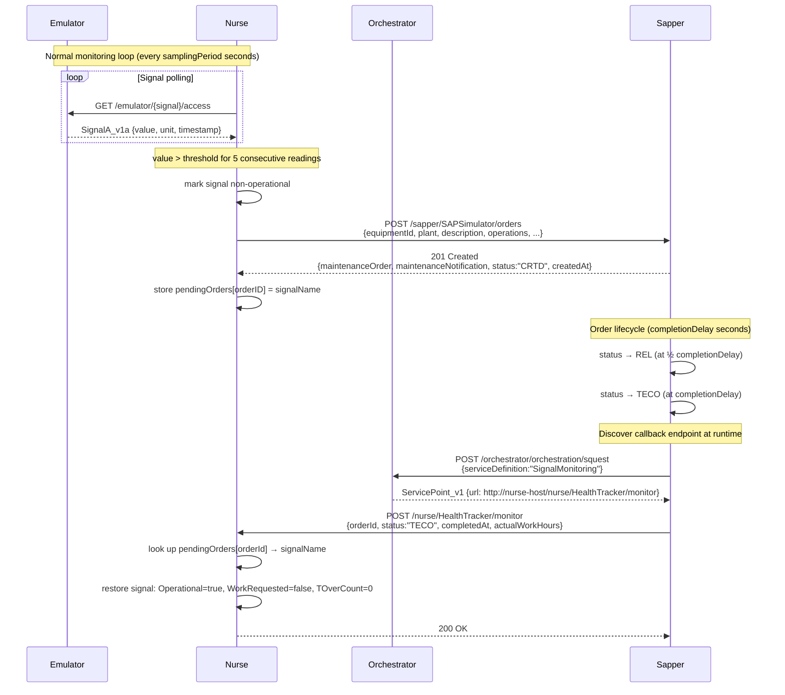

# mbaigo System: Sapper

## Purpose

The *Sapper* system bridges the Arrowhead local cloud with **SAP Plant Maintenance** (SAP Hana PM module). The name comes from the French *Sapeur* — a combat engineer who keeps equipment operational under field conditions. It is an apt metaphor: the sapper detects that a component has failed, dispatches a repair order, and reports back when the equipment is back in service.

In the Arrowhead architecture the sapper:

1. **Accepts maintenance order requests** from any authorized consumer (e.g. the Nurse) over a registered `MaintenanceOrder` service.
2. **Manages the order lifecycle** — progressing the status from `CRTD` (created) → `REL` (released) → `TECO` (technically completed).
3. **Notifies the consumer** when the order reaches `TECO` by discovering the consumer's monitoring endpoint at runtime via Arrowhead orchestration — no hard-coded callback URL required.

In simulation mode the sapper embeds the full SAP lifecycle internally; for production it can be adapted to forward orders to a real SAP system.

## How it fits with the Nurse

The **Nurse** system continuously monitors physical signals (e.g. pressure, temperature). When a signal repeatedly exceeds its threshold, the Nurse requests a maintenance order from the Sapper. Once the Sapper completes the lifecycle it discovers the Nurse's `SignalMonitoring` service via orchestration and POSTs a completion event, which causes the Nurse to restore that signal to operational status.

```
Emulator ──► Nurse ──► Sapper ──► (SAP / simulator)
                 ◄──────────────
               completion callback
               (discovered via Arrowhead)
```

## Sequence diagram



## Services

### Provided

| Service definition | Subpath | Methods | Description |
|--------------------|---------|---------|-------------|
| `MaintenanceOrder` | `orders` | `POST` | Create a maintenance order; returns order ID and notification ID |
| `MaintenanceOrder` | `orders` | `GET ?id=<orderID>` | Query the current status of a known order |

### Consumed

| Service definition | Purpose |
|--------------------|---------|
| `SignalMonitoring` | Callback endpoint discovered at runtime to report order completion |

## Configuration (`systemconfig.json`)

```json
{
    "systemname": "sapper",
    "unit_assets": [
        {
            "name": "SAPSimulator",
            "details": {
                "Plant": ["1000"]
            },
            "services": [
                {
                    "definition": "MaintenanceOrder",
                    "subpath": "orders",
                    "details": { "Forms": ["application/json"] },
                    "registrationPeriod": 30
                }
            ],
            "traits": [
                {
                    "completionDelay": 30
                }
            ]
        }
    ],
    "protocolsNports": {
        "coap": 0,
        "http": 20191,
        "https": 0
    },
    "coreSystems": [
        { "coreSystem": "serviceregistrar", "url": "http://192.168.1.109:20102/serviceregistrar/registry" },
        { "coreSystem": "orchestrator",     "url": "http://192.168.1.109:20103/orchestrator/orchestration" },
        { "coreSystem": "ca",               "url": "http://192.168.1.109:20100/ca/certification" },
        { "coreSystem": "maitreD",          "url": "http://localhost:20101/maitreD/maitreD" }
    ]
}
```

### Trait reference

| Field | Type | Default | Description |
|-------|------|---------|-------------|
| `completionDelay` | integer (seconds) | `30` | Time from order creation to `TECO`. Set to `5` for fast demos, `3600` for realistic 1-hour jobs. |

### Wiring the Nurse

Point the Nurse's `sap_url` at the sapper's `orders` endpoint:

```json
"sap_url": "http://<sapper-host>:20191/sapper/SAPSimulator/orders"
```

The sapper discovers the Nurse's callback endpoint automatically via Arrowhead orchestration — no further configuration is needed on the Nurse side.

## Order payload

### Request (POST `/orders`)

```json
{
    "equipmentId":          "10000045",
    "functionalLocation":   "FL100-200-300",
    "plant":                "1000",
    "description":          "Signal pressure exceeded threshold 75.00",
    "priority":             "3",
    "maintenanceOrderType": "PM01",
    "plannedStartTime":     "2026-03-27T14:00:00+01:00",
    "plannedEndTime":       "2026-03-27T22:00:00+01:00",
    "operations": [
        {
            "text":         "Inspect and service equipment for signal pressure",
            "workCenter":   "MAINT-WC01",
            "duration":     4,
            "durationUnit": "H"
        }
    ]
}
```

### Response (201 Created)

```json
{
    "maintenanceOrder":        "400000001",
    "maintenanceNotification": "200000001",
    "status":                  "CRTD",
    "message":                 "Maintenance order created successfully",
    "createdAt":               "2026-03-27T13:58:21Z"
}
```

### Completion callback (POST to consumer's monitor)

```json
{
    "orderId":         "400000001",
    "status":          "TECO",
    "completedAt":     "2026-03-27T14:28:21Z",
    "actualWorkHours": 0.0083,
    "notes":           "Completed by SAP simulator"
}
```

## Building and running

```bash
# Run in place (for development)
go run .

# Build for the current machine
go build -o sapper_local

# Cross-compile for Raspberry Pi 64-bit
GOOS=linux GOARCH=arm64 go build -o sapper_rpi64

# Copy to a Raspberry Pi
scp sapper_rpi64 user@192.168.1.10:mbaigo/sapper/
```

Run the binary from **inside its own directory** so it can find (or create) `systemconfig.json`.

## Startup order

```
Arrowhead core systems  →  Sapper  →  Nurse (or any other consumer)
```

The Sapper must be registered before the Nurse starts monitoring, so the Orchestrator can resolve the `MaintenanceOrder` service. The completion callback works in the opposite direction — the Nurse must be registered before any order reaches `TECO`.

## Development with a local mbaigo clone

Add both modules to the workspace `go.work` at the repository root:

```
use ./mbaigo
use ./systems/sapper
```

Or add a `replace` directive to `go.mod`:

```
require github.com/sdoque/mbaigo v0.x.x
replace github.com/sdoque/mbaigo => ../../mbaigo
```
