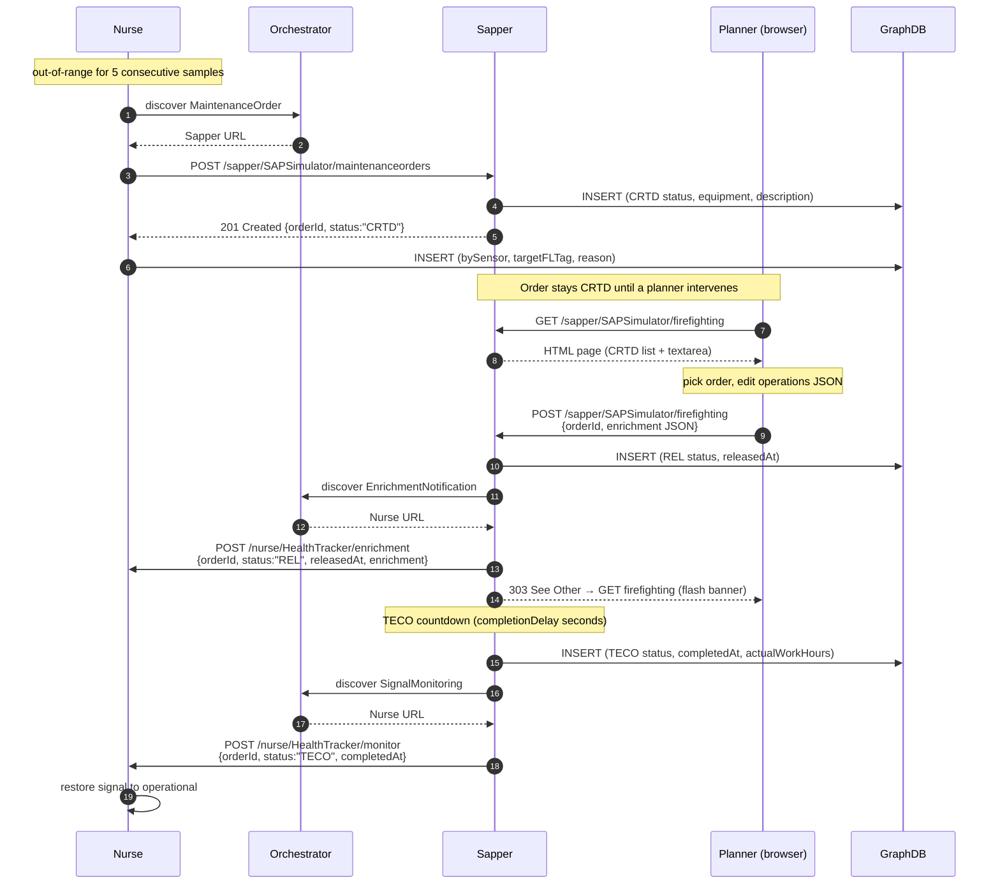

# mbaigo System: Sapper

## Purpose

The *Sapper* bridges the Arrowhead local cloud with **SAP Plant Maintenance**
(SAP Hana PM module). The name is from the French *sapeur* — a combat engineer
who keeps equipment operational under field conditions. The Sapper's role is
the same: accept a maintenance request raised by some condition-monitoring
consumer, route it through a SAP-style lifecycle that includes a **human
planner step**, and report back when the work is technically completed so the
consumer can resume monitoring.

In simulation mode the Sapper embeds the full lifecycle internally; for
production it can be adapted to forward orders to a real SAP system through
Alex Chiquito's
[SAP Maintenance Order Adaptor](https://github.com/AlexChiquito/SAP-Maintenance-order-adaptor).

## Architecture

Three responsibilities:

1. **Accept** `MaintenanceOrder` POSTs from any authorised consumer (e.g. the
   [Nurse](../nurse/)). New orders are created in **CRTD** (created) status —
   they do **not** auto-progress.
2. **Show the work to a planner** via the `firefighting` web service. The
   planner picks an order, adjusts the operations JSON, and submits. That
   submission transitions the order to **REL** (released) and starts a
   countdown to **TECO** (technically completed).
3. **Notify the consumer** at TECO — the Sapper discovers the consumer's
   `SignalMonitoring` endpoint via Arrowhead orchestration and POSTs a
   completion event. No callback URL is configured anywhere.

If a GraphDB triple store is configured, each lifecycle transition pushes a
SPARQL update so the full audit trail
(`CRTD → enrichment → REL → TECO`) is queryable.

## How it fits with the Nurse

The [Nurse](../nurse/) monitors physical signals against a range. When a
signal stays out of range for five consecutive samples, the Nurse raises a
maintenance request on the Sapper. The order sits in CRTD until a human
planner opens the Sapper's firefighting page, enriches the operations payload,
and clicks Submit. The Sapper then notifies the Nurse with the enrichment
payload (so the Nurse log shows the planner's decision), runs its TECO
countdown, and finally posts a completion event back to the Nurse.

```
Emulator ──► Nurse ──► Sapper ─┬──► CRTD (waits)
                 ▲             │
                 │             ▼  Planner opens /firefighting
                 │         REL → TECO countdown
                 │             │
                 │             ▼
                 └────── completion callback (TECO)
                         + enrichment notification (REL)
```

## Sequence diagram



## Services

### Provided

| Service definition | Subpath | Methods | Description |
|--------------------|---------|---------|-------------|
| `MaintenanceOrder` | `maintenanceorders` | `POST` | Create a new CRTD maintenance order |
| `MaintenanceOrder` | `maintenanceorders` | `GET ?id=<orderID>` | Query the current state of a known order |
| `firefighting` | `firefighting` | `GET` | Planner UI: live-refreshed list of CRTD orders + editable enrichment textarea |
| `firefighting` | `firefighting` | `POST` | Submit handler: attaches enrichment, transitions to REL, redirects (303) to the GET view |

### Consumed (via Arrowhead orchestration)

| Service definition | Used for |
|--------------------|----------|
| `SignalMonitoring` | TECO completion event — POSTed to the consumer that originally raised the order |
| `EnrichmentNotification` | REL release event — POSTed to the same consumer when the planner clicks Submit |

Both consumed endpoints are discovered fresh at the moment of need; the Sapper
holds no configured URLs for them.

## Configuration

```json
{
    "systemname": "sapper",
    "unit_assets": [
        {
            "name": "SAPSimulator",
            "details": { "Plant": ["1000"] },
            "services": [
                {
                    "definition": "MaintenanceOrder",
                    "subpath": "maintenanceorders",
                    "details": { "Forms": ["application/json"] },
                    "registrationPeriod": 30
                },
                {
                    "definition": "firefighting",
                    "subpath": "firefighting",
                    "details": { "Forms": ["text/html"] },
                    "registrationPeriod": 30
                }
            ],
            "traits": [
                {
                    "completionDelay": 30,
                    "graphDbUrl": "http://<graphdb-host>:7200/repositories/<repo>"
                }
            ]
        }
    ],
    "protocolsNports": { "coap": 0, "http": 20191, "https": 0 },
    "coreSystems": [
        { "coreSystem": "serviceregistrar", "url": "http://<host>:20102/serviceregistrar/registry" },
        { "coreSystem": "orchestrator",     "url": "http://<host>:20103/orchestrator/orchestration" },
        { "coreSystem": "ca",               "url": "http://<host>:20100/ca/certification" },
        { "coreSystem": "maitreD",          "url": "http://localhost:20101/maitreD/maitreD" }
    ]
}
```

### Trait reference

| Field | Type | Default | Description |
|-------|------|---------|-------------|
| `completionDelay` | integer (seconds) | `30` | Time from REL (planner submit) to TECO. Set `5` for fast demos, `3600` for realistic 1-hour jobs |
| `graphDbUrl`      | string            | `""` | Base URL of a GraphDB repository (no `/statements` suffix). Empty disables all SPARQL pushes; lifecycle still works in-memory |

## The firefighting UI

`GET /sapper/SAPSimulator/firefighting` renders an HTML page with two halves:

- **Top half** — a table of work orders currently in CRTD status, refreshed
  every 3 seconds via background `fetch` so new orders appear (and released
  ones disappear) without the planner reloading the page.
- **Bottom half** — a textarea for the operations JSON, empty on initial load.
  When the planner selects an order, the textarea is populated with that
  order's *suggested enrichment* (a per-order field on `Order`, currently
  defaulted to a seals/gaskets repair template). The planner edits in place
  and clicks **Submit**.

Submission uses **Post/Redirect/Get** (HTTP 303) so browser reload after a
submit re-issues a GET, not a re-POST. A flash banner above the table
confirms success or reports a validation failure.

## Order ID continuity (graph-primed counter)

Order IDs follow the SAP convention `4XXXXXXXX` — zero-padded with a leading
`4`. The Sapper's in-memory counter normally starts at `0` and increments per
order, so a fresh process would produce `400000001`, `400000002`, etc. — and
would **collide** with historical IDs if the workorders graph already has
those subjects.

To prevent this, the Sapper queries GraphDB on the **first** order creation
(once per process, behind `sync.Once`):

```sparql
SELECT (MAX(?id) AS ?max) WHERE {
    ?wo a step:WorkOrder ;
        workorder:Id ?idNode .
    FILTER(STRSTARTS(STR(?wo), "https://sinetiq.se/sap/"))
    ?idNode identifier:Id ?id .
}
```

The returned literal (e.g. `"400000017"`) primes the counter so the next
order becomes `400000018`. The peek is failure-tolerant: if GraphDB is
unconfigured, unreachable, empty, or returns garbage, the counter stays at
`0` and the Sapper produces `400000001` (the previous behaviour).

## Order payload

### Request (POST `/maintenanceorders`)

```json
{
    "equipmentId":          "827PD2708",
    "functionalLocation":   "827-PV2708-200",
    "plant":                "1000",
    "description":          "Signal pressure out of range [10.00, 25.00]",
    "priority":             "3",
    "maintenanceOrderType": "PM01",
    "plannedStartTime":     "2026-05-30T06:00:00Z",
    "plannedEndTime":       "2026-05-30T14:00:00Z",
    "operations": [
        {
            "text":         "Inspect and service equipment for signal pressure",
            "workCenter":   "MAINT-WC01",
            "duration":     4,
            "durationUnit": "H"
        }
    ]
}
```

### Response (201 Created)

```json
{
    "maintenanceOrder":        "400000018",
    "maintenanceNotification": "200000018",
    "status":                  "CRTD",
    "message":                 "Maintenance order created successfully",
    "createdAt":               "2026-05-30T13:58:21Z"
}
```

### Enrichment notification (POST to consumer's `/enrichment`)

Sent right after the planner clicks Submit, before the TECO countdown:

```json
{
    "orderId":    "400000018",
    "status":     "REL",
    "releasedAt": "2026-05-30T14:00:01Z",
    "enrichment": { "operations": [ /* the planner's submitted JSON */ ] }
}
```

### Completion callback (POST to consumer's `/monitor`)

Sent when TECO fires:

```json
{
    "orderId":         "400000018",
    "status":          "TECO",
    "completedAt":     "2026-05-30T14:00:31Z",
    "actualWorkHours": 0.0083,
    "notes":           "Completed by SAP simulator"
}
```

## GraphDB triples (when `graphDbUrl` is set)

All three lifecycle transitions land in the named graph
`<https://arrowheadweb.org/graph/sap/workorders>`, keyed by the same Order
IRI `<https://sinetiq.se/sap/MaintenanceOrder/{id}>`:

- **CRTD** — full STEP/WorkOrder block: `step:WorkOrder`, `step:WorkRequest`,
  `step:WorkRequestAssignment`, `dcterms:created`, `ex:status "CRTD"`.
- **REL** — `ex:status "REL"`, `ex:releasedAt`.
- **TECO** — `ex:status "TECO"`, `ex:completedAt`, `ex:actualWorkHours`.

A consumer (the Nurse) adds sensor-side context to the same order subject —
`ex:bySensor`, `ex:targetFLTag`, `ex:reason` — so querying any order URI
returns the full lifecycle in a single result set.

## Building and running

```bash
# Run from source (development)
go run .

# Build a binary for the current machine (with a host-specific suffix so it's gitignored)
go build -o sapper_amac .

# Cross-compile for a 64-bit Raspberry Pi
GOOS=linux GOARCH=arm64 go build -o sapper_rpi64 .

# Deploy
scp sapper_rpi64 jan@<pi-host>:oslo/sapper/
```

Run the binary from **inside its own directory** so it can find (or
auto-generate) `systemconfig.json`.

## Startup order

```
Arrowhead core systems  →  Sapper  →  Nurse (or any other consumer)
```

The Sapper must be registered before any consumer attempts to raise a
maintenance order, so the Orchestrator can resolve `MaintenanceOrder`. The
two callback paths work in the opposite direction — the consumer must be
registered before the Sapper transitions to REL (for the enrichment
notification) or TECO (for the completion callback).

## Development with a local mbaigo clone

Add both modules to the workspace `go.work` at the repository root:

```
use ./mbaigo
use ./systems/sapper
```

Or add a `replace` directive to `go.mod`:

```
require github.com/sdoque/mbaigo v0.x.x
replace github.com/sdoque/mbaigo => ../../mbaigo
```
