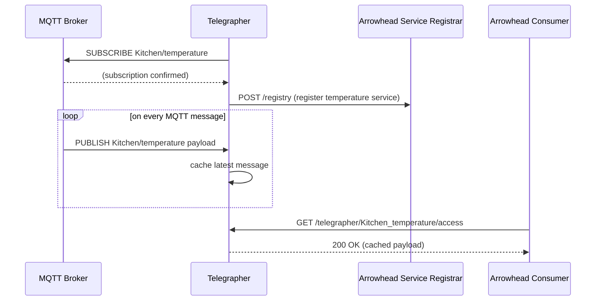

# mbaigo System: Telegrapher

The word *telegrapher* was chosen because there is no direct equivalent for *telemetry* — the one-way, periodic transmission of measurements to a remote system. Just as a telegrapher relays messages between two worlds, this system bridges the Arrowhead local cloud and an MQTT broker.

MQTT is a messaging protocol, not a service-oriented solution. The Telegrapher transforms MQTT topics into Arrowhead services by extracting path segments and interpreting them as service metadata. It works in two modes, selected by the sign of the `period` trait:

- **period < 0 — subscriber mode**: the Telegrapher subscribes to an MQTT topic and exposes the latest message as an Arrowhead service (GET/PUT).
- **period > 0 — publisher mode**: the Telegrapher periodically consumes an Arrowhead service and publishes the result to an MQTT topic. A read-only GET service describes what is being published, from where, and how often.

---

## Subscriber mode (period < 0)

The Telegrapher subscribes to the MQTT broker and caches the latest message. It registers the topic as an Arrowhead service so other systems in the local cloud can consume it via HTTP.



---

## Publisher mode (period > 0)

The Telegrapher discovers and periodically polls an Arrowhead service, then publishes the result to the MQTT broker. A companion GET service reports the source, topic, broker, and period.

```mermaid
sequenceDiagram
    participant S as Arrowhead Service Provider
    participant O as Arrowhead Orchestrator
    participant T as Telegrapher
    participant R as Arrowhead Service Registrar
    participant Broker as MQTT Broker
    participant B as Browser

    T->>R: POST /registry (register publish info service)
    T->>O: POST /orchestration (discover temperature provider)
    O-->>T: provider URL

    loop every period seconds
        T->>S: GET provider URL
        S-->>T: temperature value
        T->>Broker: PUBLISH Kitchen/temperature payload
    end

    B->>T: GET /telegrapher/Kitchen_temperature/publish
    T-->>B: Source: http://192.168.1.6:20150/ds18b20/28-00000f030344/temperature
            MQTT topic: Kitchen/temperature
            Broker: tcp://192.168.1.10:1883
            Period: 2 s
```

---

## Configuration

The unit asset name is the MQTT topic (e.g. `Kitchen/temperature`). The `pattern` trait maps topic path segments to Arrowhead service metadata keys.

Example `systemconfig.json` excerpt:

```json
{
    "name": "Kitchen/temperature",
    "traits": [{
        "broker": "tcp://192.168.1.10:1883",
        "pattern": ["FunctionalLocation"],
        "username": "user",
        "password": "password",
        "period": 2
    }]
}
```

---

## Compiling

```bash
go build -o telegrapher
```

Cross-compile for Raspberry Pi 4/5 (64-bit):

```bash
GOOS=linux GOARCH=arm64 go build -o telegrapher_rpi64
```

Run from its own directory — the system reads and writes `systemconfig.json` locally. If the file is missing, a template is generated and the program exits so you can edit it.

---

## Deploying the MQTT Broker

If you need an MQTT broker for testing, install [Eclipse Mosquitto](https://mosquitto.org):

```bash
sudo apt update && sudo apt install -y mosquitto mosquitto-clients
```

### Basic publish/subscribe test

```bash
mosquitto_pub -h localhost -t Kitchen/temperature -m '{"value":21.5}'
mosquitto_sub -h localhost -t Kitchen/temperature
```

A test publisher that generates a sine-wave temperature signal is provided in the `mqttGen/` subdirectory:

```bash
cd mqttGen && go run mqttGen.go
```

---

## Adding authentication

Edit `/etc/mosquitto/mosquitto.conf`:

```conf
listener 1883 0.0.0.0
allow_anonymous false
password_file /etc/mosquitto/pwdfile
```

Add users:

```bash
sudo mosquitto_passwd -c /etc/mosquitto/pwdfile myuser
sudo service mosquitto restart
```

Test authenticated access from another host:

```bash
mosquitto_sub -h 192.168.1.10 -t Kitchen/temperature -u myuser -P mypassword
```

For external (internet-facing) deployments, use port 8883 with TLS.
