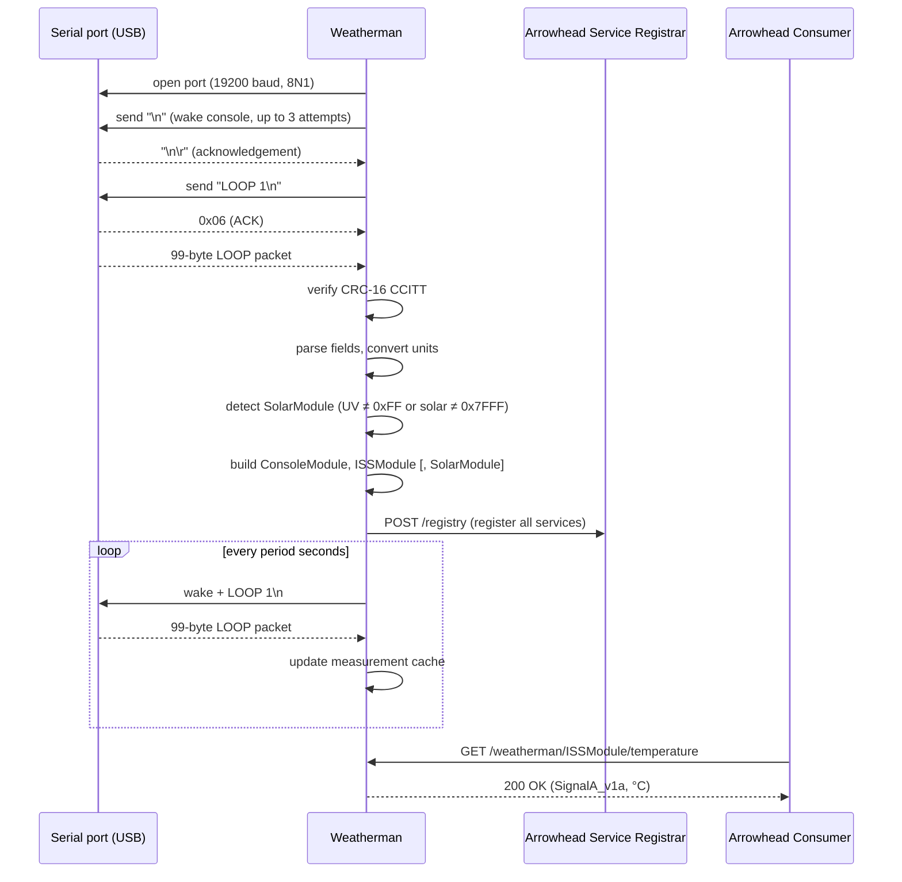

# mbaigo System: Weatherman

The weatherman system bridges a **Davis Vantage Pro2** weather station and an Arrowhead local cloud. The station connects to the host machine over USB (acting as a serial UART device). The system reads the Davis LOOP protocol, parses all measurements, and exposes them as typed Arrowhead services.

Three unit assets are created automatically based on the physical hardware discovered in the first LOOP packet:

| Asset           | Always present | Condition             | Services                                                              |
|-----------------|----------------|-----------------------|-----------------------------------------------------------------------|
| `ConsoleModule` | yes            | —                     | barometer, inside_temperature, inside_humidity                        |
| `ISSModule`     | yes            | —                     | temperature, humidity, wind_speed, wind_angle, rain_rate, rain_24h   |
| `SolarModule`   | optional       | UV or solar sensor detected | uv, solar_radiation                                            |

The station name (`VantagePro2`) is carried as `Details["FunctionalLocation"]` and the module name (e.g., `ConsoleModule`) as `Details["ModuleName"]`, so consumers that discover services via the orchestrator can filter by location and module.

---

## Hardware connection

The Davis Vantage Pro2 indoor console has a DB-9 RS-232 port. Connect it to the host machine using a **USB-to-RS232 adapter** (e.g., based on the FTDI FT232 or Prolific PL2303 chip). The system communicates at **19200 baud, 8N1**.

### Port name by platform

| Platform             | Typical port name                                     | Notes                                      |
|----------------------|-------------------------------------------------------|--------------------------------------------|
| Raspberry Pi / Linux | `/dev/ttyUSB0`                                        | FTDI adapter; use `/dev/ttyACM0` for CDC ACM adapters |
| Mac                  | `/dev/tty.usbserial-XXXXXXXX`                         | Run `ls /dev/tty.*` after plugging in to find the exact name |
| Windows              | `COM3`, `COM4`, …                                     | Check Device Manager → Ports (COM & LPT)  |

Update the `port` field in `systemconfig.json` to match your platform.

---

## Sequence diagram



---

## Services

All services are **GET only**. A `SignalA_v1a` form is returned with `value`, `unit`, and `timestamp`.

| Asset           | Sub-path             | Unit     | Description                              |
|-----------------|----------------------|----------|------------------------------------------|
| `ConsoleModule` | `barometer`          | mbar     | Station pressure                         |
| `ConsoleModule` | `inside_temperature` | °C       | Console indoor temperature               |
| `ConsoleModule` | `inside_humidity`    | %        | Console indoor relative humidity         |
| `ISSModule`     | `temperature`        | °C       | Outdoor temperature                      |
| `ISSModule`     | `humidity`           | %        | Outdoor relative humidity                |
| `ISSModule`     | `wind_speed`         | km/h     | Wind speed                               |
| `ISSModule`     | `wind_angle`         | °        | Wind direction (0–360°)                  |
| `ISSModule`     | `rain_rate`          | mm/h     | Current rainfall rate                    |
| `ISSModule`     | `rain_24h`           | mm       | Rainfall since midnight (day rain)       |
| `SolarModule`   | `uv`                 | UV index | UV index (present if sensor detected)    |
| `SolarModule`   | `solar_radiation`    | W/m²     | Solar radiation (present if sensor detected) |

If a measurement has not yet been read since startup, the service returns `503 Service Unavailable`.

---

## Configuration

Edit `systemconfig.json`:

| Field      | Description                                                  |
|------------|--------------------------------------------------------------|
| `port`     | Serial port device name (platform-specific, see table above) |
| `baudRate` | Must be `19200` for Davis Vantage Pro2                       |
| `period`   | Polling interval in seconds (default: 60)                    |

Example:

```json
{
    "name": "VantagePro2",
    "traits": [{
        "port": "/dev/ttyUSB0",
        "baudRate": 19200,
        "period": 60
    }]
}
```

---

## Compiling

```bash
go build -o weatherman
```

Cross-compile for Raspberry Pi 4/5 (64-bit):

```bash
GOOS=linux GOARCH=arm64 go build -o weatherman_rpi64
```

Cross-compile for Windows:

```bash
GOOS=windows GOARCH=amd64 go build -o weatherman.exe
```

Run from its own directory — the system reads `systemconfig.json` locally.
